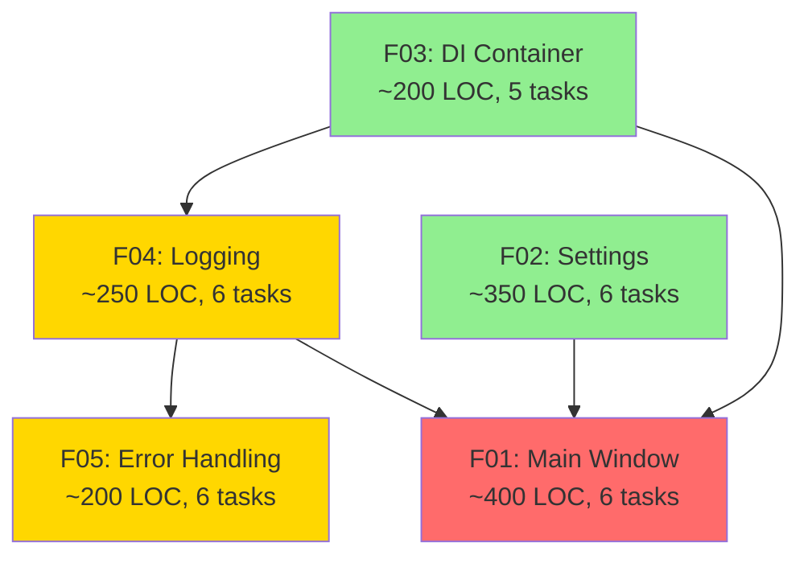

# E01 Auto-Split Summary

**Date**: 2025-12-28
**Epic**: E01 - Application Framework
**Status**: ✅ Complete

---

## Process Overview

Successfully executed auto-split process for Epic E01 following the auto-split.md module instructions.

### Phases Completed

1. ✅ **Phase 1: Initial Split** - Split E01 into 5 features (F01-F05)
2. ✅ **Phase 2: Complexity Analysis** - Analyzed all features against optimal granularity criteria
3. ✅ **Phase 3: Recursive Splitting** - Determined no further splitting needed
4. ✅ **Phase 4: Pre-Docs Generation** - Generated implementation guides for all features
5. ✅ **Phase 5: Parallelization Analysis** - Created dependency graph and execution plan

---

## Results Summary

### Features Created

| Feature | Title | LOC | Tasks | Status |
|---------|-------|-----|-------|--------|
| **F01** | Main Window & Navigation | ~400 | 6 | ✅ Optimal |
| **F02** | Settings Management | ~350 | 6 | ✅ Optimal |
| **F03** | Dependency Injection Container | ~200 | 5 | ✅ Optimal |
| **F04** | Logging Infrastructure | ~250 | 6 | ✅ Optimal |
| **F05** | Error Handling | ~200 | 6 | ✅ Optimal |
| **Total** | | **~1,400** | **29** | |

### Complexity Analysis Results

**All features reached optimal granularity:**

- ✅ All under 500 LOC
- ✅ All have < 15 acceptance criteria lines
- ✅ All have ≤ 3 integration points
- ✅ All fit in context window
- ✅ All have excellent test isolation
- ✅ All tasks broken into 2-4 hour chunks

**Decision**: No recursive splitting required

---

## Documentation Created

### Specification Files (6)

1. `/specs/E01/E01.spec.md` - Epic specification
2. `/specs/E01/F01/F01.spec.md` - Main Window feature spec
3. `/specs/E01/F02/F02.spec.md` - Settings feature spec
4. `/specs/E01/F03/F03.spec.md` - DI Container feature spec
5. `/specs/E01/F04/F04.spec.md` - Logging feature spec
6. `/specs/E01/F05/F05.spec.md` - Error Handling feature spec

### Pre-Implementation Documentation (5)

7. `/specs/E01/F01/F01-pre-docs.md` - Main Window implementation guide
8. `/specs/E01/F02/F02-pre-docs.md` - Settings implementation guide
9. `/specs/E01/F03/F03-pre-docs.md` - DI Container implementation guide
10. `/specs/E01/F04/F04-pre-docs.md` - Logging implementation guide
11. `/specs/E01/F05/F05-pre-docs.md` - Error Handling implementation guide

### Analysis Documentation (3)

12. `/specs/E01/complexity-analysis.md` - Complexity analysis results
13. `/specs/E01/E01-parallelization.md` - Parallelization strategy and dependency graph
14. `/specs/E01/AUTO-SPLIT-SUMMARY.md` - This summary

**Total**: 14 documentation files created

---

## Dependency Graph



**Legend**:
- 🟢 Green: Wave 1 (no dependencies)
- 🟡 Yellow: Wave 2 (one level)
- 🔴 Red: Wave 3+ (multiple levels)

---

## Implementation Waves

### Wave 1: Foundation (3-4 days)
- F03: DI Container (parallel)
- F02: Settings Management (parallel)

### Wave 2: Infrastructure (3-4 days)
- F04: Logging Infrastructure (depends on F03)
- F02: Remaining tasks (depends on F02-T03)

### Wave 3: Error Handling (2-3 days)
- F05: Error Handling (depends on F04)

### Wave 4: UI Integration (3-4 days)
- F01: Main Window (depends on F02, F03, F04)

**Total Estimated Duration**: 11-15 days

---

## Critical Path

```
F03 → F04 → F05 → F01
```

**Critical Path Duration**: 11-13 days (single developer)

---

## Recommended Implementation Order

### Sequential Strategy (Single Developer)

**Order**: F03 → F02 → F04 → F05 → F01

**Timeline**:
- Days 1-2: F03 (DI Container)
- Days 3-4: F02 (Settings Management)
- Days 5-6: F04 (Logging Infrastructure)
- Days 7-8: F05 (Error Handling)
- Days 9-12: F01 (Main Window & Navigation)

**Total**: ~12 working days

---

## Test Coverage Targets

| Feature | Target | Strategy |
|---------|--------|----------|
| F03 | > 80% | Heavy unit testing (pure Python) |
| F02 | > 80% | Unit + integration (persistence) |
| F04 | > 80% | Unit + integration (log rotation) |
| F05 | > 80% | Unit + integration (exception hook) |
| F01 | > 80% | Unit + UI testing |
| **Epic Total** | **> 80%** | |

---

## File Structure

```
specs/E01/
├── E01.spec.md                      # Epic specification
├── AUTO-SPLIT-SUMMARY.md            # This file
├── complexity-analysis.md           # Complexity analysis
├── E01-parallelization.md           # Parallelization report
│
├── F01/                             # Main Window & Navigation
│   ├── F01.spec.md
│   └── F01-pre-docs.md
│
├── F02/                             # Settings Management
│   ├── F02.spec.md
│   └── F02-pre-docs.md
│
├── F03/                             # DI Container
│   ├── F03.spec.md
│   └── F03-pre-docs.md
│
├── F04/                             # Logging Infrastructure
│   ├── F04.spec.md
│   └── F04-pre-docs.md
│
└── F05/                             # Error Handling
    ├── F05.spec.md
    └── F05-pre-docs.md
```

---

## Key Decisions

### No Recursive Splitting

**Decision**: All features (F01-F05) are at optimal granularity, no further splitting required.

**Rationale**:
- All features under 500 LOC
- All tasks are 2-4 hour chunks
- Clear test boundaries
- Excellent modularity
- Single responsibility per feature

### Sequential vs Parallel

**Decision**: Recommend sequential implementation for single developer.

**Rationale**:
- Strong dependency chain limits parallelization
- Two-developer strategy saves only ~15% time
- Coordination overhead may negate time savings
- Single developer maintains better architectural coherence

### Documentation Location

**Decision**: All documentation in `specs/` folder, not `docs/` folder.

**Rationale**:
- Per auto-split.md module requirements
- Co-locate specs with analysis
- Clear feature hierarchy
- Easy to navigate

---

## Success Metrics

Epic E01 implementation is successful when:

✅ All 5 features implemented and tested
✅ Test coverage > 80% across all features
✅ Application launches without errors
✅ Settings persist across restarts
✅ Errors caught and displayed with user-friendly messages
✅ Logs written with file rotation
✅ Navigation between views works correctly
✅ Cross-platform compatibility (Linux, macOS, Windows)
✅ All acceptance criteria met
✅ Code passes linting (ruff, mypy)

---

## Next Steps

### Immediate Actions

1. **Review Documentation**: Verify all specs and pre-docs are accurate
2. **Set Up Project**: Create project structure with Poetry
3. **Configure Tools**: Set up pytest, ruff, mypy, pre-commit hooks
4. **Begin Implementation**: Start with F03 (DI Container)

### Implementation Kickoff Checklist

- [ ] Create git feature branches (`feature/E01-F01`, etc.)
- [ ] Set up CI/CD pipeline
- [ ] Install dependencies (PySide6, cryptography, pytest, pytest-qt)
- [ ] Create project structure:
  ```
  src/
  ├── domain/
  ├── application/
  ├── infrastructure/
  └── presentation/
  tests/
  ├── unit/
  ├── integration/
  └── e2e/
  ```
- [ ] Begin F03-T01 (Container core)

---

## Conclusion

The auto-split process for Epic E01 has been successfully completed. All features have reached optimal granularity and are ready for implementation. Comprehensive documentation has been generated, including:

- Feature specifications with acceptance criteria
- Pre-implementation guides with code examples
- Complexity analysis justifying split decisions
- Parallelization strategy with dependency graphs
- Recommended implementation order

**The epic is fully specified and ready for development to begin.**

---

## Appendix: Auto-Split Decision Matrix

```
Decision Matrix:
IF (criteria_lines > 15 OR integration_points > 3 OR estimated_loc > 500 OR !context_fit OR !test_isolation)
  → SPLIT FURTHER
ELSE
  → OPTIMAL (stop splitting)
```

**Application Results**:

| Feature | Criteria | Integration | LOC | Context | Isolation | Decision |
|---------|----------|-------------|-----|---------|-----------|----------|
| F01 | 12 ✓ | 2 ✓ | 400 ✓ | Yes ✓ | Yes ✓ | **OPTIMAL** |
| F02 | 12 ✓ | 1 ✓ | 350 ✓ | Yes ✓ | Yes ✓ | **OPTIMAL** |
| F03 | 10 ✓ | 0 ✓ | 200 ✓ | Yes ✓ | Yes ✓ | **OPTIMAL** |
| F04 | 10 ✓ | 2 ✓ | 250 ✓ | Yes ✓ | Yes ✓ | **OPTIMAL** |
| F05 | 10 ✓ | 2 ✓ | 200 ✓ | Yes ✓ | Yes ✓ | **OPTIMAL** |

**All features passed all criteria → No recursive splitting needed**
