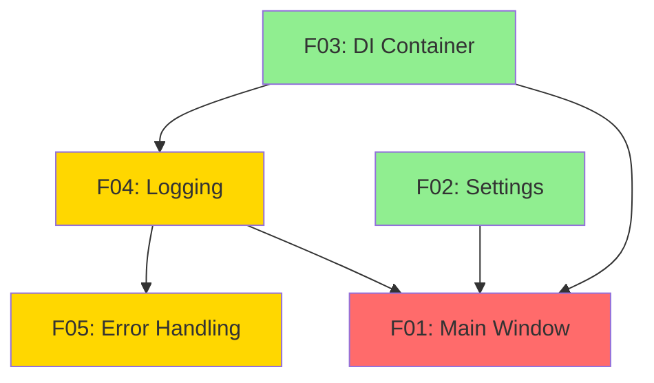
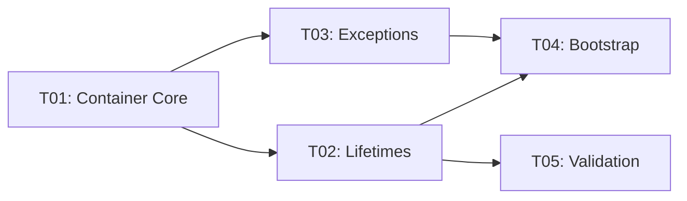
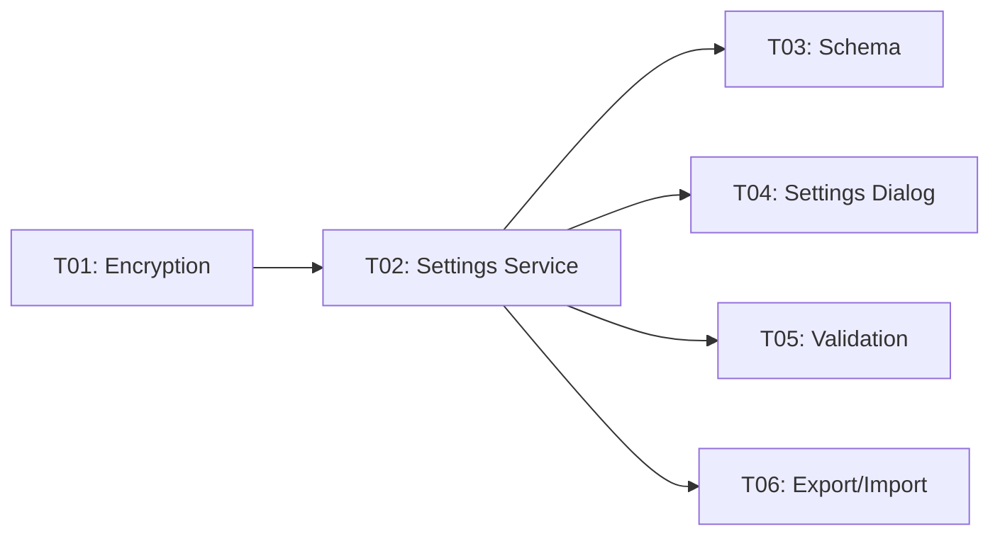
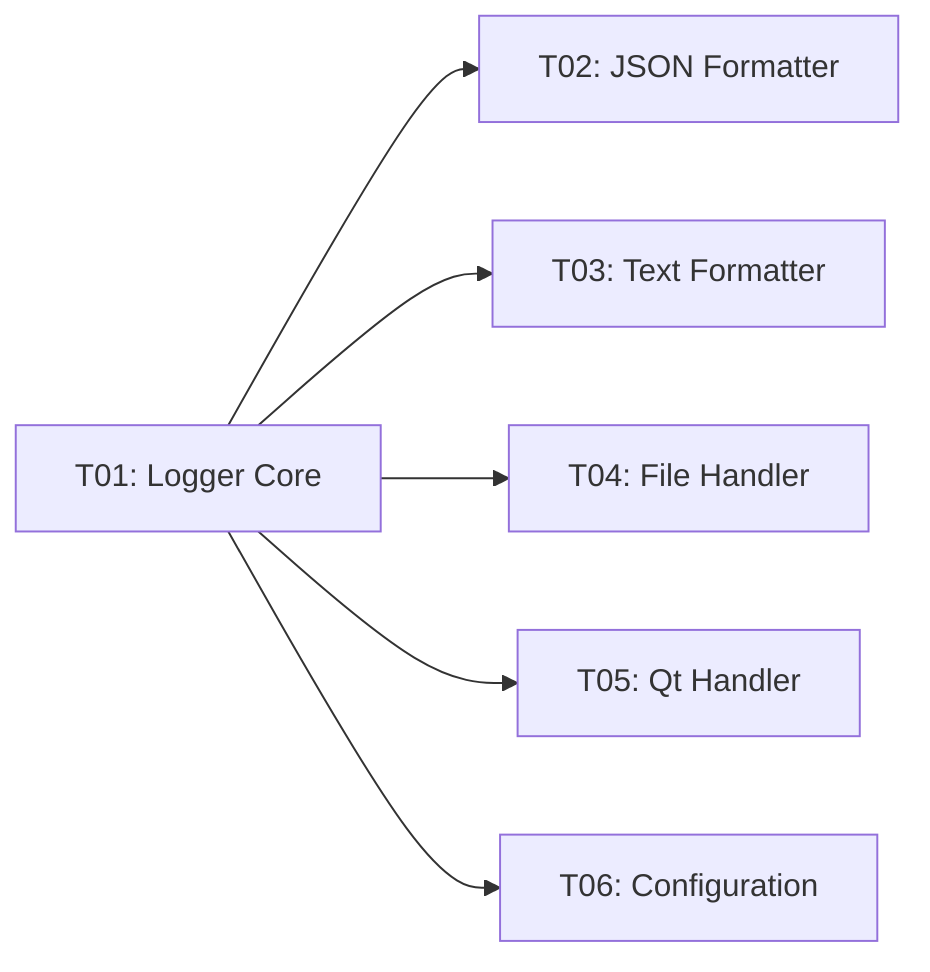
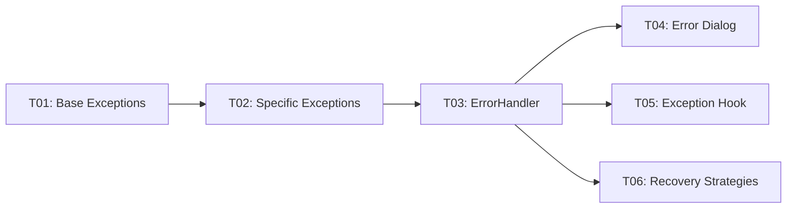
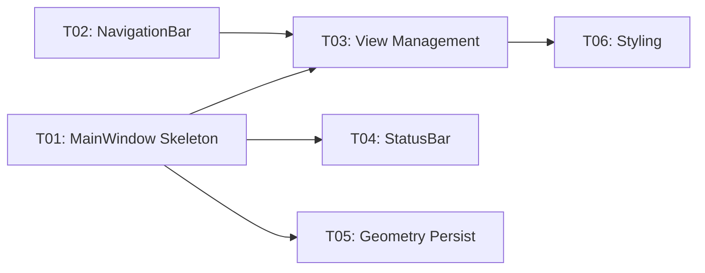

# E01: Application Framework - Parallelization Analysis

## Executive Summary

Epic E01 has been split into **5 features** (F01-F05), all of which have reached **optimal granularity** and are ready for implementation. This report provides a detailed parallelization strategy, dependency analysis, and recommended implementation order.

---

## 1. Feature Overview

| Feature | Title | LOC | Tasks | Complexity | Dependencies |
|---------|-------|-----|-------|------------|--------------|
| F01 | Main Window & Navigation | ~400 | 6 | Medium | F02, F03 |
| F02 | Settings Management | ~350 | 6 | Medium | None |
| F03 | Dependency Injection Container | ~200 | 5 | Low | None |
| F04 | Logging Infrastructure | ~250 | 6 | Low | F03 |
| F05 | Error Handling | ~200 | 6 | Low | F04 |
| **Total** | | **~1400** | **29** | **Low-Med** | |

---

## 2. Dependency Graph

### 2.1 Feature-Level Dependencies



**Legend**:
- 🟢 Green: No dependencies (Wave 1)
- 🟡 Yellow: One level of dependencies (Wave 2)
- 🔴 Red: Multiple levels of dependencies (Wave 3)

### 2.2 Task-Level Dependencies

#### F03: DI Container (5 tasks)


#### F02: Settings Management (6 tasks)


#### F04: Logging Infrastructure (6 tasks)


#### F05: Error Handling (6 tasks)


#### F01: Main Window (6 tasks)


---

## 3. Parallel Execution Waves

### Wave 1: Foundation (Parallel - No Dependencies)

**Duration**: 3-4 days

| Feature | Tasks | Estimated Time | Can Start |
|---------|-------|----------------|-----------|
| **F03: DI Container** | T01-T05 | 7 hours | Immediately |
| **F02: Settings** | T01-T03 | 6 hours | Immediately |

**Parallelization Strategy**:
- Developer A: F03 (DI Container)
- Developer B: F02 (Settings Management)
- OR single developer: F03 first (1 day), then F02 (1 day)

**Deliverables**:
- ✅ Container with singleton/transient support
- ✅ Bootstrap module
- ✅ SettingsService with encryption
- ✅ SettingsSchema definitions

**Tests**:
- Unit tests for Container
- Unit tests for SettingsService
- Integration tests for settings persistence

---

### Wave 2: Infrastructure (Parallel - Depends on Wave 1)

**Duration**: 3-4 days

| Feature | Tasks | Estimated Time | Dependencies |
|---------|-------|----------------|--------------|
| **F04: Logging** | T01-T06 | 7 hours | F03 ✅ |
| **F02: Settings (cont.)** | T04-T06 | 6 hours | F02-T03 ✅ |

**Parallelization Strategy**:
- Developer A: F04 (Logging Infrastructure)
- Developer B: F02 remaining tasks (Settings Dialog, Export/Import)
- OR single developer: F04 first (1 day), then F02 remaining (1 day)

**Deliverables**:
- ✅ Logger with rotating file handler
- ✅ JSON and Text formatters
- ✅ Qt message handler integration
- ✅ Settings Dialog UI
- ✅ Settings import/export

**Tests**:
- Unit tests for Logger and formatters
- Integration tests for log rotation
- UI tests for Settings Dialog

---

### Wave 3: Error Handling (Depends on Wave 2)

**Duration**: 2-3 days

| Feature | Tasks | Estimated Time | Dependencies |
|---------|-------|----------------|--------------|
| **F05: Error Handling** | T01-T06 | 8 hours | F04 ✅ |

**Parallelization Strategy**:
- Single developer recommended (cohesive feature)

**Deliverables**:
- ✅ Exception hierarchy (ApplicationError, ValidationError, etc.)
- ✅ ErrorHandler service
- ✅ Error dialogs
- ✅ Global exception hook
- ✅ Recovery strategies

**Tests**:
- Unit tests for exception classes
- Unit tests for ErrorHandler
- Integration tests for exception hook

---

### Wave 4: UI Integration (Depends on All Previous Waves)

**Duration**: 3-4 days

| Feature | Tasks | Estimated Time | Dependencies |
|---------|-------|----------------|--------------|
| **F01: Main Window** | T01-T06 | 10 hours | F02 ✅, F03 ✅, F04 ✅ |

**Parallelization Strategy**:
- Single developer recommended (UI cohesion)
- Can parallelize T01-T02 (MainWindow + NavigationBar) with T04 (StatusBar)

**Deliverables**:
- ✅ MainWindow with stacked widget
- ✅ NavigationBar with buttons
- ✅ StatusBar with indicators
- ✅ View registration and switching
- ✅ Geometry persistence
- ✅ Application styling

**Tests**:
- Unit tests for MainWindow, NavigationBar, StatusBar
- Integration tests for navigation flow
- UI tests for window lifecycle

---

## 4. Complexity Analysis Summary

### 4.1 Analysis Results

| Feature | Criteria Lines | Integration Points | Estimated LOC | Context Fit | Test Isolation | Decision |
|---------|----------------|-------------------|---------------|-------------|----------------|----------|
| F01 | 12 ✓ | 2 ✓ | 400 ✓ | Yes ✓ | Yes ✓ | **OPTIMAL** |
| F02 | 12 ✓ | 1 ✓ | 350 ✓ | Yes ✓ | Yes ✓ | **OPTIMAL** |
| F03 | 10 ✓ | 0 ✓ | 200 ✓ | Yes ✓ | Yes ✓ | **OPTIMAL** |
| F04 | 10 ✓ | 2 ✓ | 250 ✓ | Yes ✓ | Yes ✓ | **OPTIMAL** |
| F05 | 10 ✓ | 2 ✓ | 200 ✓ | Yes ✓ | Yes ✓ | **OPTIMAL** |

**Decision Matrix**: `IF (criteria_lines > 15 OR integration_points > 3 OR estimated_loc > 500 OR !context_fit OR !test_isolation) → SPLIT FURTHER`

**Result**: ✅ All features passed all criteria - **no further splitting required**

### 4.2 Optimal Granularity Indicators

All features meet optimal granularity:

✅ **Size**: All under 500 LOC (range: 200-400 LOC)
✅ **Complexity**: All have < 15 acceptance criteria lines
✅ **Integration**: All have ≤ 3 integration points
✅ **Context**: All fit comfortably in LLM context window
✅ **Testability**: All have excellent test isolation
✅ **Tasks**: All broken down to 2-4 hour chunks

---

## 5. Critical Path Analysis

### 5.1 Critical Path

The critical path for Epic E01 implementation:

```
F03 (DI Container) → F04 (Logging) → F05 (Error Handling) → F01 (Main Window)
```

**Total Critical Path Duration**: ~11-13 days (single developer)

### 5.2 Parallel Optimization

With 2 developers working in parallel:

```
Wave 1: F03 + F02 (parallel)           → 3-4 days
Wave 2: F04 + F02-cont (parallel)      → 3-4 days
Wave 3: F05 (sequential)               → 2-3 days
Wave 4: F01 (sequential)               → 3-4 days
                                 Total: 11-15 days
```

**Time Savings**: Minimal (critical path dominates)

**Recommendation**: Single developer sequential implementation is most efficient due to strong dependencies.

---

## 6. Recommended Implementation Order

### 6.1 Sequential Strategy (Single Developer)

**Order**: F03 → F02 → F04 → F05 → F01

**Rationale**:
1. **F03 first**: Foundation for all other features (DI container)
2. **F02 second**: Independent, needed by F01 for geometry persistence
3. **F04 third**: Depends on F03, needed by F05
4. **F05 fourth**: Depends on F04, needed by F01
5. **F01 last**: Integrates everything, depends on all

**Timeline**:
- Day 1-2: F03 (DI Container)
- Day 3-4: F02 (Settings)
- Day 5-6: F04 (Logging)
- Day 7-8: F05 (Error Handling)
- Day 9-12: F01 (Main Window)

**Total**: ~12 working days

### 6.2 Parallel Strategy (Two Developers)

**Developer A**: F03 → F04 → F05 → (assist with F01)
**Developer B**: F02 → (wait for F03) → (assist with F01)

**Timeline**:
- Day 1-2: Dev A on F03, Dev B on F02 (parallel)
- Day 3-4: Dev A on F04, Dev B on F02 remaining (parallel)
- Day 5-6: Dev A on F05, Dev B idle or other work
- Day 7-10: Both on F01 (parallel tasks)

**Total**: ~10 working days (15% time savings, coordination overhead)

---

## 7. Risk Assessment

### 7.1 Implementation Risks

| Risk | Severity | Mitigation |
|------|----------|------------|
| **Qt version incompatibility** | Medium | Test on Qt 6.5+ early, use stable APIs |
| **Cross-platform issues** | Medium | Test on Linux/macOS/Windows regularly |
| **Settings encryption key management** | Low | Document clearly, use machine-specific derivation |
| **Log file rotation edge cases** | Low | Use well-tested Python logging handlers |
| **UI responsiveness during errors** | Low | Error dialogs are modal by design |

### 7.2 Dependency Risks

| Dependency | Risk | Mitigation |
|------------|------|------------|
| F01 → F02, F03, F04 | High coupling | F01 is final integration, acceptable |
| F05 → F04 | Tight coupling | Expected (error logging), manageable |
| F04 → F03 | Container registration | Simple interface, low risk |

**Overall Risk**: **LOW** - Well-understood technologies, clear dependencies

---

## 8. Testing Strategy

### 8.1 Test Coverage Targets

| Feature | Unit Test Target | Integration Test Target | Total Coverage Target |
|---------|------------------|-------------------------|----------------------|
| F03 | 90% | 10% | > 80% |
| F02 | 85% | 15% | > 80% |
| F04 | 85% | 15% | > 80% |
| F05 | 85% | 15% | > 80% |
| F01 | 70% | 30% | > 80% |

**Epic Total**: > 80% test coverage

### 8.2 Testing Waves

Align testing with implementation waves:

**Wave 1 Testing** (F03, F02):
- Unit tests for Container (singleton, transient, exceptions)
- Unit tests for SettingsService (get/set, encryption)
- Integration test for settings persistence

**Wave 2 Testing** (F04):
- Unit tests for Logger methods
- Unit tests for formatters (JSON, Text)
- Integration test for log rotation

**Wave 3 Testing** (F05):
- Unit tests for exception classes
- Unit tests for ErrorHandler
- Integration test for exception hook

**Wave 4 Testing** (F01):
- Unit tests for MainWindow, NavigationBar, StatusBar
- Integration test for navigation flow
- UI test for window lifecycle

### 8.3 End-to-End Testing

After all waves complete:

- **E2E-01**: Application launches and shows main window
- **E2E-02**: Settings persist across restart
- **E2E-03**: Errors are caught and displayed with dialogs
- **E2E-04**: Logs are written to file with rotation
- **E2E-05**: Navigation between views works correctly

---

## 9. Documentation Deliverables

### 9.1 Completed Documentation

✅ **Spec Files**:
- `E01/E01.spec.md` - Epic specification
- `E01/F01/F01.spec.md` - Main Window spec
- `E01/F02/F02.spec.md` - Settings spec
- `E01/F03/F03.spec.md` - DI Container spec
- `E01/F04/F04.spec.md` - Logging spec
- `E01/F05/F05.spec.md` - Error Handling spec

✅ **Pre-Docs**:
- `E01/F01/F01-pre-docs.md` - Implementation guide
- `E01/F02/F02-pre-docs.md` - Implementation guide
- `E01/F03/F03-pre-docs.md` - Implementation guide
- `E01/F04/F04-pre-docs.md` - Implementation guide
- `E01/F05/F05-pre-docs.md` - Implementation guide

✅ **Analysis**:
- `E01/complexity-analysis.md` - Complexity analysis
- `E01/E01-parallelization.md` - This document

### 9.2 Documentation Location

All documentation is in the spec folder structure, **not** in `docs/` folder, as per the auto-split module requirements.

---

## 10. Next Steps

### 10.1 Immediate Actions

1. ✅ Review all spec files and pre-docs
2. ✅ Confirm implementation order
3. ⏭️ **Start Wave 1**: Begin F03 (DI Container) implementation
4. ⏭️ Set up project structure with Poetry
5. ⏭️ Configure pytest and pytest-qt

### 10.2 Implementation Kickoff Checklist

- [ ] Create git feature branches for each feature
- [ ] Set up CI/CD pipeline for automated testing
- [ ] Configure linting (ruff, mypy)
- [ ] Set up pre-commit hooks
- [ ] Create project structure (`src/`, `tests/`, `configs/`)
- [ ] Install dependencies (PySide6, cryptography, pytest)
- [ ] Begin F03-T01 (Container core implementation)

---

## 11. Summary

### 11.1 Key Metrics

- **Total Features**: 5
- **Total Tasks**: 29
- **Total Estimated LOC**: ~1,400
- **Estimated Duration**: 12 days (single dev) / 10 days (two devs)
- **Test Coverage Target**: > 80%
- **Complexity**: Low to Medium

### 11.2 Parallelization Potential

**Limited parallelization** due to linear dependency chain:
- Wave 1: 2 features can be parallel (F03, F02)
- Wave 2: 2 features can be parallel (F04, F02-cont)
- Wave 3-4: Sequential only

**Conclusion**: Single developer sequential implementation is most efficient.

### 11.3 Success Criteria

Epic E01 is complete when:

✅ All 5 features implemented with passing tests
✅ Test coverage > 80%
✅ Application launches without errors
✅ Settings persist across restarts
✅ Errors are caught and displayed
✅ Logs are written with rotation
✅ Navigation between views works
✅ Cross-platform compatibility (Linux/macOS/Windows)

---

## Appendix A: Feature File Tree

```
specs/E01/
├── E01.spec.md
├── complexity-analysis.md
├── E01-parallelization.md
├── F01/
│   ├── F01.spec.md
│   └── F01-pre-docs.md
├── F02/
│   ├── F02.spec.md
│   └── F02-pre-docs.md
├── F03/
│   ├── F03.spec.md
│   └── F03-pre-docs.md
├── F04/
│   ├── F04.spec.md
│   └── F04-pre-docs.md
└── F05/
    ├── F05.spec.md
    └── F05-pre-docs.md
```

**Total Files**: 16 (1 epic spec + 5 feature specs + 5 pre-docs + 2 analysis docs + 1 parallelization report + 2 supporting docs)
