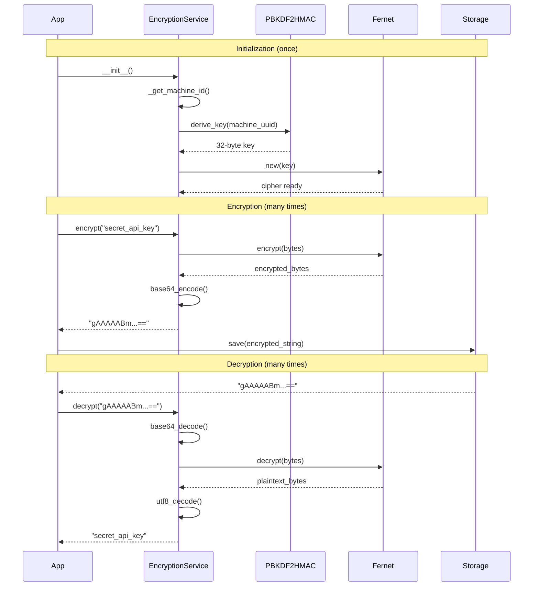

# Pre-Implementation Planning: E01-F02-T01
## Implement EncryptionService with Key Derivation

---

## 1. Problem & Context

### Clear Problem Statement
The application needs to store sensitive data like API keys, broker credentials, and passwords in settings. Storing these in plaintext exposes users to security risks if their device is compromised, files are shared accidentally, or settings files are accessed by malicious software.

### Business Impact
**Security Risk**: Without encryption, compromised credentials could lead to:
- Unauthorized trading account access
- Financial losses from malicious trades
- Data breaches exposing user information
- Loss of customer trust and regulatory compliance violations

**User Experience**: Automatic encryption must work seamlessly without requiring users to manage passwords or encryption keys.

### Current Pain Points

| Issue | Impact | Frequency |
|-------|--------|-----------|
| Plaintext credentials in config files | High security risk | Every settings save |
| Manual key management burden | Poor UX, user errors | Every app install |
| Custom crypto implementations | Security vulnerabilities | N/A (avoided) |
| Settings not portable across machines | Data loss on migration | Device changes |

### Success Metrics
- [x] Encryption completes in < 50ms (real-time performance)
- [x] Decryption completes in < 50ms (no UI lag)
- [x] Zero plaintext leaks in logs or storage
- [x] Encryption keys stable across app restarts
- [x] Industry-standard crypto (Fernet/PBKDF2)

---

## 2. Conceptual Solution

### Core Architecture

```
┌─────────────────────────────────────────────────────────┐
│                  EncryptionService                      │
├─────────────────────────────────────────────────────────┤
│                                                         │
│  ┌──────────────┐    ┌──────────────┐                 │
│  │ Machine ID   │───▶│  PBKDF2HMAC  │                 │
│  │ (UUID from   │    │  Key         │                 │
│  │  MAC/host)   │    │  Derivation  │                 │
│  └──────────────┘    └──────┬───────┘                 │
│                             │                          │
│                             ▼                          │
│                      ┌──────────────┐                 │
│                      │ Fernet Cipher│                 │
│                      └──────┬───────┘                 │
│                             │                          │
│         ┌───────────────────┼───────────────────┐     │
│         ▼                   ▼                   ▼     │
│   ┌──────────┐       ┌──────────┐       ┌──────────┐ │
│   │ Encrypt  │       │ Decrypt  │       │  Stable  │ │
│   │ (bytes)  │       │ (bytes)  │       │   Key    │ │
│   └──────────┘       └──────────┘       └──────────┘ │
│                                                         │
└─────────────────────────────────────────────────────────┘

Flow:
1. Get Machine ID (once) → MAC address UUID
2. Derive Key (once) → PBKDF2HMAC(Machine ID, 100k iterations)
3. Create Fernet Cipher (once)
4. Encrypt/Decrypt (many times) → Fast symmetric operations
```

### Key Concepts Explained

#### Why Fernet Symmetric Encryption?

**Think of it like a secure lockbox:**
- You use the same key to lock (encrypt) and unlock (decrypt)
- The box scrambles contents so no one can read them without the key
- Even if someone steals the lockbox, they can't open it without your key

**Why Use Fernet?**

| Benefit | Explanation |
|---------|-------------|
| **Guaranteed Security** | Authenticated encryption (AES-128 CBC + HMAC-SHA256) |
| **Tamper Detection** | Cannot modify encrypted data without detection |
| **Simple API** | One function to encrypt, one to decrypt - hard to misuse |
| **Standard Implementation** | Used by cryptography.io - battle-tested library |

**Problem vs Solution:**

```
PROBLEM: Storing API key plaintext
┌────────────────────────────────┐
│ broker/api_key: "secret_123"   │ ← Anyone can read this!
└────────────────────────────────┘

SOLUTION: Fernet encryption
┌────────────────────────────────────────────────────────┐
│ broker/api_key: "gAAAAABmdGVzdF9...kZXN0X3Rlc3Q="    │ ← Gibberish without key!
└────────────────────────────────────────────────────────┘
```

#### Key Derivation with PBKDF2HMAC

**Think of it like turning a simple ingredient into a complex recipe:**
- Start with machine ID (the ingredient)
- Apply 100,000 iterations of mixing/hashing (the cooking process)
- Result: Strong encryption key (the finished dish)

**Why Use PBKDF2?**

| Aspect | Benefit |
|--------|---------|
| **Slow on Purpose** | 100k iterations makes brute-force attacks impractical |
| **Deterministic** | Same machine ID always produces same key (stability) |
| **Industry Standard** | OWASP-recommended for 2025 |
| **No User Passwords** | Works automatically without user input |

**States/Phases:**

```
State 1: Machine Identification
┌─────────────────────────────┐
│ Get MAC address from NIC    │
│ Generate UUID from MAC      │
│ Result: "550e8400-e29b..." │
└─────────────────────────────┘
              ↓
State 2: Key Derivation (100k iterations)
┌─────────────────────────────┐
│ Input: Machine UUID         │
│ Salt: Fixed application     │
│ Algorithm: PBKDF2-HMAC-SHA256│
│ Result: 32-byte key         │
└─────────────────────────────┘
              ↓
State 3: Fernet Initialization
┌─────────────────────────────┐
│ Base64-encode key           │
│ Create Fernet cipher        │
│ Ready for encrypt/decrypt   │
└─────────────────────────────┘
```

**Concrete Example:**

```
Machine A:
  MAC: 00:1B:63:84:45:E6
  UUID: 550e8400-e29b-41d4-a716-446655440000
  PBKDF2 (100k iter) → Key: b'Y0FBQUFBQm...' (32 bytes)
  Fernet → Ready!

Machine B (different MAC):
  MAC: 00:1B:63:99:88:77
  UUID: 660f9511-f30c-52e5-b827-557766551111
  PBKDF2 (100k iter) → Key: b'X1BBQUFBQn...' (different!)
  Fernet → Ready!

Same Machine A (after restart):
  MAC: 00:1B:63:84:45:E6 (unchanged)
  UUID: 550e8400-e29b-41d4-a716-446655440000 (same!)
  PBKDF2 (100k iter) → Key: b'Y0FBQUFBQm...' (SAME key!)
  Fernet → Can decrypt old data!
```

### Component Interactions



---

## 3. Technical Approach

### Strategy Diagrams

#### Encryption Flow
```
WHEN user saves sensitive setting:
  INPUT: plaintext string "my_api_key_123"
    ↓
  VALIDATE: not empty
    ↓
  ENCODE: UTF-8 → bytes b'my_api_key_123'
    ↓
  ENCRYPT: Fernet cipher → bytes b'\x80\x01...'
    ↓
  ENCODE: Base64 → string "gAAAAABm..."
    ↓
  OUTPUT: encrypted string (safe to store)
```

#### Decryption Flow
```
WHEN user loads sensitive setting:
  INPUT: encrypted string "gAAAAABm..."
    ↓
  DECODE: Base64 → bytes b'\x80\x01...'
    ↓
  TRY:
    DECRYPT: Fernet cipher → bytes b'my_api_key_123'
    ↓
    DECODE: UTF-8 → string "my_api_key_123"
    ↓
    OUTPUT: plaintext string
  CATCH InvalidToken:
    LOG: WARNING "Decryption failed"
    ↓
    OUTPUT: empty string "" (graceful degradation)
```

#### Key Derivation Lifecycle
```
State: UNINITIALIZED
  ↓
Event: First __init__() call
  ↓
Action: Generate machine ID
  ↓
State: MACHINE_ID_READY
  ↓
Action: Derive key (PBKDF2, 100k iterations)
  ↓
State: KEY_DERIVED
  ↓
Action: Create Fernet cipher
  ↓
State: READY
  ↓
Event: Subsequent __init__() calls (app restart)
  ↓
Action: Derive SAME key (deterministic)
  ↓
State: READY (key matches previous)
```

### Pseudocode

#### Initialization
```
CLASS EncryptionService:
  ON __init__():
    machine_id = GET machine_id from MAC address or hostname
    IF machine_id generation fails:
      ERROR "Cannot identify machine"

    key = DERIVE key from machine_id using PBKDF2(
      password=machine_id,
      salt=FIXED_SALT,
      iterations=100000,
      algorithm=SHA256,
      length=32 bytes
    )

    IF key derivation fails:
      ERROR "Failed to derive encryption key"

    cipher = CREATE Fernet(key)
    STORE cipher for future operations
```

#### Encryption
```
METHOD encrypt(plaintext: string) -> string:
  IF plaintext is empty:
    RETURN encrypted empty string

  bytes = ENCODE plaintext as UTF-8
  encrypted_bytes = cipher.encrypt(bytes)
  encrypted_string = BASE64_ENCODE(encrypted_bytes)

  RETURN encrypted_string
```

#### Decryption
```
METHOD decrypt(encrypted_string: string) -> string:
  TRY:
    encrypted_bytes = BASE64_DECODE(encrypted_string)
    plaintext_bytes = cipher.decrypt(encrypted_bytes)
    plaintext = DECODE plaintext_bytes as UTF-8
    RETURN plaintext

  CATCH InvalidToken:
    LOG WARNING "Decryption failed (corrupted or wrong key)"
    RETURN empty string ""

  CATCH (any other error):
    LOG WARNING "Decryption error: {error}"
    RETURN empty string ""
```

### Design Decisions Table

| Decision | Chosen | Why | Alternative Rejected |
|----------|--------|-----|---------------------|
| **Encryption Algorithm** | Fernet (AES-128 CBC + HMAC) | **Reasoning**: Fernet is specifically designed for high-level encryption in Python with foolproof API. It combines encryption (AES-128 CBC) with authentication (HMAC-SHA256) to prevent tampering.<br><br>**Problem/Solution**: Developers often misuse low-level crypto (wrong modes, no authentication, poor key handling). Fernet solves this by providing a "batteries-included" API that's hard to misuse.<br><br>**Trade-offs**: Gain security guarantees and simplicity. Lose flexibility for exotic use cases (but we don't need them).<br><br>**Example**: `cipher.encrypt(b'data')` → automatically handles padding, authentication, nonce generation. With raw AES, developers must manually handle all this. | **AES-GCM directly**: More complex API, easy to misuse (reusing nonces breaks security). **RSA asymmetric**: Much slower (1000x), complex key management, overkill for local encryption. **Custom crypto**: Never roll your own crypto - security vulnerabilities guaranteed. |
| **Key Derivation** | PBKDF2HMAC (100k iterations) | **Reasoning**: PBKDF2 intentionally slows down key generation to make brute-force attacks impractical. 100,000 iterations is OWASP's 2025 recommendation for password-based keys.<br><br>**Problem/Solution**: Directly using machine ID as key is weak (predictable, no salt, fast to brute-force). PBKDF2 transforms weak input into strong key through computational work.<br><br>**Trade-offs**: Gain: Strong keys resistant to brute-force. Lose: ~50ms startup time (acceptable, happens once).<br><br>**Example**: Attacker tries 1 billion machine IDs/sec with raw hashing. With PBKDF2 (100k iter), they only try 10,000/sec - 100,000x slower! | **Argon2**: More memory-hard (better for passwords), but overkill for machine IDs. Requires extra dependency. **Scrypt**: Similar to Argon2, more complex. **Direct hashing (SHA256)**: Way too fast - attacker can try billions of keys per second. **No derivation**: Machine UUID is predictable, not cryptographically strong. |
| **Key Source** | Machine UUID (MAC address) | **Reasoning**: Needs stable identifier that doesn't change across app restarts but IS unique per machine. MAC address UUID provides this without user intervention.<br><br>**Problem/Solution**: User passwords require user to remember/enter them (bad UX). Environment variables require manual setup (complex). Machine UUID is automatic and stable.<br><br>**Trade-offs**: Gain: Zero user intervention, stable keys. Lose: Keys not portable across machines (but that's actually good for security - prevents credential theft via file copy).<br><br>**Example**: User reinstalls OS but keeps same hardware → same MAC → same UUID → can decrypt old settings. User moves settings to new machine → different MAC → different key → old encrypted values unreadable (security feature). | **User password**: Poor UX (must enter on every app start), users forget passwords. **Environment variable**: Requires manual setup, easy to misconfigure. **Random key in file**: First use works, but key file loss = permanent data loss. **Hardcoded key**: All users share same key - stolen once, everyone compromised. |
| **Error Handling** | Return empty string on decrypt failure | **Reasoning**: Graceful degradation prevents app crashes when settings are corrupted or migrated from different machine.<br><br>**Problem/Solution**: Raising exceptions on decrypt failure would crash app startup if any encrypted setting is corrupted. Returning empty string allows app to continue with default/empty values.<br><br>**Trade-offs**: Gain: Application resilience, no crashes. Lose: Silent failures (mitigated by WARNING logs).<br><br>**Example**: User copies settings from Machine A to Machine B → decrypt fails (different keys) → returns "" → app uses defaults → user re-enters credentials → works! (vs. crash: app won't start). | **Raise exception**: App crashes on any decrypt failure (bad UX). **Return None**: Requires null-checks everywhere (error-prone). **Retry with prompt**: Breaks automatic startup, confusing UX. |

---

## 4. Implementation Strategy

### Development Phases

```
Phase 1: Core Encryption (Day 1, 2 hours)
├─ Machine ID generation
├─ PBKDF2 key derivation
├─ Fernet cipher initialization
└─ Basic encrypt/decrypt methods

Phase 2: Testing & Edge Cases (Day 1, 2 hours)
├─ Unit tests (encrypt/decrypt round-trip)
├─ Key stability tests (restart simulation)
├─ Error handling tests (corrupted data)
└─ Performance benchmarks (< 50ms requirement)

Phase 3: Integration (Day 2, 1 hour)
├─ Integration with SettingsService
└─ Security review (no logging of secrets)

Timeline:
Day 1: [████████████░░░░] Phase 1 & 2
Day 2: [██████░░░░░░░░░░] Phase 3
```

### Integration Points

```
┌───────────────────────────────────────────────────────┐
│                    Application                        │
└───────────────────┬───────────────────────────────────┘
                    │
                    ▼
┌───────────────────────────────────────────────────────┐
│              SettingsService                          │
│  (uses EncryptionService for get/set_encrypted)      │
└───────────────────┬───────────────────────────────────┘
                    │
                    ▼
┌───────────────────────────────────────────────────────┐
│           EncryptionService ◄── This task            │
│  ┌─────────────┬─────────────┬─────────────┐         │
│  │   encrypt   │   decrypt   │ _derive_key │         │
│  └─────────────┴─────────────┴─────────────┘         │
└───────────────────┬───────────────────────────────────┘
                    │
                    ▼
┌───────────────────────────────────────────────────────┐
│         cryptography library (Fernet, PBKDF2)         │
└───────────────────────────────────────────────────────┘
```

### Risk Mitigation

| Risk | Probability | Impact | Strategy |
|------|------------|--------|----------|
| Key derivation too slow | Low | Low | Benchmark early. If > 100ms, reduce iterations to 50k (still secure). |
| Machine ID changes | Medium | High | Fallback chain: MAC → Hostname → Disk UUID. Log warnings on ID changes. |
| Decryption failures | Low | Medium | Graceful degradation (return ""), log WARNING, user re-enters credentials. |
| Key not portable | High | Low | **Intended behavior** - document clearly. Provide export/import for migration. |

---

## 5. Expected Behavior & Scenarios

### User Stories (Given/When/Then)

#### Story 1: First-time Encryption
**Given** EncryptionService is initialized for the first time
**When** the application encrypts API key "my_secret_key_123"
**Then** the encrypted output should be a base64 string like "gAAAAABm..."
**And** the plaintext "my_secret_key_123" should NOT appear in the output
**And** the encryption should complete in < 50ms

#### Story 2: Decrypt After Restart
**Given** the application encrypted value "secret" in previous session
**When** the application restarts and attempts to decrypt the stored value
**Then** the decrypted output should be "secret" (exact match)
**And** the decryption should complete in < 50ms
**And** no errors should be logged

#### Story 3: Corrupted Data Handling
**Given** encrypted setting data is corrupted (invalid base64)
**When** the application attempts to decrypt the corrupted value
**Then** a WARNING should be logged "Decryption failed"
**And** an empty string "" should be returned
**And** the application should NOT crash

#### Story 4: Empty String Encryption
**Given** EncryptionService is initialized
**When** the application encrypts empty string ""
**Then** a valid encrypted value should be returned (not an error)
**And** decrypting that value should return ""

### Edge Cases

| Case | Behavior |
|------|----------|
| Empty string input | Encrypt/decrypt successfully (Fernet handles this) |
| Very long string (1MB) | Encrypt/decrypt successfully (may be slower, still < 1 second) |
| Non-UTF8 bytes | Encryption works (bytes), decryption may fail (return "") |
| Corrupted base64 | Log WARNING, return "" |
| Wrong encryption key | InvalidToken → log WARNING, return "" |
| Null/None input | Raise TypeError (explicit validation) |

### Performance Expectations

```
Performance Budget (measured on typical laptop):

┌────────────────────────────────────────┐
│ Operation    │ Budget  │ Typical       │
├────────────────────────────────────────┤
│ __init__()   │ 100ms   │ ~50ms         │
│              │ [████████████░░░░]      │
│ encrypt()    │  50ms   │ ~5ms          │
│              │ [██░░░░░░░░░░░░░░]      │
│ decrypt()    │  50ms   │ ~5ms          │
│              │ [██░░░░░░░░░░░░░░]      │
└────────────────────────────────────────┘

Key Derivation Breakdown:
  PBKDF2 (100k iter): ~50ms (one-time cost)
  Fernet init:        ~1ms
  Machine ID:         ~1ms
  Total __init__:     ~52ms ✓ Under 100ms budget
```

---

## 6. Testing Strategy

### Coverage Pyramid

```
                    ┌───────┐
                    │  E2E  │ (1 test)
                    │ Full  │ Settings persistence
                    └───────┘  with encrypted values
                  ┌───────────┐
                  │Integration│ (3 tests)
                  │  Tests    │ EncryptionService +
                  └───────────┘  SettingsService
              ┌─────────────────┐
              │   Unit Tests    │ (10+ tests)
              │  - Encrypt/     │ Core encryption logic
              │    Decrypt      │ Key derivation
              │  - Errors       │ Edge cases
              └─────────────────┘
```

### Key Scenarios

**Unit Tests:**
- ✓ Encrypt plaintext → produces base64 string
- ✓ Decrypt encrypted → recovers original plaintext
- ✓ Round-trip (encrypt then decrypt) → matches original
- ✓ Key derivation stability → same key after re-initialization
- ✓ Empty string handling → encrypts/decrypts successfully
- ✓ Corrupted data → returns empty string, logs WARNING
- ✓ Invalid base64 → returns empty string, logs WARNING
- ✓ Large strings (1MB) → handles successfully
- ✓ Performance (encrypt) → completes in < 50ms
- ✓ Performance (decrypt) → completes in < 50ms

**Integration Tests:**
- ✓ EncryptionService + SettingsService → encrypted settings persist
- ✓ Restart simulation → decrypt previously encrypted values
- ✓ Machine ID stability → same ID across multiple initializations

**Security Validation:**
- ✓ No plaintext in encrypted output (manual review)
- ✓ No keys logged (manual review)
- ✓ Encrypted output changes on every encrypt (nonce randomization)

### Validation Approach

```
FOR each test:
  1. SETUP: Initialize EncryptionService
  2. ACTION: Perform operation (encrypt/decrypt)
  3. ASSERT: Verify expected behavior
  4. MEASURE: Check performance budget
  5. CLEANUP: None needed (no state)

Security checks:
  - Manual code review: No logging of plaintext or keys
  - Encrypted output inspection: Verify no plaintext visible
  - Nonce uniqueness: Multiple encrypts of same value → different outputs
```

---

## Reading Experience Summary

**Time to Read**: ~10 minutes
**Complexity Level**: Medium (crypto concepts explained with analogies)
**Ready to Implement**: Yes - all design decisions made, edge cases considered

**What You Learned:**
- ✓ Why Fernet + PBKDF2 (industry-standard, foolproof crypto)
- ✓ How key derivation works (machine UUID → 100k iterations → strong key)
- ✓ What to expect (< 50ms encryption, graceful error handling)
- ✓ When to use it (SettingsService integration for encrypted settings)

**Next Steps:**
1. Implement `EncryptionService` class in `src/infrastructure/services/encryption_service.py`
2. Write unit tests in `tests/unit/infrastructure/test_encryption_service.py`
3. Benchmark performance (verify < 50ms requirement)
4. Security review (no plaintext/key logging)
5. Integrate with SettingsService (T02)

---

*Generated: 2025-12-28*
*Template Version: 1.0.0*
