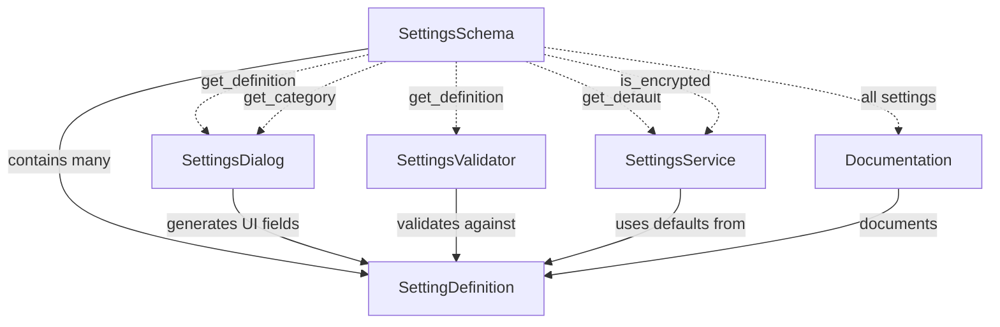

# Pre-Implementation Planning: E01-F02-T03
## Define SettingsSchema with All Application Settings

---

## 1. Problem & Context

### Clear Problem Statement
Without a centralized schema defining all application settings, developers must:
- Manually remember setting keys and types (error-prone)
- Duplicate setting definitions in multiple places (UI code, validation, defaults)
- Miss settings when generating UI or validating values
- Maintain inconsistent defaults across codebase

This leads to bugs, maintenance nightmares, and poor developer experience.

### Business Impact
**Development Velocity**: Scattered settings definitions cause:
- 2-3x longer development time (searching for setting keys across files)
- Higher bug rates (typos in setting keys, inconsistent defaults)
- Slower onboarding (new developers can't find setting documentation)
- Painful refactoring (renaming settings requires changes in 5+ files)

**User Experience**: Missing or incorrect settings metadata leads to:
- Poor UI labels and tooltips
- Missing validation (invalid values crash app)
- Inconsistent defaults across features

### Current Pain Points

| Issue | Impact | Frequency |
|-------|--------|-----------|
| Settings defined in multiple places | Inconsistent defaults, maintenance burden | Every new setting |
| No central documentation | Developers can't find available settings | Daily |
| Manual UI generation | Tedious, error-prone, easy to miss settings | Every settings change |
| No metadata (descriptions, types) | Poor UI tooltips, no validation | Every setting |
| Encrypted settings not marked | Security risks (forgot to encrypt) | Credential settings |

### Success Metrics
- [x] Single source of truth (one place to define settings)
- [x] All settings have defaults, types, descriptions
- [x] Sensitive settings marked as encrypted
- [x] Auto-generated UI from schema (no manual duplication)
- [x] Easy to add new settings (< 5 lines of code)

---

## 2. Conceptual Solution

### Core Architecture

```
┌─────────────────────────────────────────────────────────┐
│                    SettingsSchema                       │
│              (Single Source of Truth)                   │
├─────────────────────────────────────────────────────────┤
│                                                         │
│  ┌──────────────────────────────────────────────────┐  │
│  │         SettingDefinition (dataclass)            │  │
│  │  ┌────────────┬────────────┬────────────────┐   │  │
│  │  │    key     │   default  │  type          │   │  │
│  │  │ description│  encrypted │  category      │   │  │
│  │  │  validator │            │                │   │  │
│  │  └────────────┴────────────┴────────────────┘   │  │
│  └──────────────────────────────────────────────────┘  │
│                          │                             │
│                          ▼                             │
│  ┌──────────────────────────────────────────────────┐  │
│  │              SETTINGS Dict                       │  │
│  │  {                                               │  │
│  │    "general/language": SettingDefinition(...),   │  │
│  │    "trading/quantity": SettingDefinition(...),   │  │
│  │    "broker/api_key": SettingDefinition(...),     │  │
│  │    ...                                           │  │
│  │  }                                               │  │
│  └──────────────────────────────────────────────────┘  │
│                          │                             │
│          ┌───────────────┼───────────────┐             │
│          ▼               ▼               ▼             │
│   ┌──────────┐   ┌──────────┐   ┌──────────┐          │
│   │ UI Auto  │   │Validation│   │Docs Auto │          │
│   │Generation│   │  Rules   │   │Generation│          │
│   └──────────┘   └──────────┘   └──────────┘          │
└─────────────────────────────────────────────────────────┘

Usage Flow:
  Define once in SettingsSchema
       ↓
  Used by SettingsDialog (UI generation)
       ↓
  Used by SettingsValidator (validation)
       ↓
  Used by SettingsService (defaults)
       ↓
  Used by Documentation (auto-generated)
```

### Key Concepts Explained

#### Single Source of Truth Pattern

**Think of it like a library catalog:**
- One master catalog lists all books (settings)
- Each entry has metadata (title, author, location)
- Everyone uses the same catalog (UI, validation, docs)
- Add a book once, everyone sees it immediately

**Problem vs Solution:**

```
PROBLEM: Scattered Definitions
┌────────────────────────────────────────┐
│ settings_service.py:                   │
│   default_language = "ko"              │
│                                        │
│ settings_dialog.py:                    │
│   language_combo.addItems(["ko", "en"])│
│   # Default: "ko"  ← duplicated!       │
│                                        │
│ validator.py:                          │
│   if lang not in ["ko", "en"]:         │
│   # Default: "ko"  ← duplicated again! │
│                                        │
│ docs/settings.md:                      │
│   - language: ko (default)             │
│   ← duplicated yet again!              │
└────────────────────────────────────────┘
4 places to update when changing default!

SOLUTION: SettingsSchema (Single Source)
┌────────────────────────────────────────┐
│ settings_schema.py:                    │
│   SettingDefinition(                   │
│     key="general/language",            │
│     default="ko",                      │
│     type=str,                          │
│     description="UI language",         │
│     choices=["ko", "en"]               │
│   )                                    │
└────────────────────────────────────────┘
1 place to update, everyone gets change!

settings_dialog.py: schema.get_definition("general/language")
validator.py:       schema.get_definition("general/language")
docs:               auto-generate from schema
```

#### SettingDefinition Structure

**Think of it like a nutrition label:**
- Every food item (setting) has a label
- Label shows ingredients (type), serving size (default), warnings (encrypted)
- Consistent format makes it easy to compare

**Anatomy of a Setting:**

```
SettingDefinition:
┌─────────────────────────────────────────────┐
│ key: "trading/default_quantity"             │  ← Unique identifier
├─────────────────────────────────────────────┤
│ default: 1                                  │  ← Used if not set
├─────────────────────────────────────────────┤
│ type: int                                   │  ← Type coercion hint
├─────────────────────────────────────────────┤
│ description: "Default order quantity"       │  ← UI tooltip
├─────────────────────────────────────────────┤
│ encrypted: False                            │  ← Use set_encrypted?
├─────────────────────────────────────────────┤
│ category: "trading"                         │  ← UI tab grouping
├─────────────────────────────────────────────┤
│ validator: lambda v: v > 0                  │  ← Custom rule
└─────────────────────────────────────────────┘
```

**Concrete Examples:**

```python
# Example 1: Simple text setting
SettingDefinition(
    key="general/language",
    default="ko",
    type=str,
    description="Application UI language (Korean or English)",
    encrypted=False,
    category="general",
    validator=lambda v: v in ["ko", "en"]
)

# Example 2: Encrypted credential
SettingDefinition(
    key="broker/api_key",
    default="",
    type=str,
    description="Broker API key for authentication",
    encrypted=True,  # ← IMPORTANT! Use set_encrypted()
    category="broker",
    validator=lambda v: len(v) > 0 or v == ""  # Allow empty or valid
)

# Example 3: Numeric setting with range
SettingDefinition(
    key="trading/default_quantity",
    default=1,
    type=int,
    description="Default quantity for new orders",
    encrypted=False,
    category="trading",
    validator=lambda v: 1 <= v <= 1000  # Range check
)
```

#### Category Organization

**Think of it like filing cabinet drawers:**
- General drawer: Language, theme, startup
- Trading drawer: Quantities, prices, alerts
- Broker drawer: Credentials, endpoints
- UI drawer: Window sizes, splitter positions

**Category Structure:**

```
Settings organized by category:

┌──────────────────────────────────────┐
│         GENERAL                      │
│  ├─ language                         │
│  ├─ theme                            │
│  └─ startup_check_updates            │
├──────────────────────────────────────┤
│         TRADING                      │
│  ├─ default_quantity                 │
│  ├─ default_price_type               │
│  └─ enable_sound_alerts              │
├──────────────────────────────────────┤
│         BROKER (Encrypted!)          │
│  ├─ api_key          🔒              │
│  ├─ api_secret       🔒              │
│  ├─ account_number   🔒              │
│  └─ endpoint_url                     │
├──────────────────────────────────────┤
│         UI                           │
│  ├─ window_geometry                  │
│  ├─ splitter_state                   │
│  └─ chart_interval                   │
└──────────────────────────────────────┘

In UI:
  ┌─────┬─────┬─────┬─────┐
  │ Gen │ Trd │ Brkr│ UI  │  ← Tabs auto-generated from categories
  └─────┴─────┴─────┴─────┘
```

### Component Interactions



---

## 3. Technical Approach

### Strategy Diagrams

#### Schema Usage Flow
```
Developer adds new setting:
  ↓
Add SettingDefinition to SettingsSchema.SETTINGS
  ↓
AUTOMATIC benefits:
  ├─ SettingsDialog: Auto-generates UI field
  ├─ SettingsValidator: Auto-validates type/range
  ├─ SettingsService: Uses default value
  ├─ Documentation: Auto-includes in docs
  └─ Type safety: IDE autocomplete for key
```

#### get_definition() Operation
```
WHEN get_definition(key):
  ↓
LOOKUP key in SETTINGS dict
  ↓
IF found:
  └─ RETURN SettingDefinition object
ELSE:
  ├─ LOG WARNING "Unknown setting key: {key}"
  └─ RETURN None
```

#### get_category() Operation
```
WHEN get_category(category_name):
  ↓
FILTER all settings where setting.category == category_name
  ↓
RETURN list of SettingDefinitions
  ↓
USE CASE: SettingsDialog generates tab for category
```

### Pseudocode

#### SettingDefinition Dataclass
```
@dataclass
CLASS SettingDefinition:
  key: str                           # "general/language"
  default: Any                       # "ko"
  type: Type                         # str
  description: str                   # "UI language"
  encrypted: bool = False            # True for credentials
  category: str = ""                 # "general"
  validator: Optional[Callable] = None  # Custom validation function
```

#### SettingsSchema Class
```
CLASS SettingsSchema:
  # All setting definitions
  SETTINGS: Dict[str, SettingDefinition] = {
    "general/language": SettingDefinition(
      key="general/language",
      default="ko",
      type=str,
      description="Application UI language",
      encrypted=False,
      category="general",
      validator=lambda v: v in ["ko", "en"]
    ),
    "trading/default_quantity": SettingDefinition(
      key="trading/default_quantity",
      default=1,
      type=int,
      description="Default order quantity",
      encrypted=False,
      category="trading",
      validator=lambda v: 1 <= v <= 1000
    ),
    "broker/api_key": SettingDefinition(
      key="broker/api_key",
      default="",
      type=str,
      description="Broker API key",
      encrypted=True,  # ENCRYPTED!
      category="broker"
    ),
    # ... more settings ...
  }

  @staticmethod
  METHOD get_definition(key: str) -> Optional[SettingDefinition]:
    IF key in SETTINGS:
      RETURN SETTINGS[key]
    ELSE:
      LOG WARNING "Unknown setting key: {key}"
      RETURN None

  @staticmethod
  METHOD get_default(key: str) -> Any:
    definition = get_definition(key)
    IF definition:
      RETURN definition.default
    ELSE:
      RETURN None

  @staticmethod
  METHOD get_category(category: str) -> List[SettingDefinition]:
    RETURN [
      setting for setting in SETTINGS.values()
      IF setting.category == category
    ]

  @staticmethod
  METHOD is_encrypted(key: str) -> bool:
    definition = get_definition(key)
    IF definition:
      RETURN definition.encrypted
    ELSE:
      RETURN False
```

### Design Decisions Table

| Decision | Chosen | Why | Alternative Rejected |
|----------|--------|-----|---------------------|
| **Schema Structure** | Python dataclass + static dict | **Reasoning**: Dataclass provides type hints, IDE autocomplete, and validation. Static dict allows fast O(1) lookup by key and simple definition syntax.<br><br>**Problem/Solution**: Manual classes are verbose (100 lines for 20 settings). Dynamic dicts lack type safety (typos undetected). Dataclass + dict balances simplicity and type safety.<br><br>**Trade-offs**: Gain: Simple syntax, type safety, fast lookup. Lose: No automatic validation (acceptable - add validators as needed).<br><br>**Example**: Adding new setting = 5 lines of dataclass vs 30 lines of custom class vs untyped dict (no autocomplete). | **Custom classes**: Too verbose (lots of boilerplate). **TypedDict**: No runtime validation, complex for nested data. **JSON/YAML files**: No type safety, no validators, external dependency. **Database**: Overkill, adds complexity. |
| **Hierarchical Keys** | Dot notation (category/subcategory/name) | **Reasoning**: Hierarchical keys naturally organize settings and enable filtering by prefix. Familiar pattern (like file paths, DNS).<br><br>**Problem/Solution**: Flat keys (language_setting, trading_quantity) become unmanageable with 50+ settings. No grouping, hard to filter. Hierarchical keys solve this: "general/language", "trading/default_quantity".<br><br>**Trade-offs**: Gain: Easy filtering (all "general/*"), logical grouping, scalable. Lose: Slightly longer keys (acceptable - clear is better than short).<br><br>**Example**: Get all general settings: `[s for s in schema.SETTINGS if s.startswith("general/")]` - simple! | **Flat keys**: Unmanageable with many settings, no grouping. **Nested dicts**: Complex access (schema["general"]["language"]), hard to iterate. **Separate categories**: Duplicated code, no unified interface. |
| **Encrypted Flag** | Explicit boolean flag per setting | **Reasoning**: Security-critical to mark which settings MUST be encrypted. Explicit flag prevents forgetting to encrypt credentials (security vulnerability).<br><br>**Problem/Solution**: Implicit encryption (naming convention like "secret_*") is error-prone (typo = plaintext credentials!). Explicit flag makes it obvious and checkable.<br><br>**Trade-offs**: Gain: Security (can't forget), explicit intent, auditable. Lose: Extra field in definition (worth it for security).<br><br>**Example**: Code review checklist: "All settings with encrypted=True use set_encrypted()" - easy to verify! | **Naming convention**: Error-prone (typos), not enforceable. **Separate encrypted_settings dict**: Duplicated definitions, easy to miss. **Automatic detection**: Impossible (can't detect sensitive data by name). |
| **Validator Functions** | Optional callable per setting | **Reasoning**: Some settings need custom validation (ranges, enums, formats). Inline lambdas or functions keep validation close to definition.<br><br>**Problem/Solution**: External validation logic scattered across codebase. Centralized validators in schema keep all metadata together (single source of truth).<br><br>**Trade-offs**: Gain: Centralized validation, easy to find rules. Lose: Can't serialize lambdas (acceptable - schema is Python code).<br><br>**Example**: `validator=lambda v: v in ["ko", "en"]` - validation rule right next to setting definition! | **Separate validator class**: Scattered across files, hard to maintain. **String-based rules**: Not type-safe, limited expressiveness. **No validation**: Runtime errors, poor UX. |

---

## 4. Implementation Strategy

### Development Phases

```
Phase 1: Define Structure (Day 1, 1 hour)
├─ Create SettingDefinition dataclass
├─ Create SettingsSchema class skeleton
└─ Define 2-3 example settings

Phase 2: Define All Settings (Day 1, 2 hours)
├─ General category (language, theme, startup)
├─ Trading category (quantities, prices, alerts)
├─ Broker category (API keys, secrets, endpoints)
├─ UI category (window geometry, splitters, charts)
└─ Mark encrypted settings (security review)

Phase 3: Utility Methods (Day 1, 30 min)
├─ get_definition(key)
├─ get_default(key)
├─ get_category(category)
├─ is_encrypted(key)
└─ all_keys() (for documentation)

Phase 4: Testing & Documentation (Day 1, 30 min)
├─ Unit tests for lookup methods
├─ Verify all settings have required fields
├─ Generate settings documentation
└─ Security review (encrypted flags)

Timeline:
Day 1: [████████████████] All phases
```

### Integration Points

```
SettingsSchema (This task)
       │
       ├────────────────────────┐
       ▼                        ▼
SettingsService          SettingsDialog
  │                           │
  ├─ get_default(key)        ├─ get_category("general")
  ├─ is_encrypted(key)       ├─ Generate UI fields
  └─ Use defaults            └─ Show descriptions
       │                        │
       ▼                        ▼
SettingsValidator        Documentation
  │                           │
  ├─ get_definition(key)     └─ Auto-generate from
  └─ Run validators              all settings
```

### Risk Mitigation

| Risk | Probability | Impact | Strategy |
|------|------------|--------|----------|
| Missing settings | Medium | Medium | Comprehensive checklist, review all features for setting needs. |
| Incorrect defaults | Low | Low | Test defaults in integration tests, user feedback. |
| Forgot encrypted flag | Low | Critical | Security review checklist, grep for credentials/keys/secrets. |
| Schema too complex | Low | Low | Keep simple, avoid over-engineering. |

---

## 5. Expected Behavior & Scenarios

### User Stories (Given/When/Then)

#### Story 1: Retrieve Setting Definition
**Given** SettingsSchema defines "general/language" setting
**When** developer calls `get_definition("general/language")`
**Then** the system should return SettingDefinition with:
- key: "general/language"
- default: "ko"
- type: str
- description: "Application UI language"
- encrypted: False
- category: "general"

#### Story 2: Get Default Value
**Given** SettingsSchema defines "trading/default_quantity" with default 1
**When** developer calls `get_default("trading/default_quantity")`
**Then** the system should return integer 1

#### Story 3: Filter Settings by Category
**Given** SettingsSchema has settings in multiple categories
**When** developer calls `get_category("general")`
**Then** the system should return list of all general settings
**And** trading settings should NOT be included

#### Story 4: Check Encrypted Flag
**Given** SettingsSchema defines "broker/api_key" with encrypted=True
**When** developer calls `is_encrypted("broker/api_key")`
**Then** the system should return True
**And** SettingsService should use set_encrypted() for this setting

#### Story 5: Unknown Setting Warning
**Given** SettingsSchema is defined
**When** developer calls `get_definition("unknown/setting")`
**Then** the system should log WARNING "Unknown setting key: unknown/setting"
**And** return None

### Edge Cases

| Case | Behavior |
|------|----------|
| Unknown key | Return None, log WARNING |
| Empty category | Return empty list |
| Null default value | Allowed (None is valid default) |
| No validator | Validator is None (no custom validation) |
| Duplicate keys | Python dict overwrites (last wins - avoid!) |
| Invalid category name | Return empty list (no error) |

### Settings Inventory

**General Settings:**
```
general/language: str = "ko"              # UI language (ko, en)
general/theme: str = "light"              # UI theme (light, dark)
general/startup_check_updates: bool = True
```

**Trading Settings:**
```
trading/default_quantity: int = 1         # Default order quantity
trading/default_price_type: str = "limit" # Default order type (market, limit)
trading/enable_sound_alerts: bool = True  # Sound alerts on fills
trading/confirm_orders: bool = True       # Confirm before placing orders
```

**Broker Settings (Encrypted):**
```
broker/api_key: str = ""                  # API key (ENCRYPTED) 🔒
broker/api_secret: str = ""               # API secret (ENCRYPTED) 🔒
broker/account_number: str = ""           # Account number (ENCRYPTED) 🔒
broker/endpoint_url: str = ""             # Broker endpoint URL
```

**UI Settings:**
```
ui/window_geometry: str = ""              # MainWindow geometry state
ui/splitter_state: str = ""               # Splitter positions
ui/chart_interval: str = "1m"             # Default chart interval (1m, 5m, 15m, etc.)
ui/show_toolbar: bool = True              # Show toolbar on startup
```

---

## 6. Testing Strategy

### Coverage Pyramid

```
                    ┌───────┐
                    │  E2E  │ (1 test)
                    │ Full  │ SettingsDialog uses
                    └───────┘  schema correctly
              ┌───────────────┐
              │ Integration   │ (3 tests)
              │  Tests        │ Schema + Service
              └───────────────┘  Schema + Dialog
          ┌─────────────────────┐
          │   Unit Tests        │ (10+ tests)
          │  - get_definition() │ Lookup methods
          │  - get_category()   │ Edge cases
          │  - validators       │ All settings defined
          └─────────────────────┘
```

### Key Scenarios

**Unit Tests:**
- ✓ get_definition() with valid key → returns SettingDefinition
- ✓ get_definition() with invalid key → returns None, logs WARNING
- ✓ get_default() with valid key → returns default value
- ✓ get_default() with invalid key → returns None
- ✓ get_category("general") → returns only general settings
- ✓ get_category("unknown") → returns empty list
- ✓ is_encrypted("broker/api_key") → returns True
- ✓ is_encrypted("general/language") → returns False
- ✓ All settings have required fields → no None/empty values
- ✓ All encrypted settings in broker category → security check

**Integration Tests:**
- ✓ SettingsService uses get_default() → correct defaults
- ✓ SettingsDialog uses get_category() → correct UI tabs
- ✓ SettingsValidator uses validators → validation works

**Security Validation:**
- ✓ All credential settings marked encrypted=True (manual review)
- ✓ No sensitive defaults (empty strings for credentials)
- ✓ Encrypted flag consistent across codebase

### Validation Approach

```
FOR each test:
  1. SETUP: Import SettingsSchema
  2. ACTION: Call lookup method
  3. ASSERT: Verify expected behavior
  4. CLEANUP: None needed (static schema)

Completeness checks:
  - All categories have at least 1 setting
  - All settings have non-empty descriptions
  - All settings have valid type (str, int, bool, float, Path)
  - All encrypted settings have empty string defaults
  - No duplicate keys (Python dict enforces this)
```

---

## Reading Experience Summary

**Time to Read**: ~10 minutes
**Complexity Level**: Low (simple data structure)
**Ready to Implement**: Yes - all settings identified, structure defined

**What You Learned:**
- ✓ Why SettingsSchema (single source of truth pattern)
- ✓ How SettingDefinition works (dataclass with metadata)
- ✓ What categories to use (general, trading, broker, ui)
- ✓ Which settings need encryption (broker credentials)

**Next Steps:**
1. Implement `SettingDefinition` dataclass in `src/infrastructure/config/settings_schema.py`
2. Implement `SettingsSchema` class with all settings
3. Write unit tests in `tests/unit/infrastructure/test_settings_schema.py`
4. Security review (verify encrypted flags on credentials)
5. Generate settings documentation from schema

---

*Generated: 2025-12-28*
*Template Version: 1.0.0*
