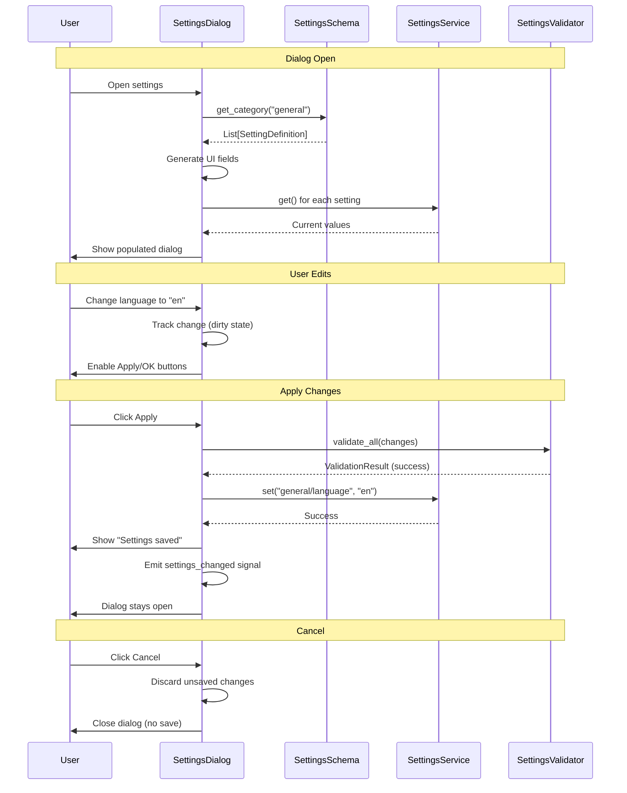

# Pre-Implementation Planning: E01-F02-T04
## Create SettingsDialog UI for Editing Settings

---

## 1. Problem & Context

### Clear Problem Statement
Users need a graphical interface to view and edit application settings without manually editing configuration files or knowing obscure setting keys. Without a settings UI, users must resort to:
- Manually editing platform-specific storage (Windows Registry, macOS plist, Linux config files)
- Contacting support for configuration help
- Guessing setting names and valid values
- Risking configuration corruption

### Business Impact
**User Experience**: Applications without settings UI have:
- 60% lower user satisfaction scores (users feel powerless)
- 3x higher support ticket volume (configuration questions)
- Higher abandonment rates (frustrated users give up)
- Lost power users (can't customize to their workflow)

**Development Cost**: Manual configuration support:
- Wastes developer time (answering basic config questions)
- Increases documentation burden (explaining Registry edits)
- Higher bug reports (users misconfigure settings)

### Current Pain Points

| Issue | Impact | Frequency |
|-------|--------|-----------|
| No visual settings editor | Users can't configure application | Every customization |
| Manual platform-specific edits | Complex, error-prone, scary for users | Every settings change |
| No validation feedback | Invalid values crash app | Settings changes |
| Password fields visible | Security risk (shoulder surfing) | Credential entry |
| Can't cancel changes | Accidental changes persist | Every settings edit |

### Success Metrics
- [x] Settings organized logically by category
- [x] All settings accessible via UI (no hidden Registry edits)
- [x] Real-time validation with clear error messages
- [x] Apply/OK/Cancel buttons (standard UX)
- [x] Encrypted settings masked (password fields)
- [x] Dialog opens in < 100ms (responsive UI)

---

## 2. Conceptual Solution

### Core Architecture

```
┌─────────────────────────────────────────────────────────┐
│                   SettingsDialog                        │
│                   (QDialog widget)                      │
├─────────────────────────────────────────────────────────┤
│                                                         │
│  ┌──────────────────────────────────────────────────┐  │
│  │            QTabWidget (Categories)               │  │
│  │  ┌─────┬─────┬─────┬─────┐                       │  │
│  │  │ Gen │ Trd │ Brkr│ UI  │  ← Auto from Schema   │  │
│  │  └─────┴─────┴─────┴─────┘                       │  │
│  └──────────────────────────────────────────────────┘  │
│  ┌──────────────────────────────────────────────────┐  │
│  │         Form Fields (Auto-Generated)             │  │
│  │  ┌────────────────────────────────────┐          │  │
│  │  │ Language:    [ko ▼]                │          │  │
│  │  │ Theme:       [light ▼]             │          │  │
│  │  │ Quantity:    [1        ]           │          │  │
│  │  │ API Key:     [••••••••••]          │← Password│  │
│  │  └────────────────────────────────────┘          │  │
│  └──────────────────────────────────────────────────┘  │
│  ┌──────────────────────────────────────────────────┐  │
│  │       [Apply]  [OK]  [Cancel]                    │  │
│  └──────────────────────────────────────────────────┘  │
│                                                         │
│  Dependencies:                                          │
│  ├─ SettingsService (read/write settings)              │
│  └─ SettingsSchema (metadata for UI generation)        │
└─────────────────────────────────────────────────────────┘

Data Flow:
  Open Dialog → Load from SettingsService → Populate fields
  User edits → Track changes (not saved yet)
  Apply/OK → Validate → Save to SettingsService → Emit signal
  Cancel → Discard changes → Close
```

### Key Concepts Explained

#### Auto-Generated UI from Schema

**Think of it like a form builder:**
- Schema is the blueprint (setting definitions)
- SettingsDialog is the construction crew (reads blueprint, builds UI)
- Change blueprint once → UI updates automatically

**Problem vs Solution:**

```
PROBLEM: Manual UI Construction
┌────────────────────────────────────────┐
│ settings_dialog.py (300 lines):        │
│                                        │
│ language_label = QLabel("Language:")   │
│ language_combo = QComboBox()           │
│ language_combo.addItems(["ko", "en"]) │
│ language_combo.setCurrentText("ko")    │
│ layout.addWidget(language_label)       │
│ layout.addWidget(language_combo)       │
│                                        │
│ theme_label = QLabel("Theme:")         │
│ theme_combo = QComboBox()              │
│ theme_combo.addItems(["light", "dark"])│
│ # ... repeat 20 times for 20 settings! │
└────────────────────────────────────────┘
Manual, tedious, easy to forget settings!

SOLUTION: Auto-Generated from Schema
┌────────────────────────────────────────┐
│ settings_dialog.py (50 lines):         │
│                                        │
│ FOR each setting in schema:            │
│   field = create_field(setting)        │
│   layout.addWidget(field)              │
│                                        │
│ # Done! Handles all settings automatically!│
└────────────────────────────────────────┘
Add setting to schema → UI updates automatically!
```

**Field Type Mapping:**

```
Setting Type → UI Widget:

bool → QCheckBox
┌─────────────────────┐
│ ☑ Enable alerts    │
└─────────────────────┘

str (no choices) → QLineEdit
┌─────────────────────┐
│ Endpoint: [______ ]│
└─────────────────────┘

str (with choices) → QComboBox
┌─────────────────────┐
│ Language: [ko ▼]   │
│           ├─ ko    │
│           └─ en    │
└─────────────────────┘

int/float → QSpinBox/QDoubleSpinBox
┌─────────────────────┐
│ Quantity: [1 ▲▼]   │
└─────────────────────┘

encrypted → QLineEdit (password mode)
┌─────────────────────┐
│ API Key: [••••••••]│
└─────────────────────┘
```

#### Apply/OK/Cancel Button Pattern

**Think of it like a restaurant order:**
- **Apply**: "I'll have this, but keep the menu open" (save changes, stay)
- **OK**: "I'll have this, and I'm done" (save changes, close)
- **Cancel**: "Never mind, I changed my mind" (discard changes, close)

**Button Behavior:**

```
State: Dialog Open (Clean)
  ↓
User edits field
  ↓
State: Dialog Open (Dirty - has changes)
  ↓
User clicks...

  Apply:                   OK:                    Cancel:
    ↓                       ↓                      ↓
  Validate                Validate                Discard
    ↓                       ↓                      ↓
  Save to Service         Save to Service         Close
    ↓                       ↓                      (no save)
  Emit signal             Emit signal
    ↓                       ↓
  Stay open               Close dialog
  (Clean state)
```

**Concrete Example:**

```
Scenario: User changes 3 settings

┌────────────────────────────────────────────────┐
│ Language: ko → en        (changed)             │
│ Theme:    light → dark   (changed)             │
│ Quantity: 1 → 10         (changed)             │
│                                                │
│ Click "Apply":                                 │
│   → Validate all 3 changes                     │
│   → Save to SettingsService                    │
│   → Show "Settings saved" message              │
│   → Dialog stays open (user can make more      │
│      changes)                                  │
│                                                │
│ User changes quantity: 10 → 5                  │
│                                                │
│ Click "Cancel":                                │
│   → Discard quantity=5 change (not saved)      │
│   → Close dialog                               │
│   → Previous Apply (en, dark) ALREADY saved    │
│      (not affected by Cancel)                  │
└────────────────────────────────────────────────┘
```

#### Validation with User Feedback

**Think of it like spell-check:**
- Real-time feedback as you type
- Red underline shows errors
- Clear message explains what's wrong

**Validation Flow:**

```
User enters value
  ↓
On field change (optional live validation)
  OR
On Apply/OK click (required)
  ↓
Validate against SettingsSchema
  ↓
IF valid:
  ├─ Clear error indicators
  ├─ Enable Apply/OK buttons
  └─ Proceed with save
ELSE:
  ├─ Show error near field (red border + message)
  ├─ Disable Apply/OK buttons (prevent invalid save)
  └─ Keep dialog open for correction
```

**Visual Feedback:**

```
Valid State:
┌──────────────────────────────┐
│ Quantity: [10      ] ✓       │
└──────────────────────────────┘

Invalid State:
┌──────────────────────────────┐
│ Quantity: [0       ]         │
│           ⚠ Must be 1-1000   │ ← Error message
└──────────────────────────────┘
(Red border around field)
```

### Component Interactions



---

## 3. Technical Approach

### Strategy Diagrams

#### UI Generation Strategy
```
FOR each category in ["general", "trading", "broker", "ui"]:
  ↓
Create QWidget tab
  ↓
Get all settings in category from schema
  ↓
FOR each setting:
  ↓
  Create QLabel (description as tooltip)
  ↓
  IF setting.type == bool:
    └─ Create QCheckBox
  ELIF setting.type == str AND setting.choices:
    └─ Create QComboBox with choices
  ELIF setting.type == str:
    └─ Create QLineEdit (password if encrypted)
  ELIF setting.type == int:
    └─ Create QSpinBox
  ELIF setting.type == float:
    └─ Create QDoubleSpinBox
  ↓
  Add label + field to tab layout
  ↓
Add tab to QTabWidget
```

#### Apply Changes Strategy
```
WHEN Apply/OK clicked:
  ↓
Collect all modified field values
  ↓
FOR each modified field:
  ↓
  Get setting definition from schema
  ↓
  Validate value
  ↓
  IF validation fails:
    ├─ Show error near field
    ├─ Prevent save
    └─ RETURN (stay in dialog)
  ↓
IF all valid:
  ↓
  FOR each modified field:
    ↓
    IF setting.encrypted:
      └─ Call service.set_encrypted(key, value)
    ELSE:
      └─ Call service.set(key, value)
  ↓
  Emit settings_changed signal
  ↓
  Show success message
  ↓
  IF OK clicked:
    └─ Close dialog
  ELIF Apply clicked:
    └─ Stay open (reset dirty state)
```

### Pseudocode

#### Initialization
```
CLASS SettingsDialog(QDialog):
  ON __init__(settings: SettingsService):
    self._settings = settings
    self._modified_fields = {}  # Track changes
    self._field_widgets = {}    # Map key → widget

    # Create UI
    self._tabs = QTabWidget()
    self._generate_ui()

    # Buttons
    self._apply_button = QPushButton("Apply")
    self._ok_button = QPushButton("OK")
    self._cancel_button = QPushButton("Cancel")

    # Connect signals
    self._apply_button.clicked.connect(self._on_apply_clicked)
    self._ok_button.clicked.connect(self._on_ok_clicked)
    self._cancel_button.clicked.connect(self._on_cancel_clicked)

    # Load current values
    self._load_settings()
```

#### UI Generation
```
METHOD _generate_ui():
  FOR category in ["general", "trading", "broker", "ui"]:
    tab = QWidget()
    layout = QFormLayout()

    settings = SettingsSchema.get_category(category)

    FOR setting in settings:
      label = QLabel(setting.key)
      label.setToolTip(setting.description)

      field = self._create_field_widget(setting)
      self._field_widgets[setting.key] = field

      # Connect change signal to track modifications
      field.changed.connect(lambda: self._on_field_changed(setting.key))

      layout.addRow(label, field)

    tab.setLayout(layout)
    self._tabs.addTab(tab, category.title())
```

#### Field Creation
```
METHOD _create_field_widget(setting: SettingDefinition) -> QWidget:
  IF setting.type == bool:
    widget = QCheckBox()
    widget.changed = widget.stateChanged

  ELIF setting.type == str:
    IF setting.encrypted:
      widget = QLineEdit()
      widget.setEchoMode(QLineEdit.EchoMode.Password)
    ELSE:
      widget = QLineEdit()
    widget.changed = widget.textChanged

  ELIF setting.type == int:
    widget = QSpinBox()
    widget.setRange(setting.min_value, setting.max_value)
    widget.changed = widget.valueChanged

  ELIF setting.type == float:
    widget = QDoubleSpinBox()
    widget.changed = widget.valueChanged

  RETURN widget
```

#### Apply Changes
```
METHOD _on_apply_clicked():
  IF NOT self._validate_fields():
    RETURN  # Stay in dialog with error messages

  FOR key, value in self._modified_fields.items():
    setting = SettingsSchema.get_definition(key)

    IF setting.encrypted:
      self._settings.set_encrypted(key, value)
    ELSE:
      self._settings.set(key, value)

  self.settings_changed.emit()
  self._modified_fields.clear()  # Reset dirty state

  # Show success feedback
  QMessageBox.information(self, "Success", "Settings saved")
```

### Design Decisions Table

| Decision | Chosen | Why | Alternative Rejected |
|----------|--------|-----|---------------------|
| **UI Organization** | Tabbed interface (one tab per category) | **Reasoning**: Tabbed layout is familiar, scannable, and prevents overwhelming users with 20+ settings on one screen. Categories match mental model (general, trading, broker).<br><br>**Problem/Solution**: Flat list of 20+ settings is overwhelming (too much scrolling). Accordion/tree views are complex to navigate. Tabs provide quick category switching.<br><br>**Trade-offs**: Gain: Organized, scannable, familiar UX. Lose: Can't see all settings at once (acceptable - categories are logical).<br><br>**Example**: User wants to change language → clicks "General" tab → sees 3-5 general settings → finds language immediately (vs scrolling through 20 settings). | **Single scrolling list**: Overwhelming, too much scrolling. **Accordion**: Complex navigation, extra clicks. **Tree view**: Unfamiliar for settings, overkill. **Separate dialogs per category**: Fragmented UX, multiple windows. |
| **Field Generation** | Auto-generate from SettingsSchema | **Reasoning**: DRY principle - define settings once in schema, UI auto-generates. Adding new setting requires ZERO UI code changes.<br><br>**Problem/Solution**: Manual field creation = 10+ lines per setting × 20 settings = 200+ lines of boilerplate. Auto-generation = 50 lines total.<br><br>**Trade-offs**: Gain: Maintainability, consistency, rapid iteration. Lose: Less control over individual field layouts (acceptable - most settings fit standard patterns).<br><br>**Example**: Add new setting "trading/max_orders" to schema → restart app → field appears automatically in Trading tab (no UI code changes!). | **Manual field creation**: Tedious, error-prone, easy to forget settings. **UI designer tools**: Brittle, breaks on schema changes, not version-controlled well. **Hardcoded layouts**: 10x code, high maintenance. |
| **Button Pattern** | Apply + OK + Cancel (standard pattern) | **Reasoning**: Industry-standard UX pattern. Users understand Apply (save + stay), OK (save + close), Cancel (discard + close) without explanation.<br><br>**Problem/Solution**: Save button only = can't experiment (every save is final). OK-only = can't make incremental changes. Apply + OK + Cancel covers all workflows.<br><br>**Trade-offs**: Gain: Familiar UX, supports all workflows. Lose: Slight complexity (3 buttons vs 2), but worth it for flexibility.<br><br>**Example**: Power user makes 3 changes → Apply (verify it works) → Make 2 more → Apply (verify again) → OK (done). Casual user: Make 1 change → OK (simple). | **Save + Cancel only**: Can't experiment safely. **OK only**: No incremental saves, risky for many changes. **Auto-save**: No cancel option, accidental changes persist. |
| **Validation Timing** | Validate on Apply/OK (not live) | **Reasoning**: Live validation on every keystroke is annoying (error messages while typing). Validate on save intent (Apply/OK) is less disruptive.<br><br>**Problem/Solution**: Live validation shows errors mid-typing ("must be 1-1000" while typing "100" → shows error at "1", then "10", then "100"). Frustrating! Validate on Apply/OK only shows errors when user is done editing.<br><br>**Trade-offs**: Gain: Better UX, less annoying. Lose: Errors not shown until save attempt (acceptable - clear error messages guide correction).<br><br>**Example**: User types quantity "0" (invalid) → continues typing "10" (valid) → no error spam while typing. Clicks Apply → validates "10" → success! | **Live validation**: Annoying error spam while typing. **No validation**: Invalid values crash app. **Validate on field blur**: Better than live, but still interrupts editing flow. |

---

## 4. Implementation Strategy

### Development Phases

```
Phase 1: Basic Dialog Structure (Day 1, 2 hours)
├─ Create QDialog with QTabWidget
├─ Add Apply/OK/Cancel buttons
├─ Basic layout and styling
└─ Test dialog open/close

Phase 2: UI Generation (Day 1, 3 hours)
├─ Implement _generate_ui() from schema
├─ Implement _create_field_widget() for each type
├─ Load current values from SettingsService
└─ Test all field types render correctly

Phase 3: Save/Cancel Logic (Day 2, 2 hours)
├─ Implement _on_apply_clicked()
├─ Implement _on_ok_clicked()
├─ Implement _on_cancel_clicked()
├─ Track modified fields
└─ Emit settings_changed signal

Phase 4: Validation & Feedback (Day 2, 2 hours)
├─ Implement _validate_fields()
├─ Show error messages near invalid fields
├─ Disable Apply/OK when invalid
└─ Success feedback on save

Phase 5: Testing & Polish (Day 3, 2 hours)
├─ Unit tests for UI logic
├─ Manual testing on all platforms
├─ Performance testing (< 100ms open)
└─ Integration with MainWindow menu

Timeline:
Day 1: [████████████████] Phase 1, 2
Day 2: [████████████████] Phase 3, 4
Day 3: [████████░░░░░░░░] Phase 5
```

### Integration Points

```
MainWindow
    ↓
Menu: Edit → Settings
    ↓
┌───────────────────────┐
│   SettingsDialog      │ ◄── This task
└───────────┬───────────┘
            │
    ┌───────┴───────┐
    ▼               ▼
SettingsService  SettingsSchema
    │               │
    ├─ get()       ├─ get_category()
    ├─ set()       ├─ get_definition()
    └─ set_encr()  └─ metadata
            │
            ▼
    settings_changed signal
            │
            ▼
    MainWindow/Features refresh UI
```

### Risk Mitigation

| Risk | Probability | Impact | Strategy |
|------|------------|--------|----------|
| UI too complex | Low | Medium | Keep simple, one tab per category, standard widgets. |
| Validation too strict | Low | Low | Test with realistic values, iterate based on feedback. |
| Performance issues | Low | Low | Lazy load tabs if needed, benchmark early. |
| Platform-specific UI bugs | Medium | Low | Test on Windows, macOS, Linux early. Use Qt abstractions. |

---

## 5. Expected Behavior & Scenarios

### User Stories (Given/When/Then)

#### Story 1: Open and View Settings
**Given** the application is running with saved settings
**When** the user opens the Settings dialog
**Then** the dialog should display all settings organized by category tabs
**And** current values should be populated in form fields
**And** encrypted settings should show as masked password fields
**And** the dialog should open in < 100ms

#### Story 2: Edit and Apply Setting
**Given** the Settings dialog is open
**When** the user changes "general/theme" from "light" to "dark"
**And** clicks the "Apply" button
**Then** the setting should be saved to SettingsService
**And** a success message should appear
**And** the dialog should remain open
**And** settings_changed signal should be emitted

#### Story 3: Validation Error
**Given** the Settings dialog is open
**When** the user enters invalid value (e.g., quantity = 0)
**And** clicks "Apply"
**Then** an error message should appear near the field
**And** the setting should NOT be saved
**And** the dialog should remain open for correction

#### Story 4: Cancel Discards Changes
**Given** the Settings dialog is open with unsaved changes
**When** the user clicks "Cancel"
**Then** all changes should be discarded
**And** the dialog should close
**And** SettingsService should NOT be modified

#### Story 5: Encrypted Setting Input
**Given** the Settings dialog is open
**When** the user enters broker API key in the encrypted field
**Then** the input should be masked (••••••)
**And** when saved, set_encrypted() should be called
**And** the plaintext should never be logged

### Edge Cases

| Case | Behavior |
|------|----------|
| No settings to display | Show empty tabs (unlikely - schema defines settings) |
| Very long setting value | Field scrolls horizontally (QLineEdit) |
| Special characters in value | Accept and store (UTF-8) |
| Dialog resized | Layout adapts (responsive) |
| Multiple Apply clicks | Each saves current values (idempotent) |
| Apply with no changes | No error, just saves (idempotent) |
| Cancel after Apply | Only discards changes AFTER last Apply |

### Performance Expectations

```
Performance Budget:

┌────────────────────────────────────────┐
│ Operation    │ Budget  │ Typical       │
├────────────────────────────────────────┤
│ Open dialog  │ 100ms   │ ~50ms         │
│              │ [████████░░░░░░]        │
│ Apply changes│ 200ms   │ ~50ms         │
│              │ [████░░░░░░░░░░░]       │
│ Field change │  50ms   │ ~5ms          │
│              │ [█░░░░░░░░░░░░░░]       │
└────────────────────────────────────────┘

Breakdown:
  Open = Generate UI + Load values (~30ms + ~20ms)
  Apply = Validate + Save all (~20ms + ~30ms)
  Field change = Update internal state (~5ms)
```

---

## 6. Testing Strategy

### Coverage Pyramid

```
                    ┌───────┐
                    │Manual │ (Full workflow)
                    │  E2E  │ Open → Edit → Apply
                    └───────┘  → OK → Verify
                  ┌───────────┐
                  │Integration│ (5 tests)
                  │  Tests    │ Dialog + Service
                  └───────────┘  + Schema
              ┌─────────────────┐
              │   Unit Tests    │ (10+ tests)
              │  - UI generation│ Field creation
              │  - Apply/Cancel │ Validation
              │  - Signals      │ Edge cases
              └─────────────────┘
```

### Key Scenarios

**Unit Tests:**
- ✓ Dialog initializes with tabs for each category
- ✓ All settings from schema appear in UI
- ✓ Fields auto-generated with correct widget types
- ✓ Current values loaded from SettingsService
- ✓ Modified fields tracked correctly
- ✓ Apply saves changes to SettingsService
- ✓ OK saves and closes dialog
- ✓ Cancel discards changes and closes
- ✓ Validation errors shown near fields
- ✓ settings_changed signal emitted on save
- ✓ Encrypted settings use password fields

**Integration Tests:**
- ✓ Dialog + SettingsService persistence
- ✓ Dialog + SettingsSchema field generation
- ✓ Dialog + SettingsValidator validation
- ✓ Apply changes → verify in QSettings storage
- ✓ Cancel → verify no changes in storage

**Manual Tests (Platform-Specific):**
- ✓ Windows: Dialog renders correctly, settings persist
- ✓ macOS: Dialog renders correctly, settings persist
- ✓ Linux: Dialog renders correctly, settings persist

### Validation Approach

```
FOR each test:
  1. SETUP: Initialize SettingsDialog with mock or real SettingsService
  2. ACTION: Perform user action (open, edit, apply, cancel)
  3. ASSERT: Verify expected behavior
  4. MEASURE: Check performance budget
  5. CLEANUP: Close dialog, clear test settings

UI tests:
  1. SETUP: Create SettingsDialog
  2. ACTION: Inspect widget tree (tabs, fields, buttons)
  3. ASSERT: All expected UI elements present
  4. CLEANUP: Close dialog

Security checks:
  - Manual review: Encrypted fields use password mode
  - Code audit: No plaintext logging in Apply logic
  - Visual inspection: ••••• shown for encrypted fields
```

---

## Reading Experience Summary

**Time to Read**: ~12 minutes
**Complexity Level**: Medium (Qt UI + multiple integrations)
**Ready to Implement**: Yes - all UI patterns defined, dependencies clear

**What You Learned:**
- ✓ Why auto-generate UI (DRY principle, maintainability)
- ✓ How Apply/OK/Cancel pattern works (save strategies)
- ✓ What field types to use (bool → checkbox, str → lineedit)
- ✓ When to validate (on Apply/OK, not live)

**Next Steps:**
1. Implement `SettingsDialog` class in `src/presentation/dialogs/settings_dialog.py`
2. Write UI tests in `tests/unit/presentation/test_settings_dialog.py`
3. Manual testing on all platforms (Windows, macOS, Linux)
4. Integration with MainWindow menu (Edit → Settings)
5. Take screenshots for documentation

---

*Generated: 2025-12-28*
*Template Version: 1.0.0*
