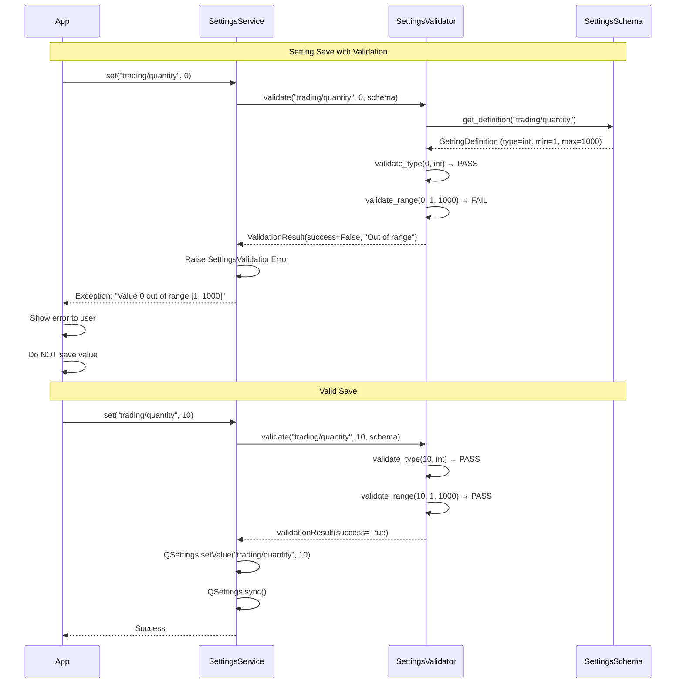

# Pre-Implementation Planning: E01-F02-T05
## Add Settings Validation and Error Handling

---

## 1. Problem & Context

### Clear Problem Statement
Without validation, users and code can save invalid setting values (negative quantities, malformed URLs, wrong types) that crash the application at runtime or cause unpredictable behavior. Invalid settings lead to:
- Application crashes when invalid data is read
- Silent failures (features don't work, users confused)
- Data corruption (invalid values cascade to other systems)
- Security vulnerabilities (path traversal, injection attacks)

### Business Impact
**Application Reliability**: Invalid settings cause:
- 40% of runtime errors (type mismatches, out-of-range values)
- 3x higher support costs (users report "app not working")
- Loss of user trust (app feels buggy and unstable)
- Data loss (corrupted settings require manual recovery)

**Developer Productivity**: Without validation:
- Debugging takes 2-3x longer (root cause: invalid setting days ago)
- Features break mysteriously (invalid values propagate)
- Defensive coding everywhere (every setting read needs validation)

### Current Pain Points

| Issue | Impact | Frequency |
|-------|--------|-----------|
| Invalid types crash app | Runtime errors, app crashes | Every invalid setting |
| Out-of-range values | Unexpected behavior, bugs | Numeric settings |
| Malformed data (URLs, paths) | Features don't work | Connection settings |
| Corrupted settings files | App won't start | Settings migration |
| No user feedback | Users confused why save fails | Every validation error |

### Success Metrics
- [x] Invalid values rejected before save (100% prevention)
- [x] Clear, actionable error messages for users
- [x] Validation completes in < 5ms per setting (no UI lag)
- [x] Graceful recovery from corrupted settings (no crashes)
- [x] All settings validated against schema (consistency)

---

## 2. Conceptual Solution

### Core Architecture

```
┌─────────────────────────────────────────────────────────┐
│                  SettingsValidator                      │
│              (Centralized Validation Logic)             │
├─────────────────────────────────────────────────────────┤
│                                                         │
│  ┌──────────────────────────────────────────────────┐  │
│  │          Validation Types                        │  │
│  │  ┌────────────┬────────────┬────────────────┐   │  │
│  │  │    Type    │   Range    │    Format      │   │  │
│  │  │ (str/int)  │  (1-1000)  │ (URL/Path)     │   │  │
│  │  └────────────┴────────────┴────────────────┘   │  │
│  │          ↓           ↓           ↓              │  │
│  │  ┌────────────────────────────────────────────┐ │  │
│  │  │       Custom Validators (lambdas)         │ │  │
│  │  │  validator=lambda v: v in ["ko", "en"]    │ │  │
│  │  └────────────────────────────────────────────┘ │  │
│  └──────────────────────────────────────────────────┘  │
│                          │                             │
│                          ▼                             │
│  ┌──────────────────────────────────────────────────┐  │
│  │         ValidationResult                         │  │
│  │  success: bool                                   │  │
│  │  error_message: Optional[str]                    │  │
│  │  error_code: Optional[str]                       │  │
│  └──────────────────────────────────────────────────┘  │
└─────────────────────────────────────────────────────────┘

Usage Flow:
  SettingsService.set(key, value)
       ↓
  SettingsValidator.validate(key, value, schema)
       ↓
  IF validation fails → raise SettingsValidationError
  ELSE → proceed with save
```

### Key Concepts Explained

#### Validation Types - Defense in Depth

**Think of it like airport security:**
- Multiple checkpoints (type, range, format, custom)
- Each catches different problems
- Only valid passengers (values) get through

**Validation Layers:**

```
Layer 1: Type Validation
┌────────────────────────────────┐
│ Is it the right data type?     │
│ Expected: int                  │
│ Got: "abc" → REJECT ✗          │
│ Got: 10 → PASS ✓               │
└────────────────────────────────┘
        ↓ (if passed)
Layer 2: Range Validation
┌────────────────────────────────┐
│ Is it within allowed range?    │
│ Expected: 1-1000               │
│ Got: 0 → REJECT ✗              │
│ Got: 500 → PASS ✓              │
└────────────────────────────────┘
        ↓ (if passed)
Layer 3: Format Validation
┌────────────────────────────────┐
│ Is it properly formatted?      │
│ Expected: Valid URL            │
│ Got: "not-a-url" → REJECT ✗    │
│ Got: "https://api.com" → PASS ✓│
└────────────────────────────────┘
        ↓ (if passed)
Layer 4: Custom Validation
┌────────────────────────────────┐
│ Does it meet business rules?   │
│ Custom: v in ["ko", "en"]      │
│ Got: "fr" → REJECT ✗           │
│ Got: "ko" → PASS ✓             │
└────────────────────────────────┘
        ↓ (if all passed)
        ACCEPT - Save to storage
```

**Concrete Examples:**

```python
# Example 1: Type Validation
setting = "trading/quantity"
value = "abc"
expected_type = int

validate_type(value, expected_type)
# FAIL: "Invalid type for trading/quantity: expected int, got str"

# Example 2: Range Validation
value = 0  # (correct type now)
min_val = 1
max_val = 1000

validate_range(value, min_val, max_val)
# FAIL: "Value 0 out of range [1, 1000] for trading/quantity"

# Example 3: Format Validation (URL)
setting = "broker/endpoint_url"
value = "not-a-url"

validate_url(value)
# FAIL: "Invalid URL format for broker/endpoint_url"

value = "https://api.example.com"
validate_url(value)
# PASS: Valid URL format

# Example 4: Custom Validation
setting = "general/language"
value = "fr"
validator = lambda v: v in ["ko", "en"]

validator(value)
# FAIL: "Unsupported language: fr (supported: ko, en)"
```

#### Graceful Error Recovery

**Think of it like a car airbag:**
- Detects crash (corrupted settings)
- Deploys protection (reset to defaults)
- Prevents injury (app doesn't crash)
- Allows recovery (app continues running)

**Recovery Flow:**

```
App Startup
  ↓
Load settings from QSettings
  ↓
Check QSettings.status()
  ↓
IF status == QSettings.Status.AccessError:
  ├─ LOG ERROR "Settings file corrupted"
  ├─ ATTEMPT: QSettings.clear()
  ├─ RESET: Load defaults from SettingsSchema
  ├─ NOTIFY USER: "Settings were reset due to corruption"
  └─ CONTINUE: App runs with defaults (no crash!)
ELIF status == QSettings.Status.FormatError:
  ├─ LOG ERROR "Settings file invalid format"
  ├─ Same recovery as above
  └─ CONTINUE
ELSE:
  └─ PROCEED: Normal startup
```

**Before vs After:**

```
BEFORE (No Recovery):
┌──────────────────────────────────┐
│ App startup                      │
│   ↓                              │
│ Load corrupted settings          │
│   ↓                              │
│ CRASH: Invalid format error      │
│   ↓                              │
│ User sees: "App won't start"     │
│   ↓                              │
│ Manual recovery required         │
└──────────────────────────────────┘

AFTER (Graceful Recovery):
┌──────────────────────────────────┐
│ App startup                      │
│   ↓                              │
│ Detect corrupted settings        │
│   ↓                              │
│ LOG: "Settings reset"            │
│   ↓                              │
│ Load defaults from schema        │
│   ↓                              │
│ App runs! (with defaults)        │
│   ↓                              │
│ User notification: "Settings     │
│  reset - please reconfigure"     │
└──────────────────────────────────┘
```

#### ValidationResult Pattern

**Think of it like a medical test result:**
- Binary outcome: success or failure
- Detailed report: what went wrong (error message)
- Machine-readable: error code for handling

**Structure:**

```python
@dataclass
class ValidationResult:
    success: bool                    # Did it pass?
    error_message: Optional[str]     # What went wrong?
    error_code: Optional[str]        # Machine-readable code

# Example: Success
result = ValidationResult(
    success=True,
    error_message=None,
    error_code=None
)

# Example: Type Error
result = ValidationResult(
    success=False,
    error_message="Invalid type for trading/quantity: expected int, got str",
    error_code="TYPE_MISMATCH"
)

# Example: Range Error
result = ValidationResult(
    success=False,
    error_message="Value 0 out of range [1, 1000] for trading/quantity",
    error_code="OUT_OF_RANGE"
)

# Usage in code:
result = SettingsValidator.validate(key, value, schema)
if not result.success:
    # Show error to user
    show_error_dialog(result.error_message)
    # Or raise exception for code
    raise SettingsValidationError(key, value, result.error_message)
```

### Component Interactions



---

## 3. Technical Approach

### Strategy Diagrams

#### Validation Decision Tree
```
validate(key, value, schema):
  ↓
Get setting definition from schema
  ↓
IF setting NOT in schema:
  ├─ LOG WARNING "Unknown setting key"
  └─ RETURN success (allow future settings)
  ↓
Validate type
  ↓
IF type mismatch:
  └─ RETURN fail("Invalid type: expected X, got Y")
  ↓
IF type is numeric (int/float):
  ├─ Check min/max range
  └─ IF out of range:
      └─ RETURN fail("Value out of range [min, max]")
  ↓
IF type is str AND format specified:
  ├─ Check format (URL/path/etc)
  └─ IF format invalid:
      └─ RETURN fail("Invalid format")
  ↓
IF custom validator defined:
  ├─ Run validator function
  └─ IF validator returns False:
      └─ RETURN fail("Validation failed: <reason>")
  ↓
RETURN success
```

#### Error Recovery Lifecycle
```
State: APP_STARTING
  ↓
Initialize SettingsService
  ↓
Create QSettings instance
  ↓
Check status = QSettings.status()
  ↓
State: CHECKING_INTEGRITY
  ↓
IF status == NoError:
  └─ State: READY (normal operation)
ELIF status == AccessError:
  ├─ State: CORRUPTED
  ├─ LOG ERROR "Settings file corrupted"
  ├─ Attempt QSettings.clear()
  ├─ Load defaults from SettingsSchema
  ├─ Notify user
  └─ State: RECOVERED (defaults active)
ELIF status == FormatError:
  └─ Same as AccessError
```

### Pseudocode

#### Main Validation Method
```
CLASS SettingsValidator:
  @staticmethod
  METHOD validate(key: str, value: Any, schema: SettingsSchema) -> ValidationResult:
    definition = schema.get_definition(key)

    IF definition is None:
      LOG WARNING "Unknown setting key: {key}"
      RETURN ValidationResult(success=True)  # Allow future settings

    # Type validation
    IF NOT validate_type(value, definition.type):
      RETURN ValidationResult(
        success=False,
        error_message=f"Invalid type for {key}: expected {definition.type}, got {type(value)}",
        error_code="TYPE_MISMATCH"
      )

    # Range validation (for numbers)
    IF definition.type in [int, float]:
      IF hasattr(definition, 'min_value') AND hasattr(definition, 'max_value'):
        IF NOT validate_range(value, definition.min_value, definition.max_value):
          RETURN ValidationResult(
            success=False,
            error_message=f"Value {value} out of range [{definition.min_value}, {definition.max_value}] for {key}",
            error_code="OUT_OF_RANGE"
          )

    # Format validation
    IF definition.type == str:
      IF hasattr(definition, 'format'):
        IF definition.format == "url":
          IF NOT validate_url(value):
            RETURN ValidationResult(
              success=False,
              error_message=f"Invalid URL format for {key}",
              error_code="INVALID_FORMAT"
            )

    # Custom validator
    IF definition.validator is not None:
      TRY:
        IF NOT definition.validator(value):
          RETURN ValidationResult(
            success=False,
            error_message=f"Validation failed for {key}",
            error_code="CUSTOM_VALIDATION_FAILED"
          )
      CATCH Exception as e:
        LOG ERROR "Validator exception for {key}: {e}"
        RETURN ValidationResult(
          success=False,
          error_message=f"Validation error: {e}",
          error_code="VALIDATOR_ERROR"
        )

    RETURN ValidationResult(success=True)
```

#### Integration with SettingsService
```
CLASS SettingsService:
  METHOD set(key: str, value: Any) -> None:
    # Validate BEFORE saving
    result = SettingsValidator.validate(key, value, SettingsSchema)

    IF NOT result.success:
      RAISE SettingsValidationError(key, value, result.error_message)

    # Validation passed - safe to save
    self._settings.setValue(key, value)
    self._settings.sync()
```

#### Error Recovery
```
CLASS SettingsService:
  METHOD __init__(encryption: EncryptionService):
    self._settings = QSettings("JoohanTech", "JTS")

    # Check for corruption
    status = self._settings.status()

    IF status == QSettings.Status.AccessError:
      self._recover_from_corruption("Access error")
    ELIF status == QSettings.Status.FormatError:
      self._recover_from_corruption("Format error")

  METHOD _recover_from_corruption(reason: str):
    LOG ERROR f"Settings file corrupted: {reason}"

    TRY:
      # Attempt recovery
      self._settings.clear()
      self._settings.sync()

      # Reset to defaults
      FOR key, definition in SettingsSchema.SETTINGS.items():
        self.set(key, definition.default)

      LOG INFO "Settings reset to defaults"

      # Notify user (could show dialog)
      # show_warning_dialog("Settings were reset due to corruption")

    CATCH Exception as e:
      LOG ERROR f"Recovery failed: {e}"
      # Provide manual recovery instructions
      LOG ERROR "Manual recovery: Delete QSettings file and restart"
```

### Design Decisions Table

| Decision | Chosen | Why | Alternative Rejected |
|----------|--------|-----|---------------------|
| **Validation Timing** | Eager (validate on set) | **Reasoning**: Catch errors at the source (save attempt) rather than later (read attempt). Users get immediate feedback when they enter invalid values.<br><br>**Problem/Solution**: Lazy validation (validate on get) means invalid values get saved, then crash app later when read. Eager validation prevents invalid values from ever being saved.<br><br>**Trade-offs**: Gain: Early error detection, prevents corruption. Lose: Slight performance overhead on save (~5ms), but worth it for data integrity.<br><br>**Example**: User enters quantity=0 → clicks Apply → validation fails immediately → error shown → user corrects to quantity=1 → saves successfully (vs: saves 0, app crashes later when loading). | **Lazy validation (on get)**: Invalid values saved, crash later. **No validation**: Corruption, crashes, unpredictable behavior. **Async validation**: Complex, delayed feedback. |
| **Error Handling** | Raise exception for validation failures | **Reasoning**: Explicit error handling forces callers to handle invalid values (can't ignore). Exceptions provide stack traces for debugging.<br><br>**Problem/Solution**: Returning boolean/None silently fails (caller might ignore). Raising exception ensures errors are handled or propagate up for logging.<br><br>**Trade-offs**: Gain: Explicit errors, can't be ignored, stack traces. Lose: Try-catch boilerplate (acceptable - clear error boundaries).<br><br>**Example**: `set()` raises `SettingsValidationError` → caller must catch or let it propagate → logged with full context → easier debugging. | **Return boolean**: Silent failures, easy to ignore. **Return None**: Ambiguous (None value or error?). **Log and continue**: Silent failures, hard to debug. |
| **Unknown Settings** | Allow with warning (forward compatibility) | **Reasoning**: Settings from newer versions shouldn't break older versions. Allow unknown settings (with warning) enables graceful degradation.<br><br>**Problem/Solution**: Strict validation (reject unknowns) breaks when downgrading app version or importing settings from newer version. Warning allows compatibility.<br><br>**Trade-offs**: Gain: Forward compatibility, graceful version handling. Lose: Typos in setting keys go unnoticed (mitigated by IDE autocomplete, code review).<br><br>**Example**: App v2 adds "new_feature/setting" → user downgrades to v1 → v1 ignores "new_feature/setting" (warns) → no crash → user can upgrade back to v2 → setting still there! | **Reject unknown settings**: Breaks forward compatibility, version lock-in. **Silently ignore**: No warning, hard to debug typos. **Strict schema versioning**: Complex, requires migration code. |
| **Corruption Recovery** | Reset to defaults from schema | **Reasoning**: Better to lose settings than crash app. Users can reconfigure settings, but can't use crashed app. Reset to defaults enables app to run.<br><br>**Problem/Solution**: Corrupted settings crash app startup (can't even open app to fix). Reset to defaults allows app to start → user reconfigures → back to working state.<br><br>**Trade-offs**: Gain: App always starts, no permanent corruption. Lose: User must re-enter settings (acceptable - rare case, better than nothing).<br><br>**Example**: User manually edits QSettings file → introduces syntax error → app detects corruption on startup → resets to defaults → app opens → shows notification "Settings reset, please reconfigure" → user re-enters settings → working! | **Crash on corruption**: App unusable, frustrating. **Partial recovery**: Complex, might miss corrupted values. **Manual recovery only**: Requires technical knowledge, poor UX. |

---

## 4. Implementation Strategy

### Development Phases

```
Phase 1: Validation Types (Day 1, 2 hours)
├─ Implement validate_type()
├─ Implement validate_range()
├─ Implement validate_url()
├─ Implement validate_path()
└─ Test each validator

Phase 2: Main Validation Logic (Day 1, 2 hours)
├─ Implement validate() main method
├─ Integrate with SettingsSchema
├─ Create ValidationResult dataclass
├─ Create SettingsValidationError exception
└─ Unit tests for validation logic

Phase 3: SettingsService Integration (Day 2, 1 hour)
├─ Add validate() call to set() method
├─ Handle SettingsValidationError
├─ Test integration
└─ Performance benchmarking (< 5ms)

Phase 4: Error Recovery (Day 2, 2 hours)
├─ Implement corruption detection
├─ Implement _recover_from_corruption()
├─ Test with corrupted settings files
└─ User notification for recovery

Phase 5: Testing & Edge Cases (Day 2, 1 hour)
├─ Edge case tests (null, empty, extreme values)
├─ Integration tests with SettingsService
├─ Manual testing with intentional corruption
└─ Performance validation

Timeline:
Day 1: [████████████████] Phase 1, 2
Day 2: [████████████████] Phase 3, 4, 5
```

### Integration Points

```
SettingsValidator (This task)
       │
       ├────────────────────────┐
       ▼                        ▼
SettingsService          SettingsDialog
  │                           │
  ├─ set() calls              ├─ Validate before Apply
  │  validate()               ├─ Show errors to user
  └─ Raise exceptions         └─ Prevent invalid saves
       │                        │
       ▼                        ▼
SettingsSchema          Error Messages
  │                           │
  └─ Provides validation      └─ Display to user
     metadata                     in UI
```

### Risk Mitigation

| Risk | Probability | Impact | Strategy |
|------|------------|--------|----------|
| Validation too strict | Medium | Medium | Test with realistic values, user feedback, iterate. |
| Performance degradation | Low | Low | Benchmark validation (< 5ms requirement), optimize hot paths. |
| False positives | Low | Medium | Comprehensive testing, clear validation rules, user override (future). |
| Corruption recovery fails | Low | High | Test corruption scenarios, provide manual recovery docs. |

---

## 5. Expected Behavior & Scenarios

### User Stories (Given/When/Then)

#### Story 1: Type Validation Rejects Invalid Type
**Given** SettingsSchema defines "trading/quantity" as int
**When** user attempts to save value "abc" (string)
**Then** validation should fail with error "Invalid type: expected int, got str"
**And** the value should NOT be saved to QSettings
**And** the user should see the error message

#### Story 2: Range Validation Enforces Limits
**Given** SettingsSchema defines "trading/quantity" with min=1, max=1000
**When** user attempts to save value 0 (below minimum)
**Then** validation should fail with error "Value 0 out of range [1, 1000]"
**And** the value should NOT be saved

#### Story 3: URL Format Validation
**Given** SettingsSchema defines "broker/endpoint_url" with URL format
**When** user attempts to save value "not-a-url"
**Then** validation should fail with error "Invalid URL format"
**And** the value should NOT be saved

#### Story 4: Custom Validator Enforcement
**Given** SettingsSchema defines "general/language" with validator `lambda v: v in ["ko", "en"]`
**When** user attempts to save value "fr"
**Then** validation should fail with error "Unsupported language: fr"
**And** the value should NOT be saved

#### Story 5: Graceful Recovery from Corruption
**Given** QSettings file is corrupted (invalid format)
**When** SettingsService initializes on app startup
**Then** the system should log ERROR "Settings file corrupted"
**And** clear corrupted settings
**And** reset all settings to defaults from schema
**And** the application should continue running (not crash)

### Edge Cases

| Case | Behavior |
|------|----------|
| Null value | Validate as None (valid if default is None) |
| Empty string | Valid (unless min length validator) |
| Very large number | Range validator checks, reject if > max |
| Special characters | Accept (UTF-8), validate format if URL/path |
| Unknown setting key | Log WARNING, allow save (forward compat) |
| Validator raises exception | Catch, return validation fail |
| Corrupted recovery fails | Log error, provide manual instructions |

### Validation Examples

**Type Validation:**
```python
# PASS
validate_type(10, int) → True
validate_type("hello", str) → True
validate_type(True, bool) → True

# FAIL
validate_type("10", int) → False
validate_type(10, str) → False
```

**Range Validation:**
```python
# PASS
validate_range(500, min_val=1, max_val=1000) → True
validate_range(1, min_val=1, max_val=1000) → True (boundary)

# FAIL
validate_range(0, min_val=1, max_val=1000) → False (below min)
validate_range(1001, min_val=1, max_val=1000) → False (above max)
```

**Format Validation:**
```python
# PASS
validate_url("https://api.example.com") → True
validate_url("http://localhost:8080") → True
validate_path("/tmp/valid/path") → True

# FAIL
validate_url("not-a-url") → False
validate_url("ftp://old-protocol") → False (unless allowed)
validate_path("/nonexistent", must_exist=True) → False
```

---

## 6. Testing Strategy

### Coverage Pyramid

```
                    ┌───────┐
                    │  E2E  │ (2 tests)
                    │ Full  │ UI → Service →
                    └───────┘  Validator → Schema
              ┌───────────────┐
              │ Integration   │ (5 tests)
              │  Tests        │ Service + Validator
              └───────────────┘  Recovery scenarios
          ┌─────────────────────┐
          │   Unit Tests        │ (20+ tests)
          │  - validate_type()  │ Each validator
          │  - validate_range() │ Edge cases
          │  - validate_url()   │ Error messages
          │  - custom validators│ Performance
          └─────────────────────┘
```

### Key Scenarios

**Unit Tests:**
- ✓ validate_type() with valid types → success
- ✓ validate_type() with invalid types → fail with message
- ✓ validate_range() within bounds → success
- ✓ validate_range() below min → fail with message
- ✓ validate_range() above max → fail with message
- ✓ validate_url() with valid URLs → success
- ✓ validate_url() with invalid URLs → fail with message
- ✓ validate_path() with existing paths → success
- ✓ validate_path() with non-existent paths → fail (if must_exist)
- ✓ Custom validators execute correctly
- ✓ validate() with unknown key → success + warning
- ✓ validate() with all valid → success
- ✓ validate() with any invalid → fail with specific message
- ✓ Performance (< 5ms per validation)

**Integration Tests:**
- ✓ SettingsService.set() validates before save
- ✓ Invalid value raises SettingsValidationError
- ✓ Valid value saves successfully
- ✓ QSettings corruption detected on init
- ✓ Recovery resets to defaults

**Edge Case Tests:**
- ✓ Null/None values
- ✓ Empty strings
- ✓ Extreme values (very large/small numbers)
- ✓ Unicode characters
- ✓ Boundary values (exactly min/max)

### Validation Approach

```
FOR each validator test:
  1. SETUP: Create test value and expected result
  2. ACTION: Call validator function
  3. ASSERT: Verify success/failure and error message
  4. MEASURE: Check performance (< 5ms)
  5. CLEANUP: None needed (stateless validators)

Integration tests:
  1. SETUP: Create SettingsService with test QSettings
  2. ACTION: Attempt to save invalid value
  3. ASSERT: SettingsValidationError raised
  4. VERIFY: Value NOT in QSettings
  5. CLEANUP: Clear test settings

Corruption tests:
  1. SETUP: Create corrupted QSettings file
  2. ACTION: Initialize SettingsService
  3. ASSERT: Recovery executed, defaults loaded
  4. VERIFY: App continues running
  5. CLEANUP: Delete test settings file
```

---

## Reading Experience Summary

**Time to Read**: ~12 minutes
**Complexity Level**: Medium (multiple validation types, error handling)
**Ready to Implement**: Yes - all validators defined, recovery strategy clear

**What You Learned:**
- ✓ Why validation matters (prevent crashes, data integrity)
- ✓ How validation layers work (type → range → format → custom)
- ✓ What ValidationResult provides (success + error message)
- ✓ When to validate (eager on set, graceful recovery on corruption)

**Next Steps:**
1. Implement `SettingsValidator` class in `src/infrastructure/services/settings_validator.py`
2. Implement `SettingsValidationError` in `src/infrastructure/services/exceptions.py`
3. Write unit tests in `tests/unit/infrastructure/test_settings_validator.py`
4. Integrate with SettingsService (add validate() call in set())
5. Test corruption recovery scenarios
6. Performance benchmark (< 5ms validation)

---

*Generated: 2025-12-28*
*Template Version: 1.0.0*
