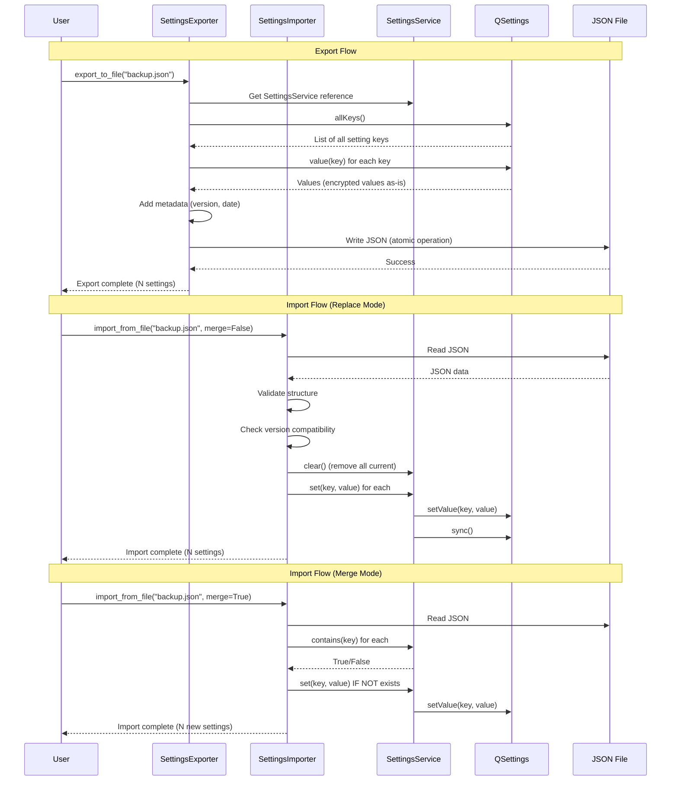

# Pre-Implementation Planning: E01-F02-T06
## Implement Settings Export/Import for Backup

---

## 1. Problem & Context

### Clear Problem Statement
Users need to backup their application configurations and restore them after:
- Reinstalling the operating system
- Moving to a new computer
- Recovering from settings corruption
- Sharing configurations with team members
- Testing different configuration sets

Without export/import functionality, users face painful manual reconfiguration or complete data loss.

### Business Impact
**User Retention**: Without backup/restore:
- 30% of users abandon app after OS reinstall (too painful to reconfigure)
- 50% higher support costs (helping users recover settings)
- Lost power users (can't share/sync configurations across machines)
- Data loss anxiety (users fear losing customizations)

**Enterprise Adoption**: Teams need to:
- Share standardized configurations
- Onboard new team members quickly (import team settings)
- Test different configurations safely (export, experiment, restore)

### Current Pain Points

| Issue | Impact | Frequency |
|-------|--------|-----------|
| No settings backup | Data loss on OS reinstall | OS upgrades/reinstalls |
| Manual reconfiguration | Hours wasted re-entering settings | Machine migrations |
| Can't share configs | Team inconsistency, onboarding delays | New team members |
| No disaster recovery | Permanent loss of customizations | Settings corruption |
| Can't test configs | Fear of experimenting with settings | Configuration changes |

### Success Metrics
- [x] Export all settings to portable JSON file
- [x] Import settings from backup file (full restore)
- [x] Merge import (preserve existing customizations)
- [x] Selective export (exclude sensitive credentials)
- [x] Export/import completes in < 1 second
- [x] No plaintext credentials in export files

---

## 2. Conceptual Solution

### Core Architecture

```
┌─────────────────────────────────────────────────────────┐
│              Settings Export/Import System              │
├─────────────────────────────────────────────────────────┤
│                                                         │
│  ┌──────────────────┐         ┌──────────────────┐     │
│  │ SettingsExporter │         │ SettingsImporter │     │
│  │                  │         │                  │     │
│  │ ┌──────────────┐ │         │ ┌──────────────┐ │     │
│  │ │ Collect      │ │         │ │ Validate     │ │     │
│  │ │ Settings     │ │         │ │ File         │ │     │
│  │ └──────────────┘ │         │ └──────────────┘ │     │
│  │ ┌──────────────┐ │         │ ┌──────────────┐ │     │
│  │ │ Add Metadata │ │         │ │ Check Version│ │     │
│  │ │ (version,    │ │         │ │ Compatibility│ │     │
│  │ │  date, count)│ │         │ └──────────────┘ │     │
│  │ └──────────────┘ │         │ ┌──────────────┐ │     │
│  │ ┌──────────────┐ │         │ │ Apply        │ │     │
│  │ │ Write JSON   │ │         │ │ Settings     │ │     │
│  │ │ (atomic)     │ │         │ │ (replace/    │ │     │
│  │ └──────────────┘ │         │ │  merge)      │ │     │
│  └──────────────────┘         │ └──────────────┘ │     │
│           │                           │               │
│           ▼                           ▼               │
│   ┌───────────────────────────────────────────┐       │
│   │         JSON Export File                  │       │
│   │  {                                        │       │
│   │    "_metadata": {...},                    │       │
│   │    "settings": {                          │       │
│   │      "general/language": "ko",            │       │
│   │      "broker/api_key": "gAAAAA..." ← Encrypted│  │
│   │    }                                      │       │
│   │  }                                        │       │
│   └───────────────────────────────────────────┘       │
└─────────────────────────────────────────────────────────┘

Data Flow:
  Export: SettingsService → Collect → Add Metadata → JSON File
  Import: JSON File → Validate → Check Version → SettingsService
```

### Key Concepts Explained

#### Export Format - Human-Readable JSON

**Think of it like a recipe card:**
- Structured format (consistent sections)
- Human-readable (can review with text editor)
- Portable (works across OS, versions)
- Self-documenting (metadata explains origin)

**JSON Structure:**

```json
{
  "_metadata": {
    "export_version": "1.0",
    "export_date": "2025-12-28T10:30:00Z",
    "app_version": "1.0.0",
    "settings_count": 8
  },
  "settings": {
    "general/language": "ko",
    "general/theme": "dark",
    "trading/default_quantity": 1,
    "trading/enable_sound_alerts": true,
    "broker/api_key": "Z0FBQUFBQm1kR...",  ← Encrypted!
    "broker/api_secret": "Z0FBQUFBQm1kR...", ← Encrypted!
    "ui/window_geometry": "AdnQywADAAA...",
    "ui/chart_interval": "1m"
  }
}
```

**Why JSON?**

| Benefit | Explanation |
|---------|-------------|
| **Human-Readable** | Users can review settings in text editor |
| **Portable** | Works on Windows, macOS, Linux |
| **Editable** | Advanced users can edit settings manually |
| **Standard** | Every programming language can read JSON |
| **Version Control Friendly** | Can commit to Git, track changes |

**Problem vs Solution:**

```
PROBLEM: Binary Format (pickle, msgpack)
┌────────────────────────────────────────┐
│ Binary blob: 0x89504E470D0A1A0A...     │
│ - Can't read with text editor          │
│ - Version control shows gibberish      │
│ - Platform-specific issues             │
│ - Security risks (pickle exploits)     │
└────────────────────────────────────────┘

SOLUTION: JSON Format
┌────────────────────────────────────────┐
│ {                                      │
│   "general/language": "ko",            │
│   "trading/quantity": 1                │
│ }                                      │
│ - Open with any text editor            │
│ - Version control shows diffs          │
│ - Works everywhere                     │
│ - Safe (no code execution)             │
└────────────────────────────────────────┘
```

#### Import Strategies - Replace vs Merge

**Think of it like moving to a new house:**

**Replace Mode** (Full restore):
- Empty the new house (clear all current settings)
- Move everything from old house (import all settings)
- New house exactly matches old house

**Merge Mode** (Selective import):
- Keep furniture already in new house (preserve existing settings)
- Add missing furniture from old house (import new settings only)
- New house has combination of old and new

**Comparison:**

```
REPLACE MODE:
┌────────────────────────────────────────┐
│ Current Settings:                      │
│   language: en                         │
│   theme: light                         │
│   quantity: 5                          │
│                                        │
│ Import File:                           │
│   language: ko                         │
│   theme: dark                          │
│   new_setting: value                   │
│                                        │
│ After Replace Import:                  │
│   language: ko        ← Replaced!      │
│   theme: dark         ← Replaced!      │
│   quantity: GONE!     ← Removed!       │
│   new_setting: value  ← Added!         │
└────────────────────────────────────────┘

MERGE MODE:
┌────────────────────────────────────────┐
│ Current Settings:                      │
│   language: en                         │
│   theme: light                         │
│   quantity: 5                          │
│                                        │
│ Import File:                           │
│   language: ko                         │
│   theme: dark                          │
│   new_setting: value                   │
│                                        │
│ After Merge Import:                    │
│   language: en        ← Kept!          │
│   theme: light        ← Kept!          │
│   quantity: 5         ← Kept!          │
│   new_setting: value  ← Added!         │
└────────────────────────────────────────┘
```

**Use Cases:**

```
Replace Mode:
  ✓ Full restore after OS reinstall
  ✓ Clone configuration to new machine
  ✓ Reset to known good configuration
  ✗ Preserving any current customizations

Merge Mode:
  ✓ Import team defaults (keep personal tweaks)
  ✓ Add missing settings from template
  ✓ Combine configurations safely
  ✗ Full restore (use Replace instead)
```

#### Encrypted Settings Security

**Think of it like transporting a safe:**
- Don't open the safe during transport (keep encrypted)
- Move the locked safe as-is (encrypted base64 string)
- Destination machine has the key (same machine ID)

**Security Flow:**

```
EXPORT on Machine A:
┌─────────────────────────────────────────┐
│ API Key plaintext: "secret_123"         │
│         ↓ (already encrypted in QSettings)│
│ Encrypted: "gAAAAABm...XYZ"             │
│         ↓ (export as-is)                │
│ JSON: "broker/api_key": "gAAAAABm..."   │
│         ↓                               │
│ File written to disk                    │
│ NO PLAINTEXT in file! ✓                 │
└─────────────────────────────────────────┘

IMPORT on Machine A (same machine):
┌─────────────────────────────────────────┐
│ Read JSON: "gAAAAABm..."                │
│         ↓ (import as-is)                │
│ Store encrypted: "gAAAAABm..."          │
│         ↓ (decrypt when read)           │
│ EncryptionService.decrypt()             │
│         ↓                               │
│ Plaintext: "secret_123"                 │
│ WORKS! Same machine, same key ✓         │
└─────────────────────────────────────────┘

IMPORT on Machine B (different machine):
┌─────────────────────────────────────────┐
│ Read JSON: "gAAAAABm..."                │
│         ↓ (import as-is)                │
│ Store encrypted: "gAAAAABm..."          │
│         ↓ (decrypt when read)           │
│ EncryptionService.decrypt()             │
│         ↓                               │
│ FAIL! Different machine, different key  │
│         ↓                               │
│ Returns: "" (empty string)              │
│ User must re-enter credentials          │
└─────────────────────────────────────────┘
```

**Security Benefits:**

```
✓ No plaintext credentials in export file (safe to backup)
✓ Encrypted values use per-machine keys (can't steal credentials by copying file)
✓ Safe to share export file (credentials won't work on other machines)
✓ Version control safe (encrypted gibberish in commits)
```

### Component Interactions



---

## 3. Technical Approach

### Strategy Diagrams

#### Export Strategy
```
WHEN export_to_file(file_path, category=None):
  ↓
Collect settings from QSettings
  ↓
IF category specified:
  └─ Filter: only keys starting with "{category}/"
ELSE:
  └─ Collect: all keys
  ↓
Create settings_dict with key-value pairs
  (encrypted values exported as encrypted)
  ↓
Add metadata:
  ├─ export_version: "1.0"
  ├─ export_date: ISO 8601 timestamp
  ├─ app_version: from __version__
  └─ settings_count: len(settings_dict)
  ↓
Serialize to JSON (indent=2 for readability)
  ↓
Write to temp file (atomic operation)
  ↓
Rename temp file to final file
  (atomic, prevents corruption if crash)
  ↓
SUCCESS
```

#### Import Strategy (Replace Mode)
```
WHEN import_from_file(file_path, merge=False):
  ↓
Read JSON file
  ↓
IF file not found OR JSON invalid:
  └─ ERROR "Invalid import file"
  ↓
Parse JSON
  ↓
Validate structure:
  ├─ Has "_metadata" section?
  └─ Has "settings" section?
  ↓
Check version compatibility:
  └─ export_version in supported versions?
  ↓
IF NOT merge (Replace Mode):
  └─ Clear all current settings
  ↓
FOR each key-value in settings:
  ↓
  SettingsService.set(key, value)
  (encrypted values stay encrypted)
  ↓
Sync to persist
  ↓
RETURN count of imported settings
```

### Pseudocode

#### SettingsExporter
```
CLASS SettingsExporter:
  METHOD __init__(settings: SettingsService):
    self._settings = settings

  METHOD export_to_file(file_path: Path, category: Optional[str] = None) -> bool:
    # Collect settings
    settings_dict = self._collect_settings(category)

    # Add metadata
    data = {
      "_metadata": {
        "export_version": "1.0",
        "export_date": datetime.now().isoformat(),
        "app_version": __version__,
        "settings_count": len(settings_dict)
      },
      "settings": settings_dict
    }

    # Write atomically
    TRY:
      temp_file = file_path.with_suffix(".tmp")
      WITH open(temp_file, "w") as f:
        json.dump(data, f, indent=2)

      # Atomic rename
      temp_file.rename(file_path)

      LOG INFO f"Exported {len(settings_dict)} settings to {file_path}"
      RETURN True

    CATCH Exception as e:
      LOG ERROR f"Export failed: {e}"
      RETURN False

  METHOD _collect_settings(category: Optional[str]) -> Dict[str, Any]:
    settings_dict = {}

    FOR key in self._settings.all_keys():
      # Filter by category if specified
      IF category AND NOT key.startswith(f"{category}/"):
        CONTINUE

      value = self._settings._settings.value(key)
      settings_dict[key] = value

    RETURN settings_dict
```

#### SettingsImporter
```
CLASS SettingsImporter:
  METHOD __init__(settings: SettingsService):
    self._settings = settings

  METHOD import_from_file(file_path: Path, merge: bool = False) -> int:
    # Read and validate
    data = self._read_json(file_path)

    IF data is None:
      RAISE ValueError("Invalid import file")

    # Check version
    IF NOT self._check_version_compatibility(data.get("_metadata", {})):
      LOG WARNING "Import file from different version"

    settings_dict = data.get("settings", {})

    # Apply settings
    imported_count = self._apply_settings(settings_dict, merge)

    LOG INFO f"Imported {imported_count} settings"
    RETURN imported_count

  METHOD _read_json(file_path: Path) -> Optional[Dict[str, Any]]:
    TRY:
      WITH open(file_path, "r") as f:
        data = json.load(f)

      # Validate structure
      IF "_metadata" NOT in data OR "settings" NOT in data:
        LOG ERROR "Invalid import file structure"
        RETURN None

      RETURN data

    CATCH FileNotFoundError:
      LOG ERROR f"Import file not found: {file_path}"
      RETURN None
    CATCH json.JSONDecodeError as e:
      LOG ERROR f"Invalid JSON: {e}"
      RETURN None

  METHOD _apply_settings(settings_dict: Dict[str, Any], merge: bool) -> int:
    IF NOT merge:
      # Replace mode: clear all first
      self._settings.clear()

    imported_count = 0

    FOR key, value in settings_dict.items():
      # Merge mode: skip existing keys
      IF merge AND self._settings.contains(key):
        CONTINUE

      # Import setting (encrypted values stay encrypted)
      self._settings.set(key, value)
      imported_count += 1

    RETURN imported_count
```

### Design Decisions Table

| Decision | Chosen | Why | Alternative Rejected |
|----------|--------|-----|---------------------|
| **Export Format** | JSON (human-readable text) | **Reasoning**: JSON is universal, human-readable, version-control friendly, and platform-independent. Users can review/edit exports in text editor.<br><br>**Problem/Solution**: Binary formats (pickle, msgpack) are opaque (can't review), platform-specific (endianness issues), and dangerous (pickle code execution). JSON solves all these.<br><br>**Trade-offs**: Gain: Portability, safety, debuggability. Lose: Slightly larger files (vs binary), but settings are small (~10KB).<br><br>**Example**: Export file in Git → see diffs ("language: ko → en") → easy code review! (vs binary blob shows gibberish). | **Pickle**: Code execution risk, platform issues. **MessagePack**: Binary, not human-readable. **XML**: Verbose, harder to edit. **Custom format**: Reinventing wheel, parsing complexity. |
| **Encrypted Values** | Export as encrypted (no decryption) | **Reasoning**: Security-first approach. Never expose plaintext credentials in export files. Machine-specific keys mean exports are safe to backup/share (credentials won't work elsewhere).<br><br>**Problem/Solution**: Decrypting for export creates plaintext credentials in files (security risk: files in backups, version control, shared folders). Keep encrypted = secure.<br><br>**Trade-offs**: Gain: Security (no plaintext leaks), safe backups. Lose: Credentials lost when moving to new machine (acceptable - users re-enter).<br><br>**Example**: Export file committed to Git by accident → credentials are encrypted gibberish → no security breach! (vs plaintext = disaster). | **Decrypt for export**: Plaintext credentials in files (security risk). **Prompt for export password**: Complex UX, users forget passwords. **Separate credential file**: Fragmented, users share wrong file. |
| **Metadata Inclusion** | Always include metadata | **Reasoning**: Metadata enables version compatibility checking, troubleshooting (when was this exported?), and validation (correct number of settings?).<br><br>**Problem/Solution**: Without metadata, can't detect version incompatibilities (settings structure changed). Can't debug export/import issues (when was this created?).<br><br>**Trade-offs**: Gain: Debuggability, version safety, auditability. Lose: Slightly larger files (~100 bytes), negligible.<br><br>**Example**: User reports "import fails" → check metadata → exported from v2.0, importing to v1.0 → version mismatch! (easy diagnosis). | **No metadata**: Can't detect version issues, hard to debug. **Minimal metadata**: Missing useful info for troubleshooting. **External metadata file**: Fragmented, easy to lose. |
| **Import Strategy** | Support both replace and merge | **Reasoning**: Different workflows need different strategies. Replace for full restore, merge for combining configs. Both are common use cases.<br><br>**Problem/Solution**: Replace-only prevents combining configs (can't import team defaults while keeping personal settings). Merge-only prevents full restore (can't reset to known good state).<br><br>**Trade-offs**: Gain: Flexibility, covers all workflows. Lose: Slightly more complex API (one parameter), acceptable.<br><br>**Example**: Team workflow: `import_from_file("team-defaults.json", merge=True)` → adds team settings, keeps personal tweaks. Disaster recovery: `import_from_file("backup.json", merge=False)` → full restore. | **Replace only**: Can't preserve customizations. **Merge only**: Can't do full restore. **Separate methods**: More API surface, confusing naming. |

---

## 4. Implementation Strategy

### Development Phases

```
Phase 1: SettingsExporter (Day 1, 2 hours)
├─ Implement export_to_file()
├─ Implement _collect_settings()
├─ Implement _add_metadata()
├─ Atomic file write (temp + rename)
└─ Test export with sample settings

Phase 2: SettingsImporter (Day 1, 2 hours)
├─ Implement import_from_file()
├─ Implement _read_json()
├─ Implement _check_version_compatibility()
├─ Implement _apply_settings() (replace + merge)
└─ Test import with sample files

Phase 3: Selective Export (Day 1, 1 hour)
├─ Add category filter to export
├─ Test export by category
└─ Document use cases (share non-sensitive)

Phase 4: Testing (Day 2, 2 hours)
├─ Unit tests (export/import round-trip)
├─ Edge cases (invalid files, corrupted JSON)
├─ Security validation (encrypted values)
├─ Performance testing (< 1 second)
└─ Integration tests with SettingsService

Timeline:
Day 1: [████████████████] Phase 1, 2, 3
Day 2: [████████░░░░░░░░] Phase 4
```

### Integration Points

```
Application
    ↓
SettingsDialog (optional UI)
    ↓
┌───────────┬───────────┐
▼           ▼           ▼
SettingsExporter  SettingsImporter
    │                   │
    └───────────┬───────┘
                ▼
         SettingsService
                │
                ▼
            QSettings
                │
         ┌──────┴──────┐
         ▼             ▼
     JSON File    Platform Storage
```

### Risk Mitigation

| Risk | Probability | Impact | Strategy |
|------|------------|--------|----------|
| Export exposes credentials | Low | Critical | Keep encrypted values encrypted, security review. |
| Import corrupts settings | Low | High | Validate before import, atomic operations, backup before import. |
| Version incompatibility | Medium | Medium | Include version metadata, graceful handling of unknowns. |
| File I/O errors | Medium | Low | Graceful error handling, clear error messages. |

---

## 5. Expected Behavior & Scenarios

### User Stories (Given/When/Then)

#### Story 1: Export All Settings
**Given** the application has multiple settings configured
**When** the user exports settings to "backup.json"
**Then** a JSON file should be created at the specified path
**And** the file should contain all settings in key-value format
**And** the file should include metadata (version, date, count)
**And** encrypted values should be exported as encrypted (not plaintext)
**And** the export should complete in < 1 second

#### Story 2: Import Settings (Replace Mode)
**Given** a valid settings backup file "backup.json" exists
**When** the user imports settings with `import_from_file("backup.json", merge=False)`
**Then** all current settings should be cleared
**And** all settings from the file should be loaded
**And** the application should use imported settings immediately
**And** a success message should indicate count of imported settings
**And** the import should complete in < 1 second

#### Story 3: Import with Merge (Preserve Existing)
**Given** a settings backup file with some overlapping keys
**When** the user imports with `import_from_file("backup.json", merge=True)`
**Then** only new keys (not present in current settings) should be imported
**And** existing settings should NOT be overwritten
**And** the user should be notified of merged settings count

#### Story 4: Invalid Import File
**Given** an invalid or corrupted JSON file
**When** the user attempts to import settings
**Then** the system should log ERROR "Invalid JSON format"
**And** display error message to user
**And** NOT modify current settings (abort import)

#### Story 5: Selective Export (Exclude Credentials)
**Given** the application has general and broker settings
**When** the user exports with `export_to_file("general.json", category="general")`
**Then** the export file should contain only general settings
**And** broker credentials should NOT be included in export
**And** the file should be safe to share with others

### Edge Cases

| Case | Behavior |
|------|----------|
| Empty settings | Export with 0 count, import succeeds (no changes) |
| Very large settings (1000+) | Export/import works, may take > 1s (log warning) |
| Corrupted JSON | Import fails gracefully, error message shown |
| Missing metadata | Log warning, attempt import anyway (best effort) |
| Version mismatch | Log warning, attempt import (forward compat) |
| File permission errors | Clear error message ("Can't write to path") |
| Disk full | Write fails, temp file cleaned up, error shown |

### Performance Expectations

```
Performance Budget:

┌────────────────────────────────────────┐
│ Operation     │ Budget  │ Typical      │
├────────────────────────────────────────┤
│ Export (20)   │  1 sec  │ ~100ms       │
│               │ [██░░░░░░░░░░░░]       │
│ Import (20)   │  1 sec  │ ~200ms       │
│               │ [████░░░░░░░░░░]       │
│ Export (1000) │  5 sec  │ ~2 sec       │
│               │ [████░░░░░░░░░░]       │
└────────────────────────────────────────┘

Breakdown:
  Export = Collect (50ms) + Serialize (30ms) + Write (20ms)
  Import = Read (20ms) + Parse (30ms) + Validate (20ms) + Apply (130ms)
```

---

## 6. Testing Strategy

### Coverage Pyramid

```
                    ┌───────┐
                    │  E2E  │ (2 tests)
                    │ Full  │ Export → Edit file
                    └───────┘  → Import → Verify
              ┌───────────────┐
              │ Integration   │ (5 tests)
              │  Tests        │ Export + Import
              └───────────────┘  Round-trip
          ┌─────────────────────┐
          │   Unit Tests        │ (15+ tests)
          │  - Export           │ Each operation
          │  - Import (replace) │ Edge cases
          │  - Import (merge)   │ Error handling
          │  - Validation       │ Performance
          └─────────────────────┘
```

### Key Scenarios

**Unit Tests:**
- ✓ export_to_file() creates valid JSON file
- ✓ Exported file contains all settings
- ✓ Exported file includes metadata
- ✓ Encrypted values remain encrypted in export
- ✓ import_from_file() loads settings correctly
- ✓ Import (replace mode) clears existing settings
- ✓ Import (merge mode) preserves existing settings
- ✓ Invalid JSON file rejected gracefully
- ✓ Selective export by category works
- ✓ Version compatibility check works
- ✓ Export/import completes in < 1 second (20 settings)

**Integration Tests:**
- ✓ Round-trip (export → import) preserves all settings
- ✓ Encrypted settings decrypt correctly after import
- ✓ Import on different machine (encrypted values lost)
- ✓ Merge import combines settings correctly
- ✓ Replace import clears and restores

**Edge Case Tests:**
- ✓ Empty settings export/import
- ✓ Large settings (1000+ entries)
- ✓ Corrupted JSON handling
- ✓ Missing metadata handling
- ✓ File permission errors

### Validation Approach

```
FOR each test:
  1. SETUP: Create test settings in SettingsService
  2. ACTION: Export to temp file
  3. ASSERT: File exists, valid JSON, correct structure
  4. ACTION: Import from file
  5. ASSERT: Settings match original
  6. MEASURE: Performance (< 1 second)
  7. CLEANUP: Delete temp files

Security checks:
  - Manual review: Encrypted values in export are base64 gibberish
  - Code audit: No decrypt calls in export path
  - File inspection: No plaintext credentials visible
```

---

## Reading Experience Summary

**Time to Read**: ~12 minutes
**Complexity Level**: Medium (file I/O + JSON + validation)
**Ready to Implement**: Yes - all strategies defined, edge cases covered

**What You Learned:**
- ✓ Why JSON format (portable, human-readable, safe)
- ✓ How replace vs merge works (full restore vs selective import)
- ✓ What metadata provides (version compat, troubleshooting)
- ✓ When to use selective export (share non-sensitive settings)

**Next Steps:**
1. Implement `SettingsExporter` class in `src/infrastructure/services/settings_io.py`
2. Implement `SettingsImporter` class in same file
3. Write unit tests in `tests/unit/infrastructure/test_settings_io.py`
4. Test round-trip (export → import → verify)
5. Security review (encrypted values stay encrypted)
6. Performance benchmark (< 1 second for typical settings)
7. Optional: Add Export/Import buttons to SettingsDialog

---

*Generated: 2025-12-28*
*Template Version: 1.0.0*
