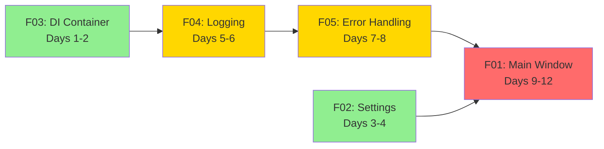
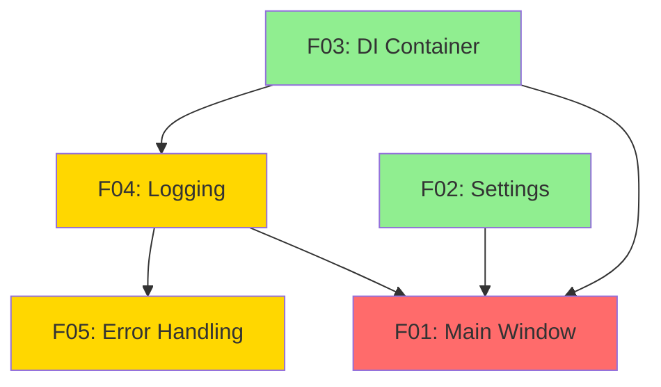

# Epic E01: Application Framework - Documentation Index

**Status**: ✅ Auto-Split Complete
**Date**: 2025-12-28
**Total Features**: 5
**Total LOC**: ~1,400
**Estimated Duration**: 11-15 days

---

## Quick Navigation

### 📋 Overview Documents
- [Auto-Split Summary](./AUTO-SPLIT-SUMMARY.md) - Process overview and results
- [Epic Specification](./E01.spec.md) - Complete epic specification
- [Complexity Analysis](./complexity-analysis.md) - Granularity analysis results
- [Parallelization Report](./E01-parallelization.md) - Dependency graph and execution plan

### 🔧 Feature Specifications

| ID | Feature | LOC | Tasks | Spec | Pre-Docs | Status |
|----|---------|-----|-------|------|----------|--------|
| **F01** | Main Window & Navigation | ~400 | 6 | [Spec](./F01/F01.spec.md) | [Pre-Docs](./F01/F01-pre-docs.md) | ✅ Optimal |
| **F02** | Settings Management | ~350 | 6 | [Spec](./F02/F02.spec.md) | [Pre-Docs](./F02/F02-pre-docs.md) | ✅ Optimal |
| **F03** | DI Container | ~200 | 5 | [Spec](./F03/F03.spec.md) | [Pre-Docs](./F03/F03-pre-docs.md) | ✅ Optimal |
| **F04** | Logging Infrastructure | ~250 | 6 | [Spec](./F04/F04.spec.md) | [Pre-Docs](./F04/F04-pre-docs.md) | ✅ Optimal |
| **F05** | Error Handling | ~200 | 6 | [Spec](./F05/F05.spec.md) | [Pre-Docs](./F05/F05-pre-docs.md) | ✅ Optimal |

---

## Implementation Roadmap

### Recommended Order (Single Developer)



### Wave-Based Approach

**Wave 1: Foundation** (Days 1-4)
- F03: DI Container
- F02: Settings Management

**Wave 2: Infrastructure** (Days 5-6)
- F04: Logging Infrastructure

**Wave 3: Error Handling** (Days 7-8)
- F05: Error Handling

**Wave 4: UI Integration** (Days 9-12)
- F01: Main Window & Navigation

---

## Feature Summaries

### F01: Main Window & Navigation
**Purpose**: Core application window with sidebar navigation

**Components**:
- `MainWindow` - QMainWindow with stacked widget
- `NavigationBar` - Custom navigation widget
- `StatusBar` - Connection and status indicators

**Key Dependencies**: F02 (Settings), F03 (DI Container), F04 (Logging)

**[View Spec](./F01/F01.spec.md)** | **[View Pre-Docs](./F01/F01-pre-docs.md)**

---

### F02: Settings Management
**Purpose**: Persistent application settings with encryption

**Components**:
- `SettingsService` - QSettings wrapper
- `EncryptionService` - Credential encryption
- `SettingsSchema` - Centralized settings definitions

**Key Dependencies**: None (foundation)

**[View Spec](./F02/F02.spec.md)** | **[View Pre-Docs](./F02/F02-pre-docs.md)**

---

### F03: Dependency Injection Container
**Purpose**: Lightweight DI for testability

**Components**:
- `Container` - Service registration and resolution
- `Lifetime` - Singleton and transient support
- `Bootstrap` - Application service registration

**Key Dependencies**: None (foundation)

**[View Spec](./F03/F03.spec.md)** | **[View Pre-Docs](./F03/F03-pre-docs.md)**

---

### F04: Logging Infrastructure
**Purpose**: Structured logging with file rotation

**Components**:
- `Logger` - Logging interface with level methods
- `JsonFormatter` - Structured JSON logs
- `TextFormatter` - Human-readable console logs
- Qt message handler integration

**Key Dependencies**: F03 (DI Container)

**[View Spec](./F04/F04.spec.md)** | **[View Pre-Docs](./F04/F04-pre-docs.md)**

---

### F05: Error Handling
**Purpose**: Centralized error handling with user-friendly messages

**Components**:
- Exception hierarchy (`ApplicationError`, `ValidationError`, etc.)
- `ErrorHandler` - Central error handling service
- Error dialogs
- Global exception hook

**Key Dependencies**: F04 (Logging)

**[View Spec](./F05/F05.spec.md)** | **[View Pre-Docs](./F05/F05-pre-docs.md)**

---

## Dependency Graph



**Legend**:
- 🟢 Green: Wave 1 (no dependencies)
- 🟡 Yellow: Wave 2 (one level)
- 🔴 Red: Wave 3+ (multiple levels)

---

## File Structure

```
E01/
├── README.md                        # This file
├── AUTO-SPLIT-SUMMARY.md            # Auto-split process summary
├── E01.spec.md                      # Epic specification
├── complexity-analysis.md           # Complexity analysis
├── E01-parallelization.md           # Parallelization strategy
│
├── F01/                             # Main Window & Navigation
│   ├── F01.spec.md                  # Feature specification
│   └── F01-pre-docs.md              # Implementation guide
│
├── F02/                             # Settings Management
│   ├── F02.spec.md
│   └── F02-pre-docs.md
│
├── F03/                             # DI Container
│   ├── F03.spec.md
│   └── F03-pre-docs.md
│
├── F04/                             # Logging Infrastructure
│   ├── F04.spec.md
│   └── F04-pre-docs.md
│
└── F05/                             # Error Handling
    ├── F05.spec.md
    └── F05-pre-docs.md
```

**Total**: 15 documentation files

---

## Key Metrics

| Metric | Value |
|--------|-------|
| Total Features | 5 |
| Total Tasks | 29 |
| Total Estimated LOC | ~1,400 |
| Single Dev Duration | 12 days |
| Two Dev Duration | 10 days |
| Test Coverage Target | > 80% |
| Complexity | Low-Medium |

---

## Next Steps

### 1. Review Phase
- [ ] Review all feature specs
- [ ] Review all pre-docs
- [ ] Confirm implementation order

### 2. Setup Phase
- [ ] Create project structure with Poetry
- [ ] Set up git feature branches
- [ ] Configure CI/CD pipeline
- [ ] Install dependencies (PySide6, cryptography, pytest)
- [ ] Configure linting (ruff, mypy)

### 3. Implementation Phase
- [ ] **Wave 1**: Implement F03 + F02 (Days 1-4)
- [ ] **Wave 2**: Implement F04 (Days 5-6)
- [ ] **Wave 3**: Implement F05 (Days 7-8)
- [ ] **Wave 4**: Implement F01 (Days 9-12)

### 4. Testing Phase
- [ ] Unit tests (> 80% coverage per feature)
- [ ] Integration tests
- [ ] End-to-end tests
- [ ] Cross-platform testing

---

## Success Criteria

Epic E01 is complete when:

✅ All 5 features implemented with passing tests
✅ Test coverage > 80%
✅ Application launches without errors
✅ Settings persist across restarts
✅ Errors caught and displayed
✅ Logs written with rotation
✅ Navigation works correctly
✅ Cross-platform compatibility verified

---

## Documentation Guide

### For Developers

**Starting a new feature?**
1. Read the feature spec (e.g., `F03/F03.spec.md`)
2. Review the pre-docs (e.g., `F03/F03-pre-docs.md`)
3. Check dependencies in parallelization report
4. Create feature branch: `git checkout -b feature/E01-F03`
5. Implement following TDD approach in spec

**Need to understand dependencies?**
- See [Parallelization Report](./E01-parallelization.md)
- Check dependency graph (above)
- Review task-level dependencies in pre-docs

**Want to see the big picture?**
- Read [Epic Specification](./E01.spec.md)
- Review [Auto-Split Summary](./AUTO-SPLIT-SUMMARY.md)

### For Project Managers

**Tracking progress?**
- Use the 5 features as milestones
- Track by wave completion (4 waves total)
- Monitor test coverage per feature

**Resource planning?**
- Single developer: 12 days sequential
- Two developers: 10 days with limited parallelization
- See [Parallelization Report](./E01-parallelization.md) for details

---

## Contact & Support

For questions about this epic:
- Review the comprehensive [Pre-Docs](./F01/F01-pre-docs.md) for implementation details
- Check [Parallelization Report](./E01-parallelization.md) for dependencies
- Refer to [Epic Specification](./E01.spec.md) for requirements

---

**Last Updated**: 2025-12-28
**Auto-Split Status**: ✅ Complete
**Ready for Implementation**: ✅ Yes
