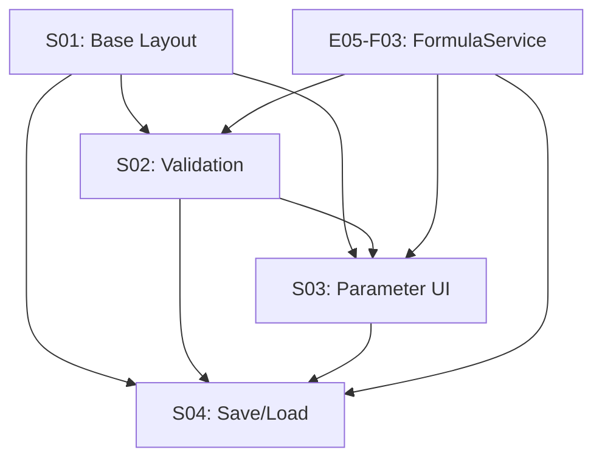

# E05-F04-T01 Split Context

## Split Summary

**Task**: E05-F04-T01 - Create FormulaEditorWidget
**Split Date**: 2025-12-28
**Subtasks Created**: 4

## Subtask Breakdown

| ID | Title | Effort | Dependencies |
|----|-------|--------|--------------|
| S01 | Create base widget layout and editor component | M | None |
| S02 | Integrate real-time validation with FormulaService | M | S01, E05-F03 |
| S03 | Add parameter editor UI | M | S01, S02 |
| S04 | Implement save/load formula functionality | S | S01, S02, S03 |

## Dependency Graph

## Execution Order

### Wave 1 (Parallel: No)
- **S01**: Create base widget layout and editor component
  - Foundation subtask, no dependencies

### Wave 2 (Parallel: No)
- **S02**: Integrate real-time validation with FormulaService
  - Requires S01 base layout
  - Requires E05-F03 FormulaService

### Wave 3 (Parallel: No)
- **S03**: Add parameter editor UI
  - Requires S01 layout for integration
  - Requires S02 validation to trigger parameter extraction

### Wave 4 (Parallel: No)
- **S04**: Implement save/load formula functionality
  - Requires all previous subtasks
  - Final integration subtask

## Split Rationale

The task was split following the natural layers of the widget:

1. **S01 (Layout)**: Establishes the foundational UI structure that all other components build upon. This must be completed first.

2. **S02 (Validation)**: Adds the core functionality of real-time validation. Depends on the editor existing (S01) and FormulaService being available (E05-F03).

3. **S03 (Parameters)**: Adds the dynamic parameter panel. Depends on validation (S02) to trigger parameter extraction after a valid formula is entered.

4. **S04 (Persistence)**: Adds save/load functionality. Depends on all previous subtasks as it needs to persist both the formula expression and parameter values.

## Files Affected

- `libs/ui/formula/editor_widget.py` - Main widget implementation
- `libs/ui/formula/parameter_panel.py` - Parameter editor panel (optional separate file)

## Notes

- All subtasks are sequential due to tight coupling
- Each subtask builds on the previous one's implementation
- External dependency on E05-F03 (FormulaService) is critical path
