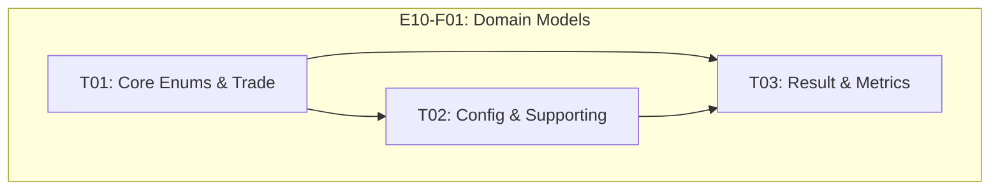

# Feature E10-F01: Domain Models

## Metadata

| Field | Value |
|-------|-------|
| Feature ID | E10-F01 |
| clickup_task_id | |
| Title | Domain Models |
| Epic | E10 (Backtesting) |
| Status | Draft |
| Complexity | M (200-400 LOC) |
| Dependencies | E09 (Strategy) |
| Internal Dependencies | None (foundation layer) |
| Parallel Group | Wave 1 |
| PRD Sections | 5.5.1, 5.5.2 |

---

## 1. Overview

### 1.1 Purpose

Provide all data structures and domain models required for backtesting functionality. This feature establishes the foundation layer that all other E10 features depend on.

### 1.2 Goals

1. **Type-Safe Configuration**: BacktestConfig with validated parameters
2. **Comprehensive Results**: BacktestResult as aggregate root for all backtest output
3. **Performance Metrics**: PerformanceMetrics with risk-adjusted ratios and trade statistics
4. **Trade Tracking**: Trade entity with entry/exit, P&L, and cost tracking

---

## 2. Domain Model

### 2.1 BacktestConfig (PRD 5.5.1)

```python
@dataclass
class BacktestConfig:
    """Backtest configuration parameters"""
    strategy: Strategy           # From E09
    symbols: list[str]          # Stock symbols to trade
    start_date: date            # Backtest start date
    end_date: date              # Backtest end date
    initial_capital: Decimal    # Starting capital (default: 100,000,000 KRW)
    commission_pct: float       # Commission percentage (default: 0.015%)
    slippage_pct: float         # Slippage percentage (default: 0.05%)
    timeframe: str              # Candle timeframe (default: "1d")
```

### 2.2 BacktestResult

```python
@dataclass
class BacktestResult:
    """Complete backtest results (aggregate root)"""
    id: str                          # Unique result ID
    config: BacktestConfig           # Configuration used
    metrics: PerformanceMetrics      # Calculated performance metrics
    equity_curve: list[EquityPoint]  # Daily equity points
    trades: list[Trade]              # All executed trades
    daily_returns: list[DailyReturn] # Daily return series
    execution_time_ms: float         # Engine execution time
    created_at: datetime             # Result creation timestamp
```

### 2.3 PerformanceMetrics (PRD 5.5.2)

```python
@dataclass
class PerformanceMetrics:
    """Key performance metrics"""
    # Returns
    total_return_pct: float          # Total return percentage
    cagr: float                      # Compound annual growth rate

    # Risk-adjusted
    sharpe_ratio: float              # Sharpe ratio (annualized)
    sortino_ratio: float             # Sortino ratio (downside risk)
    calmar_ratio: float              # Calmar ratio (CAGR/MDD)

    # Drawdown
    max_drawdown_pct: float          # Maximum drawdown percentage
    avg_drawdown_pct: float          # Average drawdown percentage
    max_drawdown_duration_days: int  # Longest drawdown period

    # Trade statistics
    total_trades: int                # Total number of trades
    winning_trades: int              # Number of winning trades
    losing_trades: int               # Number of losing trades
    win_rate: float                  # Win rate percentage
    profit_factor: float             # Gross profit / Gross loss
    avg_win: float                   # Average winning trade P&L %
    avg_loss: float                  # Average losing trade P&L %
    largest_win: float               # Largest winning trade %
    largest_loss: float              # Largest losing trade %
    avg_holding_days: float          # Average holding period

    # Final values
    final_equity: Decimal            # Final portfolio value
    final_cash: Decimal              # Final cash balance
```

### 2.4 Supporting Entities

```python
@dataclass
class EquityPoint:
    """Point on equity curve"""
    date: date
    equity: Decimal
    cash: Decimal
    positions_value: Decimal
    drawdown_pct: float

@dataclass
class DailyReturn:
    """Daily return data"""
    date: date
    return_pct: float
    cumulative_return_pct: float

@dataclass
class Trade:
    """A completed trade"""
    id: str
    symbol: str
    symbol_name: str
    side: TradeSide
    entry_date: date
    entry_price: Decimal
    entry_quantity: int
    exit_date: Optional[date]
    exit_price: Optional[Decimal]
    exit_reason: Optional[ExitReason]
    pnl: Optional[Decimal]
    pnl_pct: Optional[float]
    holding_days: Optional[int]
    commission: Decimal
    slippage: Decimal

    @property
    def is_winner(self) -> bool: ...

    @property
    def net_pnl(self) -> Decimal: ...

class TradeSide(Enum):
    LONG = "long"
    SHORT = "short"

class ExitReason(Enum):
    SIGNAL = "signal"
    STOP_LOSS = "stop_loss"
    TAKE_PROFIT = "take_profit"
    TIMEOUT = "timeout"
    DAILY_LIMIT = "daily_limit"
```

---

## 3. Key Components

| Component | Description |
|-----------|-------------|
| `BacktestConfig` | Configuration dataclass with validation |
| `BacktestResult` | Aggregate root for backtest output |
| `PerformanceMetrics` | Statistical metrics dataclass |
| `Trade` | Trade entity with computed properties |
| `EquityPoint` | Equity curve data point |
| `DailyReturn` | Daily return record |
| `TradeSide` | Long/Short enum |
| `ExitReason` | Exit reason enum |

---

## 4. Acceptance Criteria

### 4.1 BacktestConfig

- [ ] All required fields present and typed
- [ ] Default values for optional parameters
- [ ] Validation for date range (start < end)
- [ ] Validation for positive capital amount
- [ ] Validation for commission/slippage percentages (0-100)

### 4.2 BacktestResult

- [ ] Unique ID generation
- [ ] All fields properly typed
- [ ] Serialization to JSON/dict for persistence
- [ ] Deserialization from stored data

### 4.3 PerformanceMetrics

- [ ] All metric fields present and typed
- [ ] Zero-handling for edge cases (no trades, zero drawdown)

### 4.4 Trade Entity

- [ ] `is_winner` property correctly identifies winning trades
- [ ] `net_pnl` subtracts commission and slippage
- [ ] Enum values for TradeSide and ExitReason

### 4.5 Testing

- [ ] Unit tests for each dataclass
- [ ] Validation tests for BacktestConfig
- [ ] Computed property tests for Trade
- [ ] Serialization roundtrip tests
- [ ] Test coverage > 90%

---

## 5. Technical Notes

### 5.1 Design Decisions

| Decision | Choice | Reason |
|----------|--------|--------|
| Data structure | Python dataclass | Type safety, immutability, auto-generated methods |
| Monetary values | Decimal | Precision for financial calculations |
| Dates | datetime.date | Standard library, timezone-naive for simplicity |

### 5.2 Files to Create

- `libs/core/src/backtesting/domain/config.py`
- `libs/core/src/backtesting/domain/result.py`
- `libs/core/src/backtesting/domain/metrics.py`
- `libs/core/src/backtesting/domain/trade.py`
- `libs/core/src/backtesting/domain/__init__.py`

---

## 6. Tasks

| Task ID | Title | Effort | Dependencies | Description |
|---------|-------|--------|--------------|-------------|
| [E10-F01-T01](T01/E10-F01-T01.spec.md) | Core Enums and Trade Entity | S | None | TradeSide, ExitReason enums and Trade dataclass |
| [E10-F01-T02](T02/E10-F01-T02.spec.md) | Config and Supporting Models | S | T01 | BacktestConfig, EquityPoint, DailyReturn |
| [E10-F01-T03](T03/E10-F01-T03.spec.md) | BacktestResult and PerformanceMetrics | M | T01, T02 | Aggregate root and comprehensive metrics |

### Task Dependency Graph



### Parallelization

- **Sequential**: T01 first (foundation enums)
- **Parallel**: T02 and T03 can overlap after T01
- **Integration**: T03 imports from T01 and T02

---

## 7. References

- PRD Section 5.5.1: Backtesting Configuration
- PRD Section 5.5.2: Performance Metrics
- E09: Strategy Builder (Strategy entity)
