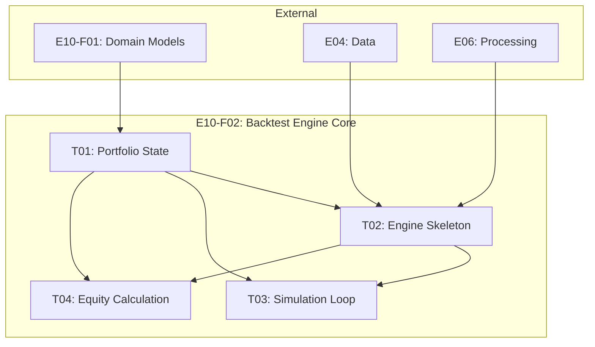

# Feature E10-F02: Backtest Engine Core

## Metadata

| Field | Value |
|-------|-------|
| Feature ID | E10-F02 |
| Title | Backtest Engine Core |
| Epic | E10 (Backtesting) |
| Status | Draft |
| Complexity | L (500-600 LOC) |
| Dependencies | E04 (Data), E06 (Processing), E09 (Strategy) |
| Internal Dependencies | E10-F01 (Domain Models) |
| Parallel Group | Wave 2 |
| PRD Sections | 5.5 |

---

## 1. Overview

### 1.1 Purpose

Implement the core simulation engine that executes backtests by iterating through historical trading days, managing portfolio state, and coordinating with external services for data and signal evaluation.

### 1.2 Goals

1. **Accurate Simulation**: Realistic trade execution with slippage and commission
2. **Fast Execution**: 1 year backtest in < 5 seconds
3. **Memory Efficient**: < 500MB memory usage during backtest
4. **Progress Tracking**: Callback support for UI progress updates

---

## 2. Architecture

### 2.1 Engine Design

```
┌─────────────────────────────────────────────────────────────────────────┐
│                           BacktestEngine                                 │
├─────────────────────────────────────────────────────────────────────────┤
│                                                                          │
│  ┌─────────────┐    ┌─────────────┐    ┌─────────────┐    ┌──────────┐ │
│  │  Data       │───►│  Signal     │───►│  Order      │───►│  Metrics │ │
│  │  Feed       │    │  Generator  │    │  Executor   │    │  Calc    │ │
│  │             │    │             │    │             │    │          │ │
│  │  OHLCV      │    │  Entry/Exit │    │  Simulate   │    │  Sharpe, │ │
│  │  Stream     │    │  Signals    │    │  Fills      │    │  DD, etc │ │
│  └─────────────┘    └─────────────┘    └─────────────┘    └──────────┘ │
│                            │                   │                        │
│                            ▼                   ▼                        │
│                     ┌─────────────┐    ┌─────────────┐                 │
│                     │  Position   │◄───│  Portfolio  │                 │
│                     │  Manager    │    │  Tracker    │                 │
│                     └─────────────┘    └─────────────┘                 │
│                                                                          │
└─────────────────────────────────────────────────────────────────────────┘
```

### 2.2 Simulation Loop

```python
for each day in date_range:
    for each symbol in universe:
        candle = get_candle(symbol, day)

        # Check exits first (priority)
        for position in open_positions[symbol]:
            if should_exit(position, candle, strategy):
                close_position(position, candle)

        # Check entries
        if not has_position(symbol):
            if should_enter(symbol, candle, strategy):
                open_position(symbol, candle)

    # End of day processing
    update_portfolio_value(day)
    check_daily_limits()
```

---

## 3. Core Components

### 3.1 BacktestEngine Class

```python
class BacktestEngine:
    """Core backtesting engine"""

    def __init__(
        self,
        candle_repo: ICandleRepository,  # From E04
        formula_service: FormulaService   # From E06
    ): ...

    async def run(
        self,
        config: BacktestConfig,
        progress_callback: Callable[[int, int], None] = None
    ) -> BacktestResult: ...
```

### 3.2 Portfolio State

```python
@dataclass
class Portfolio:
    """Internal portfolio state during simulation"""
    cash: Decimal
    positions: dict[str, Position]

@dataclass
class Position:
    """Open position during simulation"""
    symbol: str
    quantity: int
    entry_price: Decimal
    entry_date: date
    side: TradeSide
```

### 3.3 Key Methods

| Method | Description |
|--------|-------------|
| `run()` | Main entry point - runs complete backtest |
| `_load_data()` | Bulk load candle data for all symbols |
| `_get_trading_days()` | Get list of trading days in range |
| `_get_candle_at()` | Get candle data for symbol at date |
| `_calculate_equity()` | Calculate total portfolio value |
| `_calculate_drawdown()` | Calculate current drawdown |

---

## 4. Acceptance Criteria

### 4.1 Simulation Accuracy

- [ ] Simulation loop processes all trading days in order
- [ ] Portfolio state (cash, positions) tracked correctly
- [ ] Open positions closed at end of backtest (TIMEOUT reason)
- [ ] Commission calculated on both entry and exit
- [ ] Slippage applied to execution prices

### 4.2 Performance

- [ ] 1 year backtest (252 trading days) completes in < 5 seconds
- [ ] Memory usage stays below 500MB during execution
- [ ] Data loaded in bulk for efficiency (not per-candle)

### 4.3 Integration

- [ ] Uses ICandleRepository for historical data
- [ ] Uses FormulaService for signal evaluation
- [ ] Returns properly populated BacktestResult

### 4.4 Progress Tracking

- [ ] Progress callback called with (current_day, total_days)
- [ ] Callback optional - engine works without it

### 4.5 Testing

- [ ] Unit tests for portfolio state management
- [ ] Integration tests with mock repositories
- [ ] Performance benchmark tests
- [ ] Test coverage > 85%

---

## 5. Technical Notes

### 5.1 Design Decisions

| Decision | Choice | Reason |
|----------|--------|--------|
| Data loading | Bulk upfront | Avoid I/O during simulation loop |
| Loop order | Exit before entry | Prevent same-day reversal conflicts |
| Progress | Callback pattern | Decouples engine from UI |
| State | Mutable Portfolio | Performance over immutability |

### 5.2 Performance Optimizations

- Pre-load all candle data into memory
- Use pandas DataFrame for efficient time-series operations
- Avoid object creation in hot path
- Use dict for O(1) position lookup

### 5.3 Files to Create

- `libs/core/src/backtesting/engine/backtest_engine.py`
- `libs/core/src/backtesting/engine/portfolio.py`
- `libs/core/src/backtesting/engine/__init__.py`

---

## 6. Dependencies

### 6.1 External

| Dependency | Interface | From |
|------------|-----------|------|
| `ICandleRepository` | Historical candle data | E04 (Data) |
| `FormulaService` | Formula evaluation | E06 (Processing) |
| `Strategy` | Entry/exit rules | E09 (Strategy) |

### 6.2 Internal

| Dependency | Provides |
|------------|----------|
| E10-F01 | BacktestConfig, BacktestResult, Trade, Position |

---

## 7. Tasks

| Task ID | Title | Effort | Dependencies | Description |
|---------|-------|--------|--------------|-------------|
| [E10-F02-T01](T01/E10-F02-T01.spec.md) | Portfolio State Management | M | E10-F01 | Portfolio and Position classes for simulation state |
| [E10-F02-T02](T02/E10-F02-T02.spec.md) | BacktestEngine Skeleton and Data Loading | M | T01, E04, E06 | Engine class with DI and data loading methods |
| [E10-F02-T03](T03/E10-F02-T03.spec.md) | Simulation Loop Implementation | L | T01, T02 | Core simulation loop with slippage/commission |
| [E10-F02-T04](T04/E10-F02-T04.spec.md) | Equity and Drawdown Calculation | S | T01, T02 | Equity, drawdown, and daily returns calculation |

### Task Dependency Graph



### Parallelization

- **Parallel**: T01 can start immediately (only needs F01)
- **Sequential**: T02 requires T01 completion
- **Parallel**: T03 and T04 can be developed in parallel after T02

---

## 8. References

- PRD Section 5.5: Backtesting
- E04: Data Collection
- E06: Processing Engine
- E09: Strategy Builder
