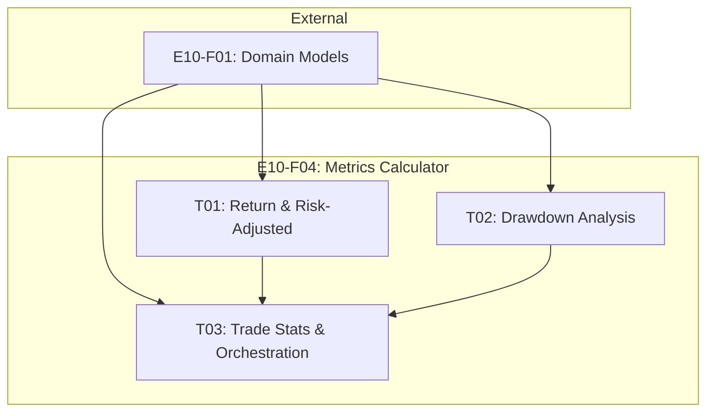

# Spec: E10-F04 - Metrics Calculator

---
# ============================================================================
# SPEC METADATA
# ============================================================================

# === IDENTIFICATION ===
id: E10-F04
clickup_task_id: ''
title: Metrics Calculator
type: feature

# === HIERARCHY ===
parent: E10
children: [E10-F04-T01, E10-F04-T02, E10-F04-T03]
epic: E10
feature: F04
domain: backtesting

# === WORKFLOW ===
status: draft
priority: high

# === TRACKING ===
created: '2025-12-30'
updated: '2025-12-30'
due_date: ''
estimated_hours: 32
actual_hours: 0

# === METADATA ===
tags: [backtesting, metrics, sharpe, sortino, drawdown, performance]
effort: large
risk: low
---

**Status**: Draft
**Type**: Feature
**Parent**: [E10 - Backtesting](../E10.spec.md)
**Created**: 2025-12-30
**Updated**: 2025-12-30

## 1. Overview

### 1.1 Purpose

Calculate comprehensive performance metrics from backtest results. This feature computes risk-adjusted ratios, drawdown analysis, and trade statistics that help evaluate strategy performance.

### 1.2 Goals

1. **Risk-Adjusted Metrics**: Sharpe, Sortino, Calmar ratios
2. **Drawdown Analysis**: Max, average, duration
3. **Trade Statistics**: Win rate, profit factor, average win/loss
4. **Return Metrics**: Total return, CAGR

---

## 2. Metrics Categories

### 2.1 Return Metrics

| Metric | Formula | Description |
|--------|---------|-------------|
| Total Return | `(final - initial) / initial * 100` | Overall percentage return |
| CAGR | `(final/initial)^(1/years) - 1` | Compound annual growth rate |

### 2.2 Risk-Adjusted Metrics

| Metric | Formula | Description |
|--------|---------|-------------|
| Sharpe Ratio | `(avg_return * 252) / (std_return * sqrt(252))` | Risk-adjusted return (annualized) |
| Sortino Ratio | `(avg_return * 252) / (downside_std * sqrt(252))` | Uses only downside deviation |
| Calmar Ratio | `CAGR / abs(max_drawdown)` | Return relative to drawdown |

### 2.3 Drawdown Metrics

| Metric | Formula | Description |
|--------|---------|-------------|
| Max Drawdown | `min((equity - peak) / peak)` | Largest peak-to-trough decline |
| Avg Drawdown | `mean(drawdown_series < 0)` | Average during drawdown periods |
| Max Duration | `max(days_in_drawdown)` | Longest recovery period |

### 2.4 Trade Statistics

| Metric | Formula | Description |
|--------|---------|-------------|
| Win Rate | `winners / total * 100` | Percentage of winning trades |
| Profit Factor | `gross_profit / gross_loss` | Ratio of profits to losses |
| Avg Win | `mean(winner_pnl_pct)` | Average winning trade % |
| Avg Loss | `mean(loser_pnl_pct)` | Average losing trade % |
| Avg Holding | `mean(holding_days)` | Average position duration |

---

## 3. Core Implementation

### 3.1 MetricsCalculator Class

```python
class MetricsCalculator:
    """Calculate performance metrics from backtest results"""

    def calculate(
        self,
        trades: list[Trade],
        equity_curve: list[EquityPoint],
        daily_returns: list[DailyReturn],
        initial_capital: Decimal
    ) -> PerformanceMetrics:
        """Calculate all metrics from backtest data"""
        # Categorize trades
        winners = [t for t in trades if t.is_winner]
        losers = [t for t in trades if t.pnl and t.pnl < 0]

        # Calculate returns
        final_equity = equity_curve[-1].equity if equity_curve else initial_capital
        total_return = self._calc_total_return(initial_capital, final_equity)
        cagr = self._calc_cagr(initial_capital, final_equity, len(equity_curve))

        # Calculate risk metrics
        returns = [d.return_pct for d in daily_returns]
        sharpe = self._calc_sharpe(returns)
        sortino = self._calc_sortino(returns)

        # Calculate drawdown
        max_dd = self._calc_max_drawdown(equity_curve)
        avg_dd = self._calc_avg_drawdown(equity_curve)
        dd_duration = self._calc_dd_duration(equity_curve)

        # Calmar ratio
        calmar = cagr / abs(max_dd) if max_dd != 0 else 0

        # Trade statistics
        win_rate = len(winners) / len(trades) * 100 if trades else 0
        profit_factor = self._calc_profit_factor(winners, losers)

        return PerformanceMetrics(
            total_return_pct=total_return,
            cagr=cagr,
            sharpe_ratio=sharpe,
            sortino_ratio=sortino,
            calmar_ratio=calmar,
            max_drawdown_pct=max_dd,
            avg_drawdown_pct=avg_dd,
            max_drawdown_duration_days=dd_duration,
            total_trades=len(trades),
            winning_trades=len(winners),
            losing_trades=len(losers),
            win_rate=win_rate,
            profit_factor=profit_factor,
            avg_win=self._calc_avg_pnl(winners),
            avg_loss=self._calc_avg_pnl(losers),
            largest_win=max((t.pnl_pct or 0) for t in trades) if trades else 0,
            largest_loss=min((t.pnl_pct or 0) for t in trades) if trades else 0,
            avg_holding_days=self._calc_avg_holding(trades),
            final_equity=final_equity,
            final_cash=equity_curve[-1].cash if equity_curve else initial_capital
        )
```

### 3.2 Sharpe Ratio Calculation

```python
def _calc_sharpe(self, returns: list[float]) -> float:
    """Calculate annualized Sharpe ratio (risk-free rate = 0)"""
    if not returns or len(returns) < 2:
        return 0.0

    avg_return = np.mean(returns)
    std_return = np.std(returns, ddof=1)  # Sample std dev

    if std_return == 0:
        return 0.0

    # Annualize: multiply avg by 252, std by sqrt(252)
    annualized_return = avg_return * 252
    annualized_std = std_return * np.sqrt(252)

    return annualized_return / annualized_std
```

### 3.3 Sortino Ratio Calculation

```python
def _calc_sortino(self, returns: list[float]) -> float:
    """Calculate Sortino ratio (downside deviation only)"""
    if not returns or len(returns) < 2:
        return 0.0

    avg_return = np.mean(returns)

    # Only negative returns for downside deviation
    negative_returns = [r for r in returns if r < 0]
    if not negative_returns:
        return float('inf') if avg_return > 0 else 0.0

    downside_std = np.std(negative_returns, ddof=1)

    if downside_std == 0:
        return 0.0

    annualized_return = avg_return * 252
    annualized_downside = downside_std * np.sqrt(252)

    return annualized_return / annualized_downside
```

### 3.4 Drawdown Calculations

```python
def _calc_max_drawdown(self, equity_curve: list[EquityPoint]) -> float:
    """Calculate maximum drawdown percentage"""
    if not equity_curve:
        return 0.0

    peak = equity_curve[0].equity
    max_dd = 0.0

    for point in equity_curve:
        if point.equity > peak:
            peak = point.equity

        dd = float((point.equity - peak) / peak) * 100
        if dd < max_dd:
            max_dd = dd

    return max_dd

def _calc_dd_duration(self, equity_curve: list[EquityPoint]) -> int:
    """Calculate maximum drawdown duration in days"""
    if not equity_curve:
        return 0

    peak = equity_curve[0].equity
    peak_date = equity_curve[0].date
    max_duration = 0
    current_duration = 0

    for point in equity_curve:
        if point.equity >= peak:
            # New peak - reset
            peak = point.equity
            peak_date = point.date
            current_duration = 0
        else:
            # Still in drawdown
            current_duration = (point.date - peak_date).days
            if current_duration > max_duration:
                max_duration = current_duration

    return max_duration
```

### 3.5 Profit Factor Calculation

```python
def _calc_profit_factor(
    self,
    winners: list[Trade],
    losers: list[Trade]
) -> float:
    """Calculate profit factor (gross profit / gross loss)"""
    gross_profit = sum(t.pnl for t in winners if t.pnl) or Decimal(0)
    gross_loss = abs(sum(t.pnl for t in losers if t.pnl)) or Decimal(1)

    if gross_loss == 0:
        return float('inf') if gross_profit > 0 else 0.0

    return float(gross_profit / gross_loss)
```

---

## 4. Key Methods

| Method | Description |
|--------|-------------|
| `calculate()` | Main entry - compute all metrics |
| `_calc_sharpe()` | Annualized Sharpe ratio |
| `_calc_sortino()` | Sortino ratio (downside only) |
| `_calc_max_drawdown()` | Maximum peak-to-trough decline |
| `_calc_dd_duration()` | Longest drawdown period |
| `_calc_profit_factor()` | Gross profit / loss ratio |
| `_calc_cagr()` | Compound annual growth rate |

---

## 5. Acceptance Criteria

### 5.1 Return Metrics

- [ ] Total return percentage calculated correctly
- [ ] CAGR formula handles fractional years
- [ ] Edge case: zero initial capital handled

### 5.2 Risk-Adjusted Metrics

- [ ] Sharpe ratio correctly annualized (x252 return, x sqrt(252) std)
- [ ] Sortino ratio uses only negative returns for downside
- [ ] Calmar ratio handles zero drawdown case
- [ ] Zero std deviation returns zero (not division error)

### 5.3 Drawdown Metrics

- [ ] Max drawdown tracks peak correctly
- [ ] Average drawdown excludes non-drawdown periods
- [ ] Duration counts calendar days correctly
- [ ] Empty equity curve returns zero values

### 5.4 Trade Statistics

- [ ] Win rate as percentage (0-100)
- [ ] Profit factor handles all-winners/all-losers cases
- [ ] Average win/loss calculated from pnl_pct
- [ ] Holding days averaged correctly

### 5.5 Testing

- [ ] Mathematical correctness tests against known values
- [ ] Edge case tests (empty data, single trade, all winners)
- [ ] Reference comparison with standard financial libraries
- [ ] Test coverage > 90%

---

## 6. Technical Notes

### 6.1 Design Decisions

| Decision | Choice | Reason |
|----------|--------|--------|
| Risk-free rate | 0% | Standard for Korean market backtests |
| Annualization | 252 days | Trading days per year |
| Std dev | ddof=1 | Sample standard deviation |
| Precision | float | Sufficient for metrics display |

### 6.2 Mathematical References

- Sharpe Ratio: `(R_p - R_f) / sigma_p` (annualized)
- Sortino Ratio: `(R_p - R_f) / sigma_d` (downside deviation)
- Calmar Ratio: `CAGR / |Max Drawdown|`

### 6.3 Files to Create

- `libs/core/src/backtesting/metrics/calculator.py`
- `libs/core/src/backtesting/metrics/__init__.py`

---

## 7. Dependencies

### 7.1 External

| Dependency | Interface | From |
|------------|-----------|------|
| numpy | Statistical calculations | Third-party |

### 7.2 Internal

| Dependency | Provides |
|------------|----------|
| E10-F01 | Trade, EquityPoint, DailyReturn, PerformanceMetrics |

---

## 8. Tasks

| Task ID | Title | Effort | Dependencies | Description |
|---------|-------|--------|--------------|-------------|
| [E10-F04-T01](T01/E10-F04-T01.spec.md) | Return and Risk-Adjusted Metrics | M | E10-F01 | Total return, CAGR, Sharpe, Sortino calculations |
| [E10-F04-T02](T02/E10-F04-T02.spec.md) | Drawdown Analysis | M | E10-F01 | Max drawdown, average drawdown, duration |
| [E10-F04-T03](T03/E10-F04-T03.spec.md) | Trade Statistics and Orchestration | M | T01, T02, E10-F01 | Win rate, profit factor, calculate() orchestrator |

### Task Dependency Graph



### Parallelization

- **Parallel**: T01 and T02 can be implemented in parallel (independent calculations)
- **Sequential**: T03 depends on T01 and T02 completion

---

## 9. References

- PRD Section 5.5.2: Performance Metrics
- [Sharpe Ratio - Wikipedia](https://en.wikipedia.org/wiki/Sharpe_ratio)
- [Sortino Ratio - Wikipedia](https://en.wikipedia.org/wiki/Sortino_ratio)
- [Calmar Ratio - Investopedia](https://www.investopedia.com/terms/c/calmarratio.asp)

---
*Template Version: 2.0.0 - Enhanced with Speckit features*
