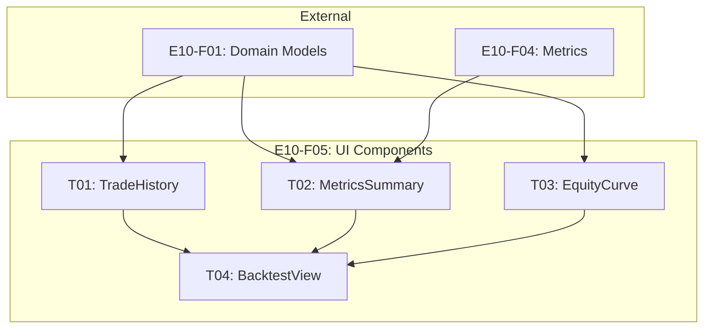

# Spec: E10-F05 - UI Components

---
# ============================================================================
# SPEC METADATA
# ============================================================================

# === IDENTIFICATION ===
id: E10-F05
clickup_task_id: ''
title: UI Components
type: feature

# === HIERARCHY ===
parent: E10
children: [E10-F05-T01, E10-F05-T02, E10-F05-T03, E10-F05-T04]
epic: E10
feature: F05
domain: backtesting

# === WORKFLOW ===
status: draft
priority: medium

# === TRACKING ===
created: '2025-12-30'
updated: '2025-12-30'
due_date: ''
estimated_hours: 40
actual_hours: 0

# === METADATA ===
tags: [backtesting, ui, qt, charts, widgets]
effort: large
risk: medium
---

**Status**: Draft
**Type**: Feature
**Parent**: [E10 - Backtesting](../E10.spec.md)
**Created**: 2025-12-30
**Updated**: 2025-12-30

## 1. Overview

### 1.1 Purpose

Provide Qt-based UI widgets for backtest configuration, execution monitoring, and results visualization. Users can configure backtests, run them with progress feedback, and analyze results through charts and tables.

### 1.2 Goals

1. **Configuration UI**: Easy strategy/date/capital setup
2. **Progress Feedback**: Real-time execution progress
3. **Metrics Display**: Clear summary of key performance indicators
4. **Visual Analysis**: Interactive equity curve and trade history

---

## 2. UI Layout (PRD 6.4)

```
┌─────────────────────────────────────────────────────────────────────────┐
│ Backtest                                                                 │
├─────────────────────────────────────────────────────────────────────────┤
│ Strategy: RSI Momentum Strategy                                          │
│ Period: 2023-01-01 ~ 2024-12-31    Capital: ₩100,000,000                │
│                                                      [▶ 백테스트 실행]  │
├─────────────────────────────────────────────────────────────────────────┤
│ Performance Summary                                                      │
│ ┌─────────┐ ┌─────────┐ ┌─────────┐ ┌─────────┐ ┌─────────┐            │
│ │ 수익률   │ │ 샤프    │ │ 최대낙폭│ │ 승률    │ │ 거래수  │            │
│ │ +45.2%  │ │  1.85   │ │ -12.3%  │ │  62%    │ │  127    │            │
│ └─────────┘ └─────────┘ └─────────┘ └─────────┘ └─────────┘            │
├─────────────────────────────────────────────────────────────────────────┤
│ Equity Curve                                                             │
│ ┌─────────────────────────────────────────────────────────────────────┐ │
│ │ ₩145M                                          ╭────────────        │ │
│ │ ₩130M                          ╭───────────────╯                    │ │
│ │ ₩115M           ╭──────────────╯                                    │ │
│ │ ₩100M ──────────╯                                                   │ │
│ │        Jan   Mar   May   Jul   Sep   Nov                            │ │
│ └─────────────────────────────────────────────────────────────────────┘ │
├─────────────────────────────────────────────────────────────────────────┤
│ Trade History                                          [CSV 내보내기]   │
│ ┌────────┬────────────┬────────────┬───────────┬─────────┬──────────┐  │
│ │ Symbol │ Entry      │ Exit       │ P&L       │ P&L %   │ 청산사유  │  │
│ ├────────┼────────────┼────────────┼───────────┼─────────┼──────────┤  │
│ │ 005930 │ 01-15      │ 01-18      │ +₩520,000 │ +5.2%   │ 익절     │  │
│ │ 000660 │ 01-22      │ 01-22      │ -₩180,000 │ -1.8%   │ 손절     │  │
│ └────────┴────────────┴────────────┴───────────┴─────────┴──────────┘  │
└─────────────────────────────────────────────────────────────────────────┘
```

---

## 3. Core Components

### 3.1 BacktestView (Main Container)

```python
class BacktestView(QWidget):
    """Main backtest view container"""

    # Signals
    backtest_started = Signal(BacktestConfig)
    backtest_completed = Signal(BacktestResult)
    export_requested = Signal()

    def __init__(self, parent=None):
        super().__init__(parent)
        self._setup_ui()
        self._connect_signals()

    def _setup_ui(self):
        layout = QVBoxLayout(self)

        # Configuration section
        self._config_widget = BacktestConfigWidget()
        layout.addWidget(self._config_widget)

        # Metrics summary
        self._metrics_widget = MetricsSummaryWidget()
        layout.addWidget(self._metrics_widget)

        # Equity curve
        self._equity_widget = EquityCurveWidget()
        layout.addWidget(self._equity_widget)

        # Trade history
        self._trades_widget = TradeHistoryWidget()
        layout.addWidget(self._trades_widget)

    def set_result(self, result: BacktestResult):
        """Update all widgets with backtest result"""
        self._metrics_widget.set_metrics(result.metrics)
        self._equity_widget.set_data(result.equity_curve, result.config.initial_capital)
        self._trades_widget.set_trades(result.trades)
```

### 3.2 MetricsSummaryWidget

```python
class MetricsSummaryWidget(QWidget):
    """Display key performance metrics as cards"""

    def __init__(self, parent=None):
        super().__init__(parent)
        self._cards = {}
        self._setup_ui()

    def _setup_ui(self):
        layout = QHBoxLayout(self)

        self._cards = {
            'return': self._create_card("수익률", "+0.0%"),
            'sharpe': self._create_card("샤프", "0.00"),
            'drawdown': self._create_card("최대낙폭", "0.0%"),
            'win_rate': self._create_card("승률", "0%"),
            'trades': self._create_card("거래수", "0")
        }

        for card in self._cards.values():
            layout.addWidget(card)

    def _create_card(self, label: str, initial_value: str) -> QFrame:
        card = QFrame()
        card.setFrameStyle(QFrame.Box)
        card.setStyleSheet("QFrame { background: #f5f5f5; border-radius: 8px; }")

        layout = QVBoxLayout(card)

        value_label = QLabel(initial_value)
        value_label.setObjectName("value")
        value_label.setStyleSheet("font-size: 24px; font-weight: bold;")
        value_label.setAlignment(Qt.AlignCenter)
        layout.addWidget(value_label)

        name_label = QLabel(label)
        name_label.setStyleSheet("font-size: 12px; color: #666;")
        name_label.setAlignment(Qt.AlignCenter)
        layout.addWidget(name_label)

        return card

    def set_metrics(self, metrics: PerformanceMetrics):
        """Update display with metrics"""
        # Set values
        self._set_card_value('return', f"{metrics.total_return_pct:+.1f}%")
        self._set_card_value('sharpe', f"{metrics.sharpe_ratio:.2f}")
        self._set_card_value('drawdown', f"{metrics.max_drawdown_pct:.1f}%")
        self._set_card_value('win_rate', f"{metrics.win_rate:.0f}%")
        self._set_card_value('trades', str(metrics.total_trades))

        # Color coding
        self._apply_color('return', metrics.total_return_pct >= 0)
```

### 3.3 EquityCurveWidget

```python
class EquityCurveWidget(QWidget):
    """Equity curve chart with drawdown overlay"""

    def __init__(self, parent=None):
        super().__init__(parent)
        self._setup_ui()

    def _setup_ui(self):
        layout = QVBoxLayout(self)

        self._plot = pg.PlotWidget()
        self._plot.setBackground('w')
        self._plot.showGrid(x=True, y=True, alpha=0.3)
        self._plot.setLabel('left', 'Equity', units='₩')
        self._plot.setLabel('bottom', 'Date')

        layout.addWidget(self._plot)

    def set_data(self, equity_curve: list[EquityPoint], initial_capital: Decimal):
        """Plot equity curve with drawdown shading"""
        self._plot.clear()

        if not equity_curve:
            return

        dates = list(range(len(equity_curve)))
        equities = [float(e.equity) for e in equity_curve]

        # Plot equity line
        pen = pg.mkPen(color='#2196F3', width=2)
        self._plot.plot(dates, equities, pen=pen)

        # Reference line at initial capital
        self._plot.addLine(y=float(initial_capital),
                          pen=pg.mkPen(color='#9E9E9E', width=1, style=Qt.DashLine))

        # Shade drawdown periods
        self._shade_drawdowns(equity_curve)
```

### 3.4 TradeHistoryWidget

```python
class TradeHistoryWidget(QWidget):
    """Trade history table with export"""

    export_clicked = Signal()

    def __init__(self, parent=None):
        super().__init__(parent)
        self._trades: list[Trade] = []
        self._setup_ui()

    def _setup_ui(self):
        layout = QVBoxLayout(self)

        # Header with export button
        header = QHBoxLayout()
        header.addWidget(QLabel("Trade History"))
        header.addStretch()

        export_btn = QPushButton("CSV 내보내기")
        export_btn.clicked.connect(self.export_clicked.emit)
        header.addWidget(export_btn)

        layout.addLayout(header)

        # Table
        self._table = QTableView()
        self._model = TradeTableModel()
        self._table.setModel(self._model)
        self._table.setSortingEnabled(True)

        layout.addWidget(self._table)

    def set_trades(self, trades: list[Trade]):
        """Update table with trades"""
        self._trades = trades
        self._model.set_trades(trades)

class TradeTableModel(QAbstractTableModel):
    """Table model for trade data"""

    COLUMNS = ['Symbol', 'Entry', 'Exit', 'P&L', 'P&L %', '청산사유']

    def set_trades(self, trades: list[Trade]): ...
    def rowCount(self, parent=None) -> int: ...
    def columnCount(self, parent=None) -> int: ...
    def data(self, index, role=Qt.DisplayRole): ...
    def headerData(self, section, orientation, role=Qt.DisplayRole): ...
```

---

## 4. Key Widgets

| Widget | Description |
|--------|-------------|
| `BacktestView` | Main container coordinating all widgets |
| `BacktestConfigWidget` | Configuration form (strategy, dates, capital) |
| `MetricsSummaryWidget` | 5 metric cards with color coding |
| `EquityCurveWidget` | PyQtGraph chart with drawdown shading |
| `TradeHistoryWidget` | Sortable table with export button |
| `TradeTableModel` | Data model for trade table |

---

## 5. Acceptance Criteria

### 5.1 Configuration Widget

- [ ] Strategy selector with available strategies
- [ ] Date range picker (start/end)
- [ ] Initial capital input with formatting
- [ ] Commission/slippage percentage inputs
- [ ] Run button triggers backtest

### 5.2 Metrics Summary

- [ ] 5 cards displayed: Return, Sharpe, Drawdown, Win Rate, Trades
- [ ] Values formatted appropriately (%, ratio, count)
- [ ] Color coding: green for positive return, red for negative
- [ ] Responsive layout for different window sizes

### 5.3 Equity Curve

- [ ] Line chart renders equity over time
- [ ] Dashed reference line at initial capital
- [ ] Drawdown periods shaded in red
- [ ] Grid lines visible
- [ ] Y-axis shows currency format

### 5.4 Trade History

- [ ] Table shows all trades
- [ ] Columns: Symbol, Entry, Exit, P&L, P&L %, Reason
- [ ] Sortable by any column
- [ ] P&L colored (green positive, red negative)
- [ ] Export button triggers CSV export
- [ ] Korean exit reason labels (익절, 손절, 신호, 타임아웃)

### 5.5 Progress Indication

- [ ] Progress bar during backtest execution
- [ ] Disabled controls during execution
- [ ] Re-enabled after completion

### 5.6 Testing

- [ ] Widget tests with mock data
- [ ] Layout tests for different screen sizes
- [ ] Signal/slot connection tests
- [ ] Test coverage > 80%

---

## 6. Technical Notes

### 6.1 Design Decisions

| Decision | Choice | Reason |
|----------|--------|--------|
| Chart library | PyQtGraph | Fast rendering, Qt integration |
| Table model | QAbstractTableModel | Efficient for large datasets |
| Layout | QVBoxLayout | Vertical scrolling friendly |
| Styling | Stylesheet | Consistent appearance |

### 6.2 Exit Reason Labels (Korean)

| ExitReason | Korean Label |
|------------|--------------|
| SIGNAL | 신호 |
| STOP_LOSS | 손절 |
| TAKE_PROFIT | 익절 |
| TIMEOUT | 타임아웃 |
| DAILY_LIMIT | 일한도 |

### 6.3 Files to Create

- `apps/desktop/src/views/backtest_view.py`
- `apps/desktop/src/widgets/metrics_summary.py`
- `apps/desktop/src/widgets/equity_curve.py`
- `apps/desktop/src/widgets/trade_history.py`

---

## 7. Dependencies

### 7.1 External

| Dependency | Interface | From |
|------------|-----------|------|
| PyQt6 | Qt widgets | Third-party |
| PyQtGraph | Chart rendering | Third-party |
| E01 (Framework) | Base widget classes | Epic dependency |

### 7.2 Internal

| Dependency | Provides |
|------------|----------|
| E10-F01 | BacktestResult, PerformanceMetrics, Trade |
| E10-F04 | Metrics for display |

---

## 8. Tasks

| Task ID | Title | Effort | Dependencies | Description |
|---------|-------|--------|--------------|-------------|
| [E10-F05-T01](T01/E10-F05-T01.spec.md) | TradeTableModel and TradeHistoryWidget | M | E10-F01 | Trade table with sorting and export button |
| [E10-F05-T02](T02/E10-F05-T02.spec.md) | MetricsSummaryWidget | S | E10-F01, E10-F04 | 5 metric cards with color coding |
| [E10-F05-T03](T03/E10-F05-T03.spec.md) | EquityCurveWidget | M | E10-F01 | PyQtGraph chart with drawdown shading |
| [E10-F05-T04](T04/E10-F05-T04.spec.md) | BacktestView and BacktestConfigWidget | L | T01, T02, T03 | Main container and configuration form |

### Task Dependency Graph



### Parallelization

- **Parallel**: T01, T02, T03 can all be developed in parallel
- **Sequential**: T04 integrates all widgets and must wait for T01-T03

---

## 9. References

- PRD Section 6.4: Backtest Screen
- E01: Application Framework
- PyQtGraph Documentation

---
*Template Version: 2.0.0 - Enhanced with Speckit features*
