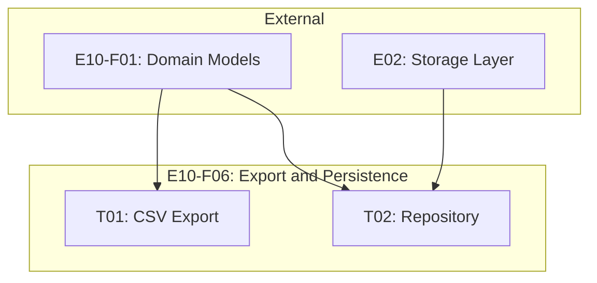

# Spec: E10-F06 - Export and Persistence

---
# ============================================================================
# SPEC METADATA
# ============================================================================

# === IDENTIFICATION ===
id: E10-F06
clickup_task_id: ''
title: Export and Persistence
type: feature

# === HIERARCHY ===
parent: E10
children: [E10-F06-T01, E10-F06-T02]
epic: E10
feature: F06
domain: backtesting

# === WORKFLOW ===
status: draft
priority: medium

# === TRACKING ===
created: '2025-12-30'
updated: '2025-12-30'
due_date: ''
estimated_hours: 20
actual_hours: 0

# === METADATA ===
tags: [backtesting, export, csv, persistence, storage]
effort: medium
risk: low
---

**Status**: Draft
**Type**: Feature
**Parent**: [E10 - Backtesting](../E10.spec.md)
**Created**: 2025-12-30
**Updated**: 2025-12-30

## 1. Overview

### 1.1 Purpose

Provide result export to CSV format and persistence of backtest results for comparison and later analysis. Users can save results, export trade history, and retrieve historical backtests.

### 1.2 Goals

1. **CSV Export**: Trade list and metrics export for external analysis
2. **Result Persistence**: Save/load backtest results
3. **Result Listing**: Browse and filter historical results
4. **Data Integrity**: Reliable serialization/deserialization

---

## 2. Export Formats

### 2.1 Trade List CSV

```csv
ID,Symbol,Symbol Name,Side,Entry Date,Entry Price,Quantity,Exit Date,Exit Price,Exit Reason,P&L,P&L %,Holding Days,Commission,Slippage
trade-001,005930,삼성전자,LONG,2024-01-15,72000,100,2024-01-18,75600,TAKE_PROFIT,360000,5.0,3,2160,1800
trade-002,000660,SK하이닉스,LONG,2024-01-22,135000,50,2024-01-22,132300,STOP_LOSS,-135000,-2.0,0,990,1350
```

### 2.2 Metrics Summary CSV

```csv
Metric,Value
Total Return,45.2%
CAGR,22.6%
Sharpe Ratio,1.85
Sortino Ratio,2.41
Calmar Ratio,3.67
Max Drawdown,-12.3%
Win Rate,62.0%
Profit Factor,2.15
Total Trades,127
Avg Holding Days,4.3
Final Equity,145200000
```

---

## 3. Core Components

### 3.1 BacktestResultExporter

```python
class BacktestResultExporter:
    """Export backtest results to various formats"""

    def export_trades_csv(
        self,
        trades: list[Trade],
        file_path: Path
    ) -> None:
        """Export trade list to CSV"""
        with open(file_path, 'w', newline='', encoding='utf-8-sig') as f:
            writer = csv.writer(f)

            # Header
            writer.writerow([
                'ID', 'Symbol', 'Symbol Name', 'Side',
                'Entry Date', 'Entry Price', 'Quantity',
                'Exit Date', 'Exit Price', 'Exit Reason',
                'P&L', 'P&L %', 'Holding Days',
                'Commission', 'Slippage'
            ])

            # Data rows
            for trade in trades:
                writer.writerow([
                    trade.id,
                    trade.symbol,
                    trade.symbol_name,
                    trade.side.value,
                    trade.entry_date.isoformat(),
                    float(trade.entry_price),
                    trade.entry_quantity,
                    trade.exit_date.isoformat() if trade.exit_date else '',
                    float(trade.exit_price) if trade.exit_price else '',
                    trade.exit_reason.value if trade.exit_reason else '',
                    float(trade.pnl) if trade.pnl else 0,
                    trade.pnl_pct if trade.pnl_pct else 0,
                    trade.holding_days if trade.holding_days else 0,
                    float(trade.commission),
                    float(trade.slippage)
                ])

    def export_metrics_csv(
        self,
        metrics: PerformanceMetrics,
        file_path: Path
    ) -> None:
        """Export metrics summary to CSV"""
        with open(file_path, 'w', newline='', encoding='utf-8-sig') as f:
            writer = csv.writer(f)
            writer.writerow(['Metric', 'Value'])

            writer.writerow(['Total Return', f"{metrics.total_return_pct:.1f}%"])
            writer.writerow(['CAGR', f"{metrics.cagr:.1f}%"])
            writer.writerow(['Sharpe Ratio', f"{metrics.sharpe_ratio:.2f}"])
            writer.writerow(['Sortino Ratio', f"{metrics.sortino_ratio:.2f}"])
            writer.writerow(['Calmar Ratio', f"{metrics.calmar_ratio:.2f}"])
            writer.writerow(['Max Drawdown', f"{metrics.max_drawdown_pct:.1f}%"])
            writer.writerow(['Win Rate', f"{metrics.win_rate:.1f}%"])
            writer.writerow(['Profit Factor', f"{metrics.profit_factor:.2f}"])
            writer.writerow(['Total Trades', metrics.total_trades])
            writer.writerow(['Avg Holding Days', f"{metrics.avg_holding_days:.1f}"])
            writer.writerow(['Final Equity', float(metrics.final_equity)])

    def export_full_report(
        self,
        result: BacktestResult,
        directory: Path
    ) -> dict[str, Path]:
        """Export complete backtest report"""
        directory.mkdir(parents=True, exist_ok=True)

        trades_path = directory / f"trades_{result.id}.csv"
        metrics_path = directory / f"metrics_{result.id}.csv"

        self.export_trades_csv(result.trades, trades_path)
        self.export_metrics_csv(result.metrics, metrics_path)

        return {
            'trades': trades_path,
            'metrics': metrics_path
        }
```

### 3.2 IBacktestResultRepository (Interface)

```python
from abc import ABC, abstractmethod

class IBacktestResultRepository(ABC):
    """Repository interface for backtest results"""

    @abstractmethod
    async def save(self, result: BacktestResult) -> str:
        """Save result and return ID"""
        pass

    @abstractmethod
    async def get(self, result_id: str) -> Optional[BacktestResult]:
        """Get result by ID"""
        pass

    @abstractmethod
    async def list(
        self,
        strategy_id: Optional[str] = None,
        start_date: Optional[date] = None,
        end_date: Optional[date] = None,
        limit: int = 100
    ) -> list[BacktestResultSummary]:
        """List results with optional filters"""
        pass

    @abstractmethod
    async def delete(self, result_id: str) -> bool:
        """Delete result by ID"""
        pass

@dataclass
class BacktestResultSummary:
    """Summary for result listing"""
    id: str
    strategy_name: str
    total_return_pct: float
    sharpe_ratio: float
    max_drawdown_pct: float
    total_trades: int
    created_at: datetime
```

### 3.3 DuckDBBacktestResultRepository

```python
class DuckDBBacktestResultRepository(IBacktestResultRepository):
    """DuckDB implementation of backtest result repository"""

    def __init__(self, connection: duckdb.DuckDBPyConnection):
        self._conn = connection
        self._ensure_tables()

    def _ensure_tables(self):
        """Create tables if not exist"""
        self._conn.execute("""
            CREATE TABLE IF NOT EXISTS backtest_results (
                id VARCHAR PRIMARY KEY,
                config_json TEXT,
                metrics_json TEXT,
                equity_curve_json TEXT,
                trades_json TEXT,
                daily_returns_json TEXT,
                execution_time_ms DOUBLE,
                created_at TIMESTAMP
            )
        """)

    async def save(self, result: BacktestResult) -> str:
        """Serialize and save result"""
        self._conn.execute("""
            INSERT INTO backtest_results
            (id, config_json, metrics_json, equity_curve_json,
             trades_json, daily_returns_json, execution_time_ms, created_at)
            VALUES (?, ?, ?, ?, ?, ?, ?, ?)
        """, [
            result.id,
            self._serialize_config(result.config),
            self._serialize_metrics(result.metrics),
            self._serialize_equity_curve(result.equity_curve),
            self._serialize_trades(result.trades),
            self._serialize_daily_returns(result.daily_returns),
            result.execution_time_ms,
            result.created_at
        ])
        return result.id

    async def get(self, result_id: str) -> Optional[BacktestResult]:
        """Load and deserialize result"""
        row = self._conn.execute(
            "SELECT * FROM backtest_results WHERE id = ?",
            [result_id]
        ).fetchone()

        if not row:
            return None

        return self._deserialize_result(row)

    async def list(
        self,
        strategy_id: Optional[str] = None,
        start_date: Optional[date] = None,
        end_date: Optional[date] = None,
        limit: int = 100
    ) -> list[BacktestResultSummary]:
        """Query results with filters"""
        query = "SELECT id, config_json, metrics_json, created_at FROM backtest_results"
        conditions = []
        params = []

        if start_date:
            conditions.append("created_at >= ?")
            params.append(start_date)

        if end_date:
            conditions.append("created_at <= ?")
            params.append(end_date)

        if conditions:
            query += " WHERE " + " AND ".join(conditions)

        query += f" ORDER BY created_at DESC LIMIT {limit}"

        rows = self._conn.execute(query, params).fetchall()
        return [self._to_summary(row) for row in rows]
```

---

## 4. Key Components

| Component | Description |
|-----------|-------------|
| `BacktestResultExporter` | CSV export service |
| `IBacktestResultRepository` | Repository interface |
| `DuckDBBacktestResultRepository` | DuckDB implementation |
| `BacktestResultSummary` | Lightweight summary for listing |

---

## 5. Acceptance Criteria

### 5.1 CSV Export

- [ ] Trade CSV includes all required columns
- [ ] Metrics CSV includes all key metrics
- [ ] UTF-8 with BOM encoding for Korean character support
- [ ] File paths with result ID for uniqueness
- [ ] Handles special characters in symbol names

### 5.2 Result Persistence

- [ ] Results can be saved to database
- [ ] Results can be retrieved by ID
- [ ] All fields correctly serialized/deserialized
- [ ] Equity curve and trades preserved

### 5.3 Result Listing

- [ ] List returns summary objects (not full results)
- [ ] Filter by date range works
- [ ] Results ordered by created_at DESC
- [ ] Limit parameter respected

### 5.4 Data Integrity

- [ ] Decimal precision preserved through serialization
- [ ] Dates correctly formatted (ISO 8601)
- [ ] Enum values correctly stored/restored
- [ ] No data loss on roundtrip

### 5.5 Testing

- [ ] Export tests with various trade sets
- [ ] Roundtrip tests (save then load)
- [ ] Filter tests for listing
- [ ] Korean character handling tests
- [ ] Test coverage > 85%

---

## 6. Technical Notes

### 6.1 Design Decisions

| Decision | Choice | Reason |
|----------|--------|--------|
| CSV encoding | UTF-8 with BOM | Excel compatibility with Korean |
| Storage format | JSON in DuckDB | Flexible schema, efficient queries |
| Repository | Interface + impl | Testability, future flexibility |
| Listing | Summary objects | Memory efficiency for large lists |

### 6.2 Serialization Strategy

```python
# Config serialization
{
    "strategy_id": "...",
    "symbols": [...],
    "start_date": "2024-01-01",
    "end_date": "2024-12-31",
    "initial_capital": "100000000",
    "commission_pct": 0.015,
    "slippage_pct": 0.05
}

# Trades serialization (array of objects)
[
    {
        "id": "...",
        "symbol": "005930",
        "entry_date": "2024-01-15",
        ...
    }
]
```

### 6.3 Files to Create

- `libs/core/src/backtesting/export/exporter.py`
- `libs/core/src/backtesting/repository/interface.py`
- `libs/core/src/backtesting/repository/duckdb_impl.py`

---

## 7. Dependencies

### 7.1 External

| Dependency | Interface | From |
|------------|-----------|------|
| DuckDB | Database connection | E02 (Storage) |
| csv | Standard library | Python |
| json | Serialization | Python |

### 7.2 Internal

| Dependency | Provides |
|------------|----------|
| E10-F01 | BacktestResult, Trade, PerformanceMetrics |

---

## 8. Tasks

| Task ID | Title | Effort | Dependencies | Description |
|---------|-------|--------|--------------|-------------|
| [E10-F06-T01](T01/E10-F06-T01.spec.md) | CSV Export Service | M | E10-F01 | BacktestResultExporter for trades and metrics CSV |
| [E10-F06-T02](T02/E10-F06-T02.spec.md) | Result Persistence Repository | M | E10-F01, E02 | IBacktestResultRepository and DuckDB implementation |

### Task Dependency Graph



### Parallelization

- **Parallel**: T01 and T02 can be developed in parallel (independent functionality)

---

## 9. References

- PRD Section 5.5: Backtesting
- E02: Storage Layer (DuckDB)
- Python csv module documentation

---
*Template Version: 2.0.0 - Enhanced with Speckit features*
