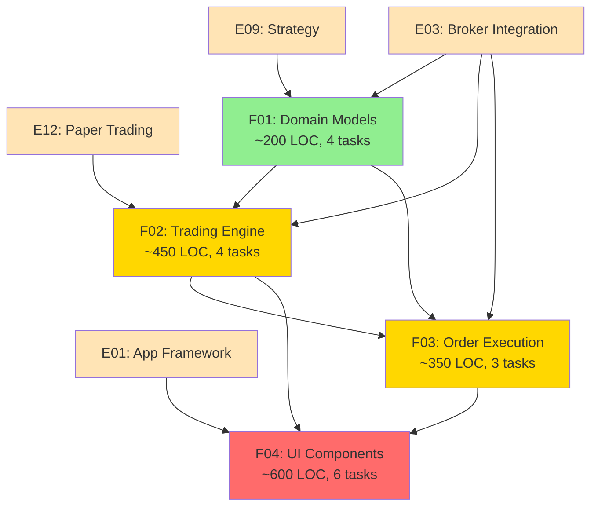
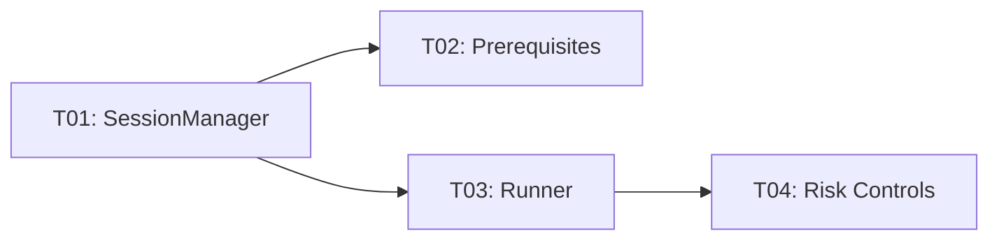
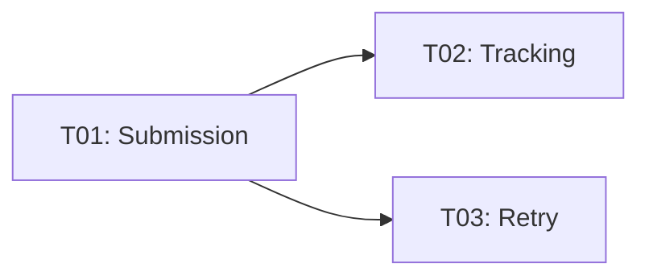

# E13: Live Trading - Parallelization Analysis

## Executive Summary

Epic E13 has been split into **4 features** (F01-F04) with **17 tasks**, all of which have reached **optimal granularity** and are ready for implementation. This report provides a detailed parallelization strategy, dependency analysis, and recommended implementation order.

---

## 1. Feature Overview

| Feature | Title | LOC | Tasks | Complexity | Dependencies |
|---------|-------|-----|-------|------------|--------------|
| **F01** | Domain Models | ~200 | 4 | Low | None (external: E09, E12) |
| **F02** | Live Trading Engine | ~450 | 4 | High | F01, E03, E09, E12 |
| **F03** | Order Execution | ~350 | 3 | High | F01, F02, E03 |
| **F04** | UI Components | ~600 | 6 | Medium | F01, F02, F03, E01 |
| **Total** | | **~1,600** | **17** | **High** | |

---

## 2. Dependency Graph

### 2.1 Feature-Level Dependencies



**Legend**:
- 🟡 Orange: External dependencies (other epics)
- 🟢 Green: Wave 1 (no internal dependencies)
- 🟡 Yellow: Wave 2 (one level of dependencies)
- 🔴 Red: Wave 3+ (multiple levels)

### 2.2 Task-Level Dependencies

#### F01: Domain Models (4 tasks)
```mermaid
graph LR
    T01[T01: Enums<br/>[P]]
    T02[T02: RiskControls<br/>[P]]
    T03[T03: Entities]
    T04[T04: Prerequisites]

    T01 --> T03
    T02 --> T03
    T01 --> T04
```

#### F02: Live Trading Engine (4 tasks)


#### F03: Order Execution (3 tasks)


#### F04: UI Components (6 tasks)
```mermaid
graph LR
    T01[T01: SetupView<br/>[P]]
    T02[T02: AccountWidget<br/>[P]]
    T03[T03: PrereqWidget<br/>[P]]
    T04[T04: Dashboard]
    T05[T05: ConfirmDialog<br/>[P]]
    T06[T06: OrderHistory]

    T02 --> T01
    T03 --> T01
    T01 --> T04
    T04 --> T06
```

---

## 3. Parallel Execution Waves

### Wave 1: Foundation (Day 1-2)

**Duration**: 1-2 days

| Feature | Task | Description | Effort | Parallel |
|---------|------|-------------|--------|----------|
| **F01** | T01 | Define enums | 2h | [P] |
| **F01** | T02 | Define RiskControls | 2h | [P] |

**Parallelization Strategy**:
- Developer A: F01-T01 (Enums)
- Developer B: F01-T02 (RiskControls)
- OR single developer: Complete in sequence (4h total)

**Deliverables**:
- ✅ ExecutionMode, SessionStatus, OrderStatus enums
- ✅ RiskControls dataclass with validation
- ✅ Unit tests for all types

**Exit Criteria**:
- All enum values defined and tested
- RiskControls defaults and validation working
- No external dependencies needed

---

### Wave 2: Core Entities (Day 2-3)

**Duration**: 1-2 days

| Feature | Task | Description | Effort | Dependencies |
|---------|------|-------------|--------|--------------|
| **F01** | T03 | LiveTradingSession & LiveOrder | 3h | T01, T02 ✅ |
| **F01** | T04 | PreRequisiteCheck | 1h | T01 ✅ |

**Parallelization Strategy**:
- Can run T03 and T04 in parallel after Wave 1

**Deliverables**:
- ✅ LiveTradingSession entity with lifecycle methods
- ✅ LiveOrder entity with status tracking
- ✅ PreRequisiteCheck with all_passed logic
- ✅ Unit tests for all entities

**Exit Criteria**:
- All entities created and tested
- Lifecycle methods working correctly
- F01 complete, ready for F02

---

### Wave 3: Engine Core (Day 3-5)

**Duration**: 2-3 days

| Feature | Task | Description | Effort | Dependencies |
|---------|------|-------------|--------|--------------|
| **F02** | T01 | SessionManager core | 4h | F01 ✅, E03 |
| **F02** | T02 | Prerequisite checking | 3h | T01, E12 |

**Parallelization Strategy**:
- T01 and T02 can start in parallel after F01 complete
- Requires E03 (Broker) to be available

**Deliverables**:
- ✅ SessionManager with start/stop/pause/resume
- ✅ Prerequisites validation logic
- ✅ Integration with broker registry
- ✅ Integration tests with mock broker

**Exit Criteria**:
- Sessions can be created and managed
- Prerequisites correctly validated
- Broker integration verified

---

### Wave 4: Trading Loop (Day 5-7)

**Duration**: 2-3 days

| Feature | Task | Description | Effort | Dependencies |
|---------|------|-------------|--------|--------------|
| **F02** | T03 | LiveTradingRunner | 5h | F01 ✅, F02-T01 ✅, E03 |
| **F02** | T04 | Risk control enforcement | 3h | T03 |
| **F03** | T01 | Order submission | 4h | F01 ✅, F02-T03 ✅ |

**Parallelization Strategy**:
- F02-T03 must complete first (critical path)
- F02-T04 and F03-T01 can run in parallel after T03

**Deliverables**:
- ✅ Main trading loop with symbol processing
- ✅ Entry/exit signal generation
- ✅ Risk control validation (positions, daily loss)
- ✅ Order submission to broker
- ✅ Integration tests for trading flow

**Exit Criteria**:
- Trading loop runs and processes symbols
- Risk controls correctly applied
- Orders submitted to mock broker

---

### Wave 5: Order Management (Day 7-8)

**Duration**: 1-2 days

| Feature | Task | Description | Effort | Dependencies |
|---------|------|-------------|--------|--------------|
| **F03** | T02 | Order status tracking | 3h | F03-T01 ✅ |
| **F03** | T03 | Retry logic | 3h | F03-T01 ✅ |

**Parallelization Strategy**:
- T02 and T03 can run in parallel

**Deliverables**:
- ✅ OrderTracker polling broker for updates
- ✅ Retry with exponential backoff
- ✅ Rate limit handling
- ✅ Integration tests for order flow

**Exit Criteria**:
- Order status updates correctly
- Retry logic handles transient failures
- Rate limits respected

---

### Wave 6: UI Foundation (Day 8-10)

**Duration**: 2-3 days

| Feature | Task | Description | Effort | Dependencies |
|---------|------|-------------|--------|--------------|
| **F04** | T01 | SetupView layout | 3h | F02-T01 ✅ |
| **F04** | T02 | AccountSelectionWidget | 3h | E03 |
| **F04** | T03 | PreRequisiteWidget | 2h | F01-T04 ✅ |
| **F04** | T05 | OrderConfirmationDialog | 2h | F01 ✅ |

**Parallelization Strategy**:
- All 4 tasks can run in parallel (different widgets)

**Deliverables**:
- ✅ SetupView main layout
- ✅ Account selection with broker list
- ✅ Prerequisites checklist
- ✅ Order confirmation dialog
- ✅ UI tests for all widgets

**Exit Criteria**:
- Setup flow complete
- Widgets tested individually
- Korean text displays correctly

---

### Wave 7: UI Integration (Day 10-12)

**Duration**: 2-3 days

| Feature | Task | Description | Effort | Dependencies |
|---------|------|-------------|--------|--------------|
| **F04** | T04 | LiveTradingDashboard | 5h | F02 ✅, F03 ✅ |
| **F04** | T06 | OrderHistoryWidget | 2h | T04 |

**Parallelization Strategy**:
- T04 (Dashboard) is critical path
- T06 depends on T04 integration

**Deliverables**:
- ✅ Live trading dashboard
- ✅ Real-time position updates
- ✅ Signal display and confirmation
- ✅ Order history table
- ✅ End-to-end UI tests

**Exit Criteria**:
- Complete UI for live trading
- Real-time updates working
- All user flows tested

---

## 4. Critical Path Analysis

### 4.1 Critical Path

```
F01-T01 → F01-T03 → F02-T01 → F02-T03 → F03-T01 → F04-T04
   │                                        │
   └→ F01-T04 → F02-T02                     └→ F03-T02/T03 → F04-T06
```

**Total Critical Path Duration**: ~11-12 days (single developer)

### 4.2 Parallel Optimization

With 2 developers:

```
Wave 1: F01-T01 + F01-T02 (parallel)       → 0.5 days
Wave 2: F01-T03 + F01-T04 (parallel)       → 0.5 days
Wave 3: F02-T01 + F02-T02 (parallel)       → 1 day
Wave 4: F02-T03 → F02-T04 + F03-T01        → 2 days
Wave 5: F03-T02 + F03-T03 (parallel)       → 1 day
Wave 6: F04-T01,T02,T03,T05 (parallel)     → 1 day
Wave 7: F04-T04 → F04-T06                  → 2 days
                                    Total: ~8 days
```

**Time Savings**: ~33% with two developers

---

## 5. Test Coverage Targets

| Feature | Unit Test | Integration Test | Total Coverage |
|---------|-----------|-----------------|----------------|
| **F01** | 95% | - | > 90% |
| **F02** | 80% | 20% | > 85% |
| **F03** | 80% | 20% | > 85% |
| **F04** | 70% | 30% | > 80% |
| **Epic Total** | | | **> 85%** |

---

## 6. Risk Assessment

### 6.1 High Risk Items

| Item | Risk | Impact | Mitigation |
|------|------|--------|------------|
| Broker API integration | E03 not complete | Blocks F02, F03 | Mock broker for development |
| Real money operations | Financial loss | Critical | Never test with real accounts |
| Async complexity | Race conditions | High | Thorough concurrent testing |
| Daily loss limit | Safety critical | High | 100% test coverage |

### 6.2 External Dependencies

| Dependency | Required By | Status | Risk |
|------------|-------------|--------|------|
| E03 (Broker) | F01, F02, F03 | TBD | High - blocks trading logic |
| E09 (Strategy) | F01, F02 | TBD | Medium - needed for signals |
| E12 (Paper Trading) | F02 | TBD | Low - only for prerequisites |
| E01 (App Framework) | F04 | TBD | Low - UI integration |

**Recommendation**: Ensure E03 is prioritized or use extensive mocking

---

## 7. Recommended Implementation Order

### Single Developer Strategy

**Order**: F01 → F02 → F03 → F04

**Timeline**:
- Day 1-2: F01 (Domain Models) - 8 hours
- Day 3-5: F02 (Trading Engine) - 15 hours
- Day 6-8: F03 (Order Execution) - 10 hours
- Day 9-12: F04 (UI Components) - 17 hours

**Total**: ~12 working days (~50 hours)

### Two Developer Strategy

**Developer A**: F01 → F02 → F03-T01
**Developer B**: F04-T02,T03,T05 → F03-T02,T03 → F04-T01,T04,T06

**Timeline**: ~8 working days (25% time savings)

---

## 8. Success Criteria

Epic E13 is complete when:

✅ All 4 features implemented and tested
✅ Test coverage > 85% across all features
✅ Live trading session can be started with prerequisites check
✅ Risk controls properly enforced (positions, daily loss)
✅ Orders submitted to broker with retry logic
✅ Order status tracked and updated
✅ UI shows real-time positions and P&L
✅ Order confirmation works in MANUAL mode
✅ All acceptance criteria from E13.spec.md met
✅ NEVER tested with real money

---

## 9. File Structure

```
specs/E13/
├── E13.spec.md                     # Epic specification
├── AUTO-SPLIT-SUMMARY.md           # Split summary
├── complexity-analysis.md          # This analysis
├── E13-parallelization.md          # Parallelization report
│
├── F01/                            # Domain Models
│   ├── E13-F01.spec.md
│   ├── F01-pre-docs.md
│   ├── T01/E13-F01-T01.spec.md    # Enums [P]
│   ├── T02/E13-F01-T02.spec.md    # RiskControls [P]
│   ├── T03/E13-F01-T03.spec.md    # Entities
│   └── T04/E13-F01-T04.spec.md    # Prerequisites
│
├── F02/                            # Trading Engine
│   ├── E13-F02.spec.md
│   ├── F02-pre-docs.md
│   ├── T01/E13-F02-T01.spec.md    # SessionManager
│   ├── T02/E13-F02-T02.spec.md    # Prerequisite Check
│   ├── T03/E13-F02-T03.spec.md    # Runner
│   └── T04/E13-F02-T04.spec.md    # Risk Controls
│
├── F03/                            # Order Execution
│   ├── E13-F03.spec.md
│   ├── F03-pre-docs.md
│   ├── T01/E13-F03-T01.spec.md    # Submission
│   ├── T02/E13-F03-T02.spec.md    # Tracking
│   └── T03/E13-F03-T03.spec.md    # Retry
│
└── F04/                            # UI Components
    ├── E13-F04.spec.md
    ├── F04-pre-docs.md
    ├── T01/E13-F04-T01.spec.md    # SetupView [P]
    ├── T02/E13-F04-T02.spec.md    # AccountWidget [P]
    ├── T03/E13-F04-T03.spec.md    # PrereqWidget [P]
    ├── T04/E13-F04-T04.spec.md    # Dashboard
    ├── T05/E13-F04-T05.spec.md    # ConfirmDialog [P]
    └── T06/E13-F04-T06.spec.md    # OrderHistory
```

**Total Files**: 22 specification files

---

## 10. Next Steps

### Immediate Actions

1. ✅ Review all spec files for completeness
2. ⏭️ Verify E03 (Broker) integration readiness
3. ⏭️ Create pre-docs for all features
4. ⏭️ Begin F01-T01 implementation (Enums)
5. ⏭️ Set up test infrastructure for live trading

### Implementation Kickoff Checklist

- [ ] Create git feature branches for E13
- [ ] Verify E03 mock broker available
- [ ] Set up test fixtures for live trading entities
- [ ] Configure CI for E13 tests
- [ ] Begin F01-T01 (Enums)

---

**Analysis Complete** - Epic E13 is ready for implementation.
